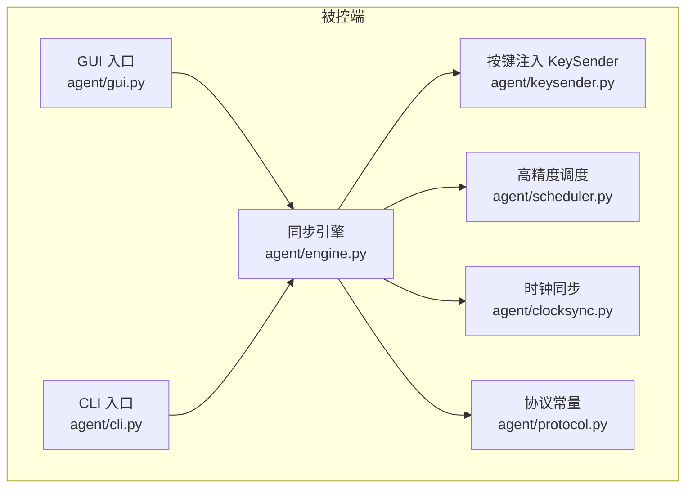
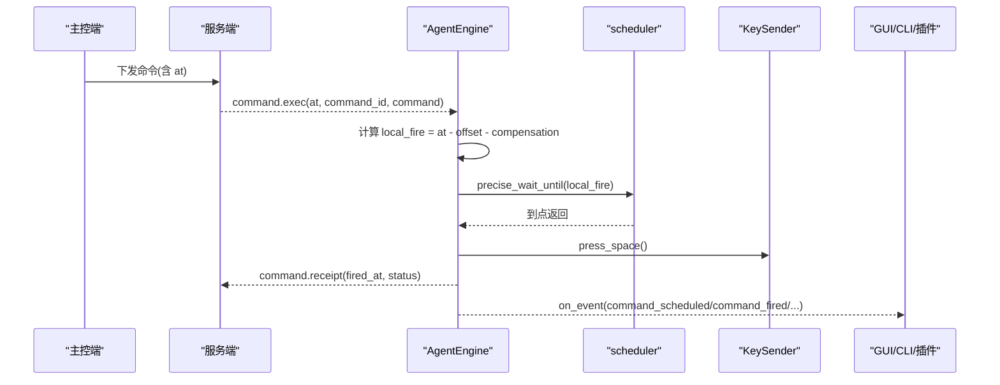
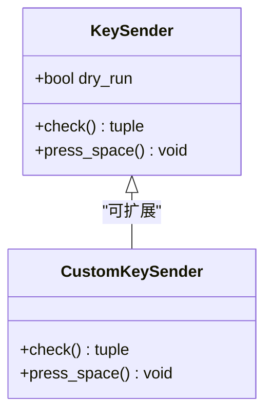
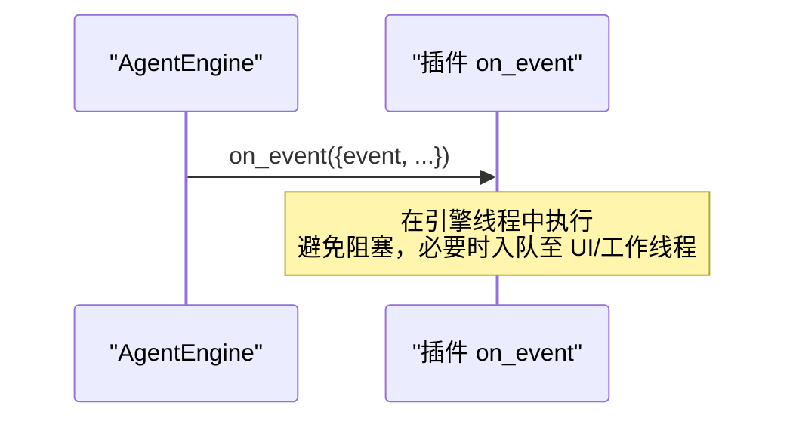
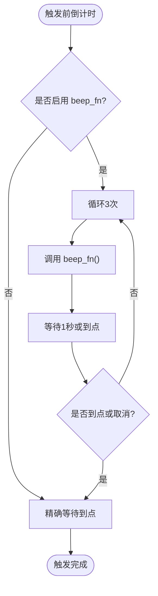
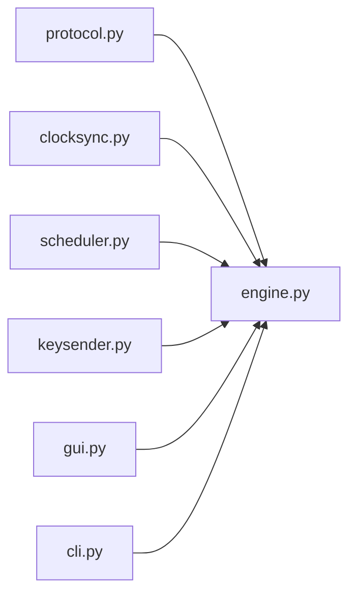

# 插件开发指南

<cite>
**本文引用的文件**
- [agent/agent/engine.py](file://agent/agent/engine.py)
- [agent/agent/keysender.py](file://agent/agent/keysender.py)
- [agent/agent/gui.py](file://agent/agent/gui.py)
- [agent/agent/cli.py](file://agent/agent/cli.py)
- [agent/agent/scheduler.py](file://agent/agent/scheduler.py)
- [agent/agent/clocksync.py](file://agent/agent/clocksync.py)
- [agent/agent/protocol.py](file://agent/agent/protocol.py)
- [README.md](file://README.md)
</cite>

## 目录
1. [简介](#简介)
2. [项目结构](#项目结构)
3. [核心组件](#核心组件)
4. [架构总览](#架构总览)
5. [详细组件分析](#详细组件分析)
6. [依赖关系分析](#依赖关系分析)
7. [性能考量](#性能考量)
8. [故障排查指南](#故障排查指南)
9. [结论](#结论)
10. [附录：插件开发与发布实践](#附录插件开发与发布实践)

## 简介
本指南面向希望在 ScriptCue 被控端中扩展“插件能力”的开发者，重点覆盖以下目标：
- 插件架构与扩展点：KeySender 接口规范、自定义触发动作开发方法。
- on_event 回调机制：事件类型、回调注册与异步处理模式。
- beep_fn 提示音功能：自定义实现、音频库集成与跨平台兼容。
- 完整插件示例：简单按键映射、复杂自动化脚本、第三方系统集成。
- 生命周期管理、错误处理与性能优化策略。
- 打包发布、测试方法与部署最佳实践。

## 项目结构
ScriptCue 被控端位于 agent 目录，核心由同步引擎、时钟同步、高精度调度、按键注入和 GUI/CLI 入口组成。协议常量在 agent/agent/protocol.py 中维护，与服务端保持一致。

**图表来源**
- [agent/agent/gui.py:96-238](file://agent/agent/gui.py#L96-L238)
- [agent/agent/cli.py:104-134](file://agent/agent/cli.py#L104-L134)
- [agent/agent/engine.py:31-59](file://agent/agent/engine.py#L31-L59)
- [agent/agent/keysender.py:99-126](file://agent/agent/keysender.py#L99-L126)
- [agent/agent/scheduler.py:33-58](file://agent/agent/scheduler.py#L33-L58)
- [agent/agent/clocksync.py:29-106](file://agent/agent/clocksync.py#L29-L106)
- [agent/agent/protocol.py:7-80](file://agent/agent/protocol.py#L7-L80)

**章节来源**
- [README.md:7-27](file://README.md#L7-L27)
- [agent/agent/protocol.py:7-80](file://agent/agent/protocol.py#L7-L80)

## 核心组件
- AgentEngine（同步引擎）：负责连接生命周期、时钟同步、绝对时刻调度、触发回执与事件上报。提供 on_event 回调与 beep_fn 钩子，是插件扩展的核心接入点。
- KeySender（按键注入）：跨平台空格键注入器，提供 check() 自检与 press_space() 触发。可替换为自定义实现以支持更丰富的动作。
- scheduler.precise_wait_until：高精度定时等待，采用“粗睡眠 + 末段自旋”策略，保证亚毫秒级到点精度。
- clocksync.ClockSync：类 NTP 时钟同步，维护样本并估算偏移与质量等级。
- protocol：定义消息类型、指令类型、错误码、心跳与重连参数等。

**章节来源**
- [agent/agent/engine.py:31-59](file://agent/agent/engine.py#L31-L59)
- [agent/agent/keysender.py:99-126](file://agent/agent/keysender.py#L99-L126)
- [agent/agent/scheduler.py:33-58](file://agent/agent/scheduler.py#L33-L58)
- [agent/agent/clocksync.py:29-106](file://agent/agent/clocksync.py#L29-L106)
- [agent/agent/protocol.py:7-80](file://agent/agent/protocol.py#L7-L80)

## 架构总览
被控端通过 WebSocket 与服务器保持长连接，周期性进行时钟同步；收到带绝对执行时刻的命令后，在精确时刻触发动作（默认空格键），并通过回执上报结果。on_event 将内部状态变化暴露给上层（GUI/CLI/插件）。

**图表来源**
- [agent/agent/engine.py:268-378](file://agent/agent/engine.py#L268-L378)
- [agent/agent/scheduler.py:33-58](file://agent/agent/scheduler.py#L33-L58)
- [agent/agent/keysender.py:121-126](file://agent/agent/keysender.py#L121-L126)
- [agent/agent/protocol.py:23-47](file://agent/agent/protocol.py#L23-L47)

## 详细组件分析

### 插件扩展点一：KeySender 接口规范与自定义触发动作
- 内置 KeySender 提供跨平台空格键注入，包含开机自检 check() 与触发 press_space()。
- 插件可通过继承或组合方式实现自定义 KeySender，从而将“触发”从单一空格键扩展为任意系统级动作（如发送组合键、调用外部程序、控制播放器等）。
- 关键约束：
  - 必须保证线程安全：press_space() 可能在独立触发线程中被调用。
  - 异常需向上抛出，以便引擎记录错误回执。
  - 自检 check() 应验证运行环境权限与能力（例如 macOS 辅助功能权限）。

**图表来源**
- [agent/agent/keysender.py:99-126](file://agent/agent/keysender.py#L99-L126)

**章节来源**
- [agent/agent/keysender.py:14-126](file://agent/agent/keysender.py#L14-L126)

### 插件扩展点二：on_event 回调机制与异步处理模式
- AgentEngine 构造时接受 on_event(event: dict) 回调，所有事件均在引擎线程中调用。
- 事件类型包括：connecting、connected、disconnected、reconnecting、error、clock_sample、command_scheduled、command_fired、command_cancelled、fire_skipped、comp_changed 等。
- GUI/CLI 通过队列或线程安全方式接收事件并更新 UI 或日志。
- 插件可在 on_event 中订阅事件，实现：
  - 统计与审计：记录触发偏差、失败原因。
  - 联动逻辑：根据 command 类型触发不同业务动作。
  - 动态配置：响应 comp_changed 调整本地补偿值。

**图表来源**
- [agent/agent/engine.py:383-388](file://agent/agent/engine.py#L383-L388)
- [agent/agent/gui.py:291-337](file://agent/agent/gui.py#L291-L337)
- [agent/agent/cli.py:33-62](file://agent/agent/cli.py#L33-L62)

**章节来源**
- [agent/agent/engine.py:31-59](file://agent/agent/engine.py#L31-L59)
- [agent/agent/gui.py:291-337](file://agent/agent/gui.py#L291-L337)
- [agent/agent/cli.py:33-62](file://agent/agent/cli.py#L33-L62)

### 插件扩展点三：beep_fn 提示音功能的自定义实现
- AgentEngine 在触发前 3 秒起按秒播放提示音（最多三次），通过 beep_fn 钩子调用。
- GUI 提供 make_beep_fn() 实现跨平台提示音：Windows 使用 winsound，macOS 使用 afplay。
- 插件可替换 beep_fn 以实现：
  - 自定义音频库（如 pygame、pydub、playsound）。
  - 网络提示音（HTTP 请求播放远端音频）。
  - 多设备协同提示（广播提示事件）。
- 注意事项：
  - beep_fn 必须在极短耗时内完成，避免影响精确等待。
  - 捕获异常并忽略，确保主流程不被中断。
  - 跨平台兼容性：检测 sys.platform 选择合适实现。

**图表来源**
- [agent/agent/engine.py:329-378](file://agent/agent/engine.py#L329-L378)
- [agent/agent/gui.py:71-89](file://agent/agent/gui.py#L71-L89)

**章节来源**
- [agent/agent/engine.py:27-378](file://agent/agent/engine.py#L27-L378)
- [agent/agent/gui.py:71-89](file://agent/agent/gui.py#L71-L89)

### 插件示例一：简单按键映射插件
- 目标：将“起播”命令映射为特定快捷键组合（例如 Ctrl+Space）。
- 实现思路：
  - 自定义 KeySender.press_space() 发送组合键。
  - 在 on_event 中监听 command_scheduled/command_fired，记录映射行为。
- 关键点：
  - 组合键注入需考虑前台窗口焦点与输入法状态。
  - 异常处理：捕获系统 API 错误并上报。

**章节来源**
- [agent/agent/keysender.py:99-126](file://agent/agent/keysender.py#L99-L126)
- [agent/agent/engine.py:329-378](file://agent/agent/engine.py#L329-L378)

### 插件示例二：复杂自动化脚本插件
- 目标：在触发前后执行一系列自动化步骤（如启动播放器、切换场景、录制开始）。
- 实现思路：
  - 在 on_event 中订阅 command_scheduled 准备资源，command_fired 执行主动作，command_cancelled 清理资源。
  - 使用队列将 UI 更新与工作线程解耦。
- 关键点：
  - 资源生命周期管理：确保取消时释放句柄、进程。
  - 超时与重试：对第三方调用设置超时与重试策略。

**章节来源**
- [agent/agent/engine.py:268-378](file://agent/agent/engine.py#L268-L378)
- [agent/agent/gui.py:291-337](file://agent/agent/gui.py#L291-L337)

### 插件示例三：第三方系统集成插件
- 目标：与外部系统（如 OBS、直播推流服务、会议系统）集成，触发时调用其 API。
- 实现思路：
  - 在 on_event 中根据 command 类型调用 HTTP/WebSocket 接口。
  - 使用异步客户端避免阻塞引擎线程。
- 关键点：
  - 认证与鉴权：安全存储令牌。
  - 错误恢复：网络抖动时的重试与降级。

**章节来源**
- [agent/agent/engine.py:268-378](file://agent/agent/engine.py#L268-L378)

## 依赖关系分析
- AgentEngine 依赖：
  - protocol：消息类型、指令类型、错误码、心跳与重连参数。
  - clocksync：时钟同步与质量评估。
  - scheduler：高精度等待。
  - keysender：触发动作。
- GUI/CLI 作为上层消费者，通过 on_event 订阅事件，通过 set_ready/set_compensation 控制引擎状态。

**图表来源**
- [agent/agent/engine.py:12-24](file://agent/agent/engine.py#L12-L24)
- [agent/agent/gui.py:25-28](file://agent/agent/gui.py#L25-L28)
- [agent/agent/cli.py:21-23](file://agent/agent/cli.py#L21-L23)

**章节来源**
- [agent/agent/protocol.py:7-80](file://agent/agent/protocol.py#L7-L80)
- [agent/agent/clocksync.py:11-15](file://agent/agent/clocksync.py#L11-L15)
- [agent/agent/scheduler.py:13-18](file://agent/agent/scheduler.py#L13-L18)

## 性能考量
- 高精度调度：采用“粗睡眠 + 末段自旋”，Windows 下提升系统定时器分辨率，确保到点误差亚毫秒级。
- 时钟同步：密集采样与维持性采样结合，取 RTT 最小样本作为可信偏移，降低网络抖动影响。
- 提示音优化：beep_fn 需在临近到点前停止，避免干扰精确等待。
- 线程模型：触发在独立线程执行，避免阻塞事件循环；on_event 在引擎线程调用，UI 需自行切换到 UI 线程。

**章节来源**
- [agent/agent/scheduler.py:1-58](file://agent/agent/scheduler.py#L1-L58)
- [agent/agent/clocksync.py:1-106](file://agent/agent/clocksync.py#L1-L106)
- [agent/agent/engine.py:1-10](file://agent/agent/engine.py#L1-L10)

## 故障排查指南
- 连接问题：检查 server_url 格式（http/https 自动转换为 ws/wss），确认房间码与口令正确。
- 时钟未同步：若 offset 为 None，将无法调度；等待密集采样完成后重试。
- 按键注入失败：macOS 需授予辅助功能权限；Windows 可能被安全软件拦截。
- 提示音不响：确认 beep_fn 实现可用，捕获异常不影响主流程。
- 事件丢失：on_event 中避免阻塞，必要时使用队列缓冲。

**章节来源**
- [agent/agent/engine.py:95-128](file://agent/agent/engine.py#L95-L128)
- [agent/agent/engine.py:297-311](file://agent/agent/engine.py#L297-L311)
- [agent/agent/keysender.py:107-119](file://agent/agent/keysender.py#L107-L119)
- [agent/agent/gui.py:433-454](file://agent/agent/gui.py#L433-L454)

## 结论
ScriptCue 被控端通过清晰的扩展点（KeySender、on_event、beep_fn）提供了强大的插件能力。开发者可基于这些扩展点实现从简单按键映射到复杂自动化脚本与第三方系统集成的多种插件。遵循高精度调度与时钟同步机制，可确保触发精度与稳定性。结合合理的生命周期管理与错误处理策略，能够构建健壮且高性能的插件生态。

## 附录：插件开发与发布实践

### 插件生命周期管理
- 初始化：创建 KeySender 实例，设置 on_event 与 beep_fn。
- 运行：启动引擎 run()，进入事件循环。
- 退出：调用 disconnect() 断开连接，清理资源。

**章节来源**
- [agent/agent/gui.py:220-238](file://agent/agent/gui.py#L220-L238)
- [agent/agent/cli.py:121-134](file://agent/agent/cli.py#L121-L134)

### 错误处理机制
- 引擎层：捕获异常并上报 error 事件，记录日志。
- 触发层：按键注入异常时，回执携带 detail 信息。
- 提示音：beep_fn 异常被忽略，确保主流程继续。

**章节来源**
- [agent/agent/engine.py:116-118](file://agent/agent/engine.py#L116-L118)
- [agent/agent/engine.py:362-377](file://agent/agent/engine.py#L362-L377)
- [agent/agent/engine.py:345-348](file://agent/agent/engine.py#L345-L348)

### 性能优化策略
- 使用 precise_wait_until 替代普通 sleep，减少到点误差。
- 合理设置补偿值，抵消系统延迟。
- 限制 on_event 处理耗时，避免阻塞引擎线程。

**章节来源**
- [agent/agent/scheduler.py:33-58](file://agent/agent/scheduler.py#L33-L58)
- [agent/agent/engine.py:71-74](file://agent/agent/engine.py#L71-L74)

### 打包发布指南
- 使用 PyInstaller 打包为单文件：
  - Windows：执行 build_windows.ps1，产物 dist/ScriptCueAgent.exe。
  - macOS：执行 build_macos.sh，产物 dist/ScriptCue.app。
- 首次运行需授权辅助功能权限（macOS）。

**章节来源**
- [README.md:74-79](file://README.md#L74-L79)

### 测试方法
- 命令行版联调：使用 --dry-run 跳过实际按键注入，验证核心链路。
- 事件观察：通过 on_event 打印日志，确认指令调度与触发偏差。
- 压力测试：模拟高频指令，验证重连与资源清理。

**章节来源**
- [agent/agent/cli.py:104-134](file://agent/agent/cli.py#L104-L134)
- [agent/agent/cli.py:33-62](file://agent/agent/cli.py#L33-L62)

### 部署最佳实践
- 服务端：使用 Docker 部署，便于横向扩展与数据持久化。
- 被控端：分发单文件包，简化安装与升级。
- 监控：收集 on_event 中的 clock_sample 与 command_fired 偏差，评估同步质量。

**章节来源**
- [README.md:36-55](file://README.md#L36-L55)
- [agent/agent/engine.py:217-241](file://agent/agent/engine.py#L217-L241)