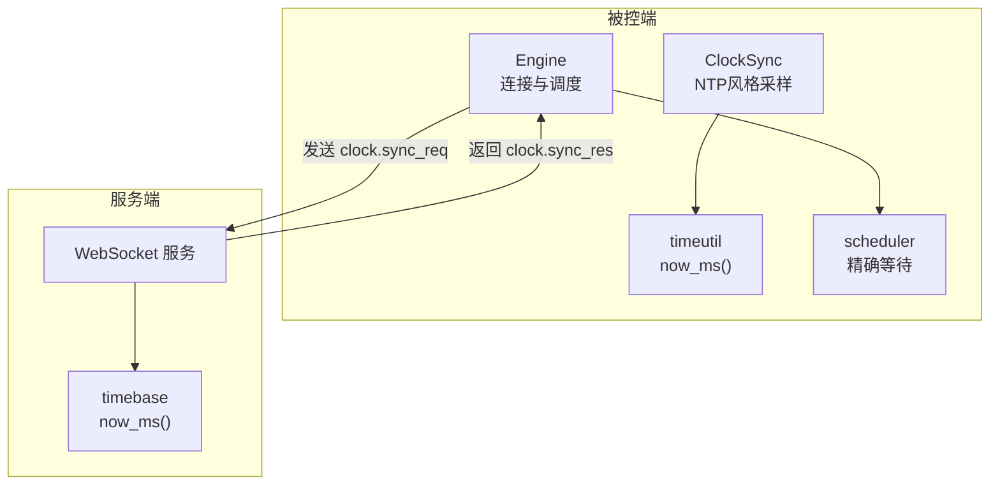
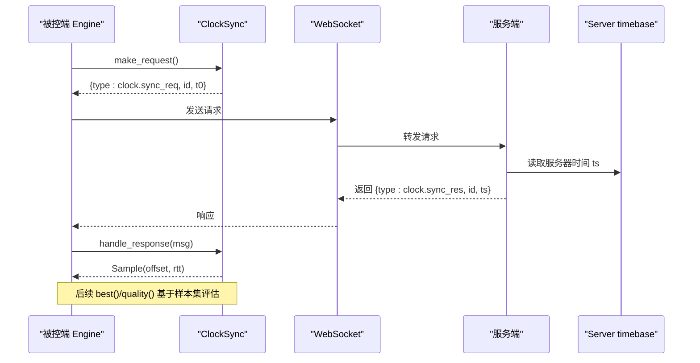
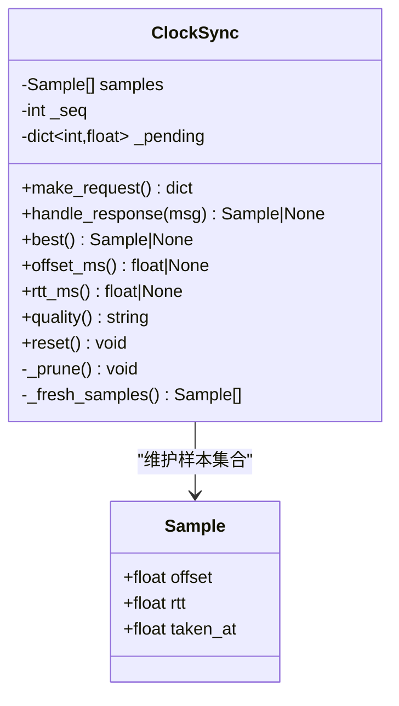
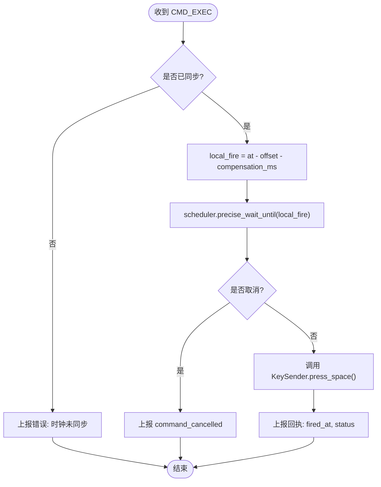
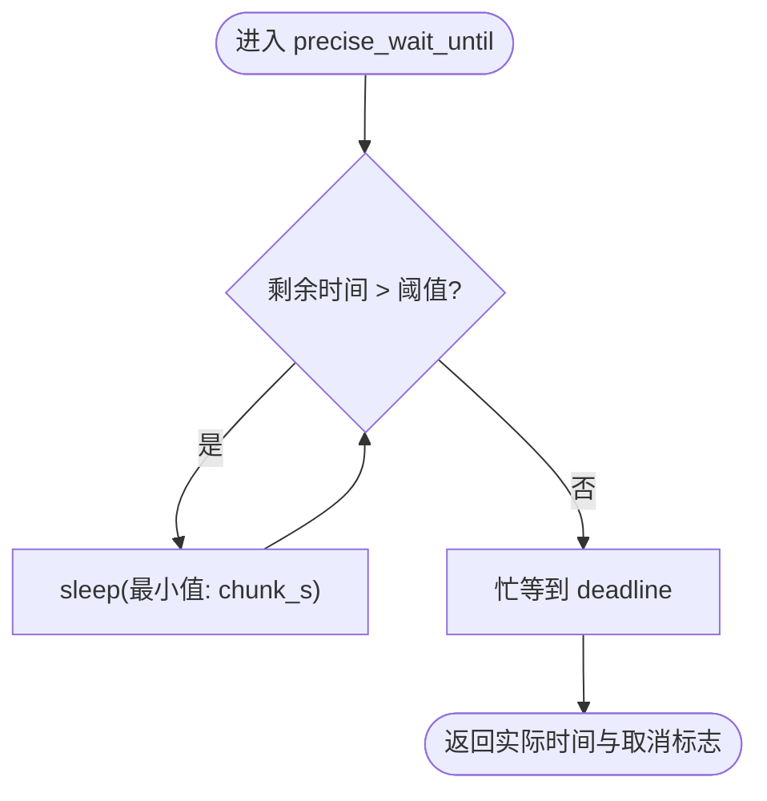
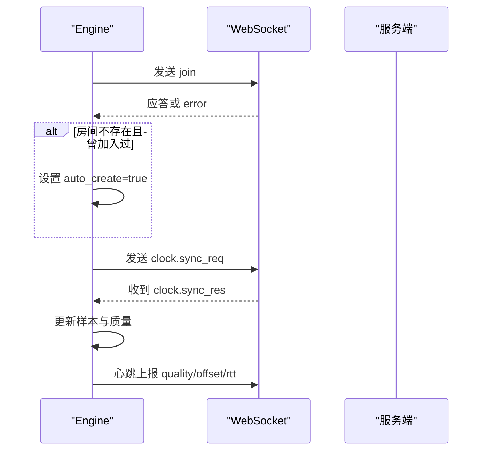
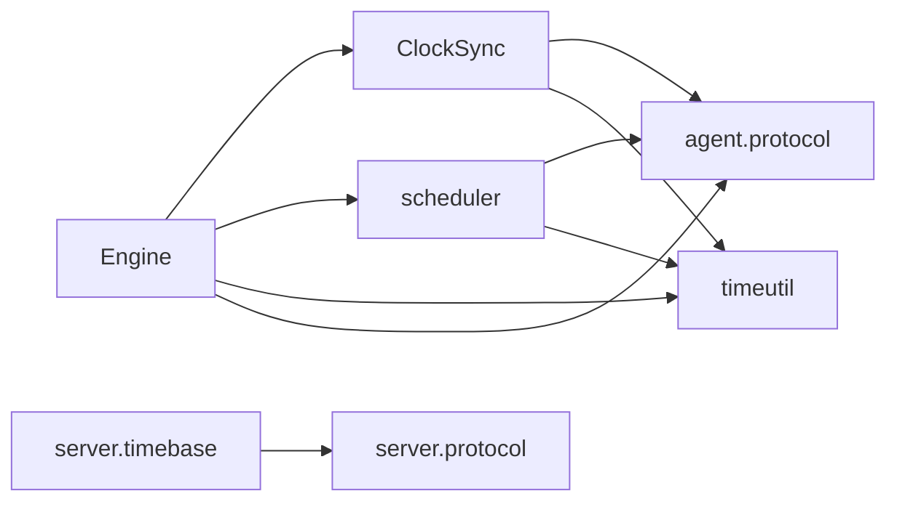

# 时钟同步系统

<cite>
**本文引用的文件**
- [agent/agent/clocksync.py](file://agent/agent/clocksync.py)
- [agent/agent/timeutil.py](file://agent/agent/timeutil.py)
- [agent/agent/protocol.py](file://agent/agent/protocol.py)
- [server/server/protocol.py](file://server/server/protocol.py)
- [agent/agent/engine.py](file://agent/agent/engine.py)
- [agent/agent/scheduler.py](file://agent/agent/scheduler.py)
- [server/server/timebase.py](file://server/server/timebase.py)
- [README.md](file://README.md)
</cite>

## 目录
1. [简介](#简介)
2. [项目结构](#项目结构)
3. [核心组件](#核心组件)
4. [架构总览](#架构总览)
5. [详细组件分析](#详细组件分析)
6. [依赖关系分析](#依赖关系分析)
7. [性能与精度分析](#性能与精度分析)
8. [故障诊断与排错](#故障诊断与排错)
9. [结论](#结论)
10. [附录：参数配置与最佳实践](#附录参数配置与最佳实践)

## 简介
本技术文档面向 ScriptCue 被控端（Agent）的时钟同步子系统，系统性阐述其类 NTP 风格的时钟同步算法、多次采样策略、网络延迟补偿计算与时钟偏移量估算；深入解析 ClockSync 类的密集采样与维持性采样机制、时钟质量评估；文档化时间工具函数与高精度定时调度；说明协议交互流程（请求构造、响应处理、异常恢复）；并提供同步精度分析、性能调优建议与常见问题排查方法。

## 项目结构
- 服务端提供 WebSocket 长连接、房间管理与授时基准，负责响应时钟同步请求并返回服务器时间戳。
- 被控端在加入房间后启动时钟同步任务：先进行密集采样快速收敛，随后周期性维持采样以抑制时钟漂移。
- 指令调度采用“绝对时刻 + 本地偏移补偿”的方式，结合粗睡眠与末段自旋等待实现亚毫秒级触发精度。

图表来源
- [agent/agent/engine.py:129-157](file://agent/agent/engine.py#L129-L157)
- [agent/agent/clocksync.py:29-55](file://agent/agent/clocksync.py#L29-L55)
- [agent/agent/timeutil.py:9-11](file://agent/agent/timeutil.py#L9-L11)
- [agent/agent/scheduler.py:33-58](file://agent/agent/scheduler.py#L33-L58)
- [server/server/timebase.py:10-12](file://server/server/timebase.py#L10-L12)

章节来源
- [README.md:16-27](file://README.md#L16-L27)

## 核心组件
- ClockSync：实现类 NTP 的偏移估计与 RTT 选择，维护样本队列、老化窗口与质量评估。
- Engine：管理 WebSocket 生命周期、发起密集/维持性采样、处理心跳与指令调度。
- timeutil：提供高精度本地时间获取（毫秒级 Unix 时间戳）。
- scheduler：实现“粗睡眠 + 末段自旋”的高精度等待，保证到点触发的低抖动。
- protocol（两端）：定义消息类型、质量等级、重连退避、同步间隔等常量。
- server timebase：服务端统一的时间源，确保所有“服务器时间”一致。

章节来源
- [agent/agent/clocksync.py:22-105](file://agent/agent/clocksync.py#L22-L105)
- [agent/agent/engine.py:31-211](file://agent/agent/engine.py#L31-L211)
- [agent/agent/timeutil.py:9-11](file://agent/agent/timeutil.py#L9-L11)
- [agent/agent/scheduler.py:33-58](file://agent/agent/scheduler.py#L33-L58)
- [agent/agent/protocol.py:75-79](file://agent/agent/protocol.py#L75-L79)
- [server/server/protocol.py:75-79](file://server/server/protocol.py#L75-L79)
- [server/server/timebase.py:10-12](file://server/server/timebase.py#L10-L12)

## 架构总览
被控端通过 WebSocket 与服务端建立长连接，加入房间后启动两个并行任务：
- 密集采样：短时间内连续发送多次时钟同步请求，快速获得一组样本，选取 RTT 最小的作为可信偏移。
- 维持性采样：周期性发送请求，持续修正偏移，抑制本地时钟漂移。

收到带绝对执行时刻的指令后，引擎将服务器时间换算为本地触发时刻（减去偏移与补偿），使用 scheduler 精确等待并在到时触发按键动作，最后上报回执。

图表来源
- [agent/agent/engine.py:198-211](file://agent/agent/engine.py#L198-L211)
- [agent/agent/clocksync.py:37-55](file://agent/agent/clocksync.py#L37-L55)
- [server/server/timebase.py:10-12](file://server/server/timebase.py#L10-L12)

## 详细组件分析

### ClockSync：类 NTP 偏移估算与质量评估
- 采样模型：发送请求记录本地发出时刻 t0，收到响应记录本地接收时刻 t1，服务器时间 ts 由服务端附加；偏移 offset = ts - (t0 + t1)/2，往返时延 rtt = t1 - t0。
- 多次采样与 RTT 择优：维护样本列表，按 RTT 排序保留最优一批；新鲜样本中取 RTT 最小者作为可信偏移。
- 样本老化：超过最大保留时间的旧样本仅在无新样本时兜底使用，避免路由变化导致陈旧样本主导。
- 质量分级：根据新鲜样本数量与 RTT 阈值划分 excellent/good/poor/none。

图表来源
- [agent/agent/clocksync.py:22-105](file://agent/agent/clocksync.py#L22-L105)

章节来源
- [agent/agent/clocksync.py:22-105](file://agent/agent/clocksync.py#L22-L105)

### Engine：连接、同步与调度
- 连接生命周期：指数退避重连、自动重建房间、状态回调。
- 同步任务：
  - 密集采样：加入房间后立即发送 DENSE_SYNC_SAMPLES 次请求，间隔 DENSE_SYNC_INTERVAL_MS。
  - 维持性采样：每 MAINTAIN_SYNC_INTERVAL_S 秒发送一次请求，抑制漂移。
- 心跳上报：周期上报 ready、clock_quality、compensation_ms、offset、rtt 等。
- 指令调度：收到 CMD_EXEC 后，若未同步则上报错误；否则计算 local_fire = at - offset - compensation_ms，使用 scheduler 精确等待并触发按键，最终上报回执。

图表来源
- [agent/agent/engine.py:297-379](file://agent/agent/engine.py#L297-L379)

章节来源
- [agent/agent/engine.py:106-211](file://agent/agent/engine.py#L106-L211)
- [agent/agent/engine.py:268-379](file://agent/agent/engine.py#L268-L379)

### 时间工具与高精度定时
- timeutil.now_ms：使用 time.time_ns() 除以 1e6 得到浮点毫秒时间戳，保留亚毫秒信息。
- scheduler.precise_wait_until：
  - 粗睡眠阶段：每次最多睡眠 COARSE_SLEEP_CHUNK_S 秒，支持取消事件打断。
  - 末段自旋：进入 SPIN_THRESHOLD_MS 内切换忙等，逼近目标时刻，误差控制在亚毫秒级。
  - Windows 下提升系统定时器分辨率，改善 sleep 精度。

图表来源
- [agent/agent/scheduler.py:33-58](file://agent/agent/scheduler.py#L33-L58)
- [agent/agent/timeutil.py:9-11](file://agent/agent/timeutil.py#L9-L11)

章节来源
- [agent/agent/scheduler.py:1-59](file://agent/agent/scheduler.py#L1-L59)
- [agent/agent/timeutil.py:1-12](file://agent/agent/timeutil.py#L1-L12)

### 协议交互与异常恢复
- 请求构造：ClockSync.make_request 生成包含 type、id、t0 的消息；Engine 通过 WebSocket 发送。
- 响应处理：Engine._dispatch 识别 CLOCK_SYNC_RES，调用 ClockSync.handle_response 计算样本并更新质量。
- 异常恢复：
  - 连接异常：Engine.run 捕获异常并指数退避重连。
  - 房间丢失：加入失败且 ERR_ROOM_NOT_FOUND 时标记自动重建。
  - 指令取消：收到 CMD_CANCEL 时取消 pending 触发。
  - 未同步指令：上报错误并跳过触发。

图表来源
- [agent/agent/engine.py:159-192](file://agent/agent/engine.py#L159-L192)
- [agent/agent/engine.py:198-211](file://agent/agent/engine.py#L198-L211)
- [agent/agent/engine.py:268-291](file://agent/agent/engine.py#L268-L291)

章节来源
- [agent/agent/engine.py:106-192](file://agent/agent/engine.py#L106-L192)
- [agent/agent/engine.py:268-291](file://agent/agent/engine.py#L268-L291)

## 依赖关系分析
- Engine 依赖 ClockSync、KeySender、scheduler、timeutil 与 protocol。
- ClockSync 依赖 protocol 常量与 timeutil.now_ms。
- scheduler 依赖 protocol 中的 SPIN_THRESHOLD_MS 与 timeutil.now_ms。
- 服务端 timebase 为权威时间源，与客户端 timeutil 保持一致的毫秒级 Unix 时间语义。

图表来源
- [agent/agent/engine.py:19-23](file://agent/agent/engine.py#L19-L23)
- [agent/agent/clocksync.py:11-14](file://agent/agent/clocksync.py#L11-L14)
- [agent/agent/scheduler.py:17-18](file://agent/agent/scheduler.py#L17-L18)
- [server/server/timebase.py:7-12](file://server/server/timebase.py#L7-L12)

章节来源
- [agent/agent/engine.py:19-23](file://agent/agent/engine.py#L19-L23)
- [agent/agent/clocksync.py:11-14](file://agent/agent/clocksync.py#L11-L14)
- [agent/agent/scheduler.py:17-18](file://agent/agent/scheduler.py#L17-L18)
- [server/server/timebase.py:7-12](file://server/server/timebase.py#L7-L12)

## 性能与精度分析
- 偏移估算：采用 NTP 风格公式 offset = ts - (t0 + t1)/2，利用对称路径假设降低单向延迟影响。
- 多次采样与 RTT 择优：通过密集采样快速收敛，维护性采样抑制漂移；选择 RTT 最小样本提高可信度。
- 样本老化：超过 10 分钟的样本仅在新样本缺失时兜底，避免路由变化导致的偏差。
- 触发精度：粗睡眠 + 末段自旋策略，Windows 下提升系统定时器分辨率，整体到点误差控制在亚毫秒级。
- 提前量与鲁棒性：默认提前量 3s，只要网络抖动不超过提前量，不影响同步起播精度。

章节来源
- [agent/agent/clocksync.py:16-19](file://agent/agent/clocksync.py#L16-L19)
- [agent/agent/clocksync.py:66-77](file://agent/agent/clocksync.py#L66-L77)
- [agent/agent/scheduler.py:1-11](file://agent/agent/scheduler.py#L1-L11)
- [README.md:22-27](file://README.md#L22-L27)

## 故障诊断与排错
- 时钟未同步：若 offset 为空，引擎会跳过触发并上报错误；检查密集采样是否完成、网络是否稳定。
- 质量降级：当新鲜样本不足或 RTT 增大时，quality 可能降为 good/poor；检查网络抖动与服务器负载。
- 连接异常：指数退避重连，关注 reconnect 事件与 delay；确认服务端可达性与房间是否存在。
- 指令取消：收到 CMD_CANCEL 时取消 pending 触发；核对主控端是否主动取消。
- 补偿值变更：COMP_UPDATE 会更新本地补偿；必要时调整 compensation_ms 并上报。

章节来源
- [agent/agent/engine.py:297-311](file://agent/agent/engine.py#L297-L311)
- [agent/agent/engine.py:277-291](file://agent/agent/engine.py#L277-L291)
- [agent/agent/engine.py:106-127](file://agent/agent/engine.py#L106-L127)

## 结论
该时钟同步系统通过类 NTP 的偏移估算、多次采样与 RTT 择优、样本老化与质量评估，结合高精度定时调度，实现了在公网环境下 ≤50ms 精度的同步起播。Engine 将连接管理、同步与调度解耦，便于扩展与维护。合理的参数配置与异常恢复机制保障了系统的鲁棒性与可运维性。

## 附录：参数配置与最佳实践
- 密集采样次数与间隔：DENSE_SYNC_SAMPLES=20，DENSE_SYNC_INTERVAL_MS=50；建议在加入房间后保持网络稳定，以获得快速收敛。
- 维持性采样间隔：MAINTAIN_SYNC_INTERVAL_S=30；可根据网络抖动情况适当调整，平衡精度与开销。
- 样本上限与老化：SAMPLE_KEEP_MAX=200，SAMPLE_MAX_AGE_MS=600000；用于控制内存占用与避免陈旧样本影响。
- 自旋阈值：SPIN_THRESHOLD_MS=50；决定末段忙等起点，影响触发抖动与 CPU 占用。
- 提前量：DEFAULT_LEAD_MS=3000；在网络抖动较大时可适当增加以提升鲁棒性。
- 最佳实践：
  - 首次加入房间后观察 quality 与 rtt，确保达到 excellent 后再下发关键指令。
  - 监控心跳中的 clock_offset_ms 与 clock_rtt_ms，发现异常波动及时排查网络。
  - 合理设置补偿值 compensation_ms，使不同设备间对齐更精准。
  - 在 Windows 环境启用系统定时器分辨率提升，以获得更好的 sleep 精度。

章节来源
- [agent/agent/protocol.py:75-79](file://agent/agent/protocol.py#L75-L79)
- [agent/agent/clocksync.py:16-19](file://agent/agent/clocksync.py#L16-L19)
- [agent/agent/scheduler.py:17-27](file://agent/agent/scheduler.py#L17-L27)
- [server/server/protocol.py:72-79](file://server/server/protocol.py#L72-L79)