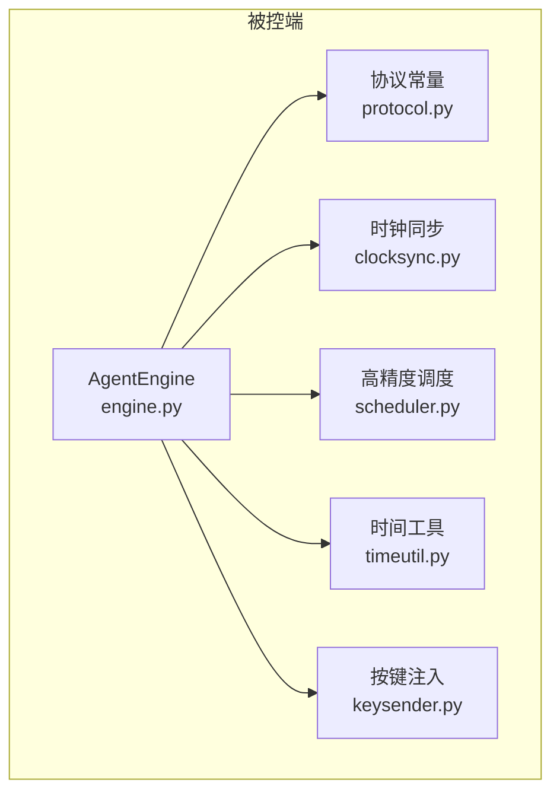
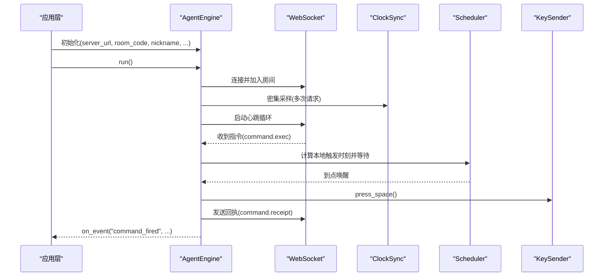
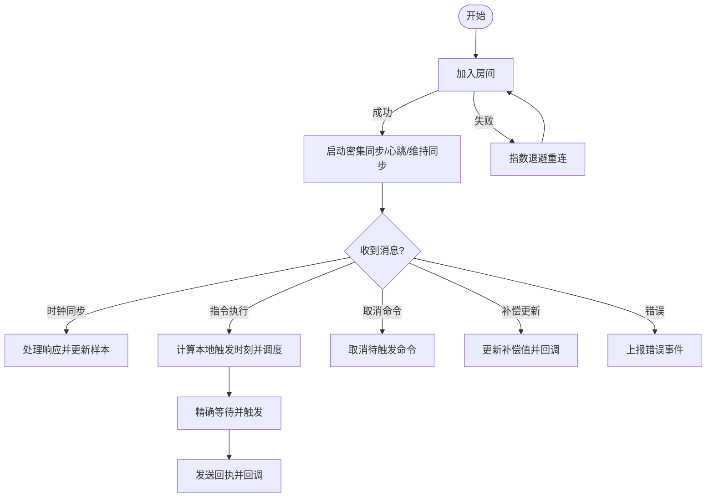
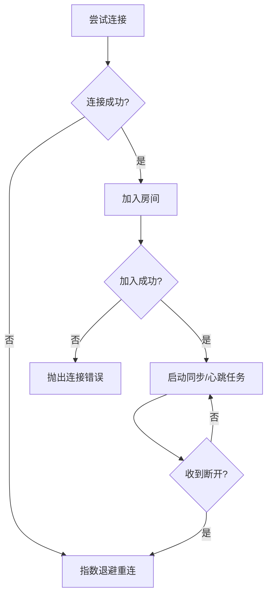
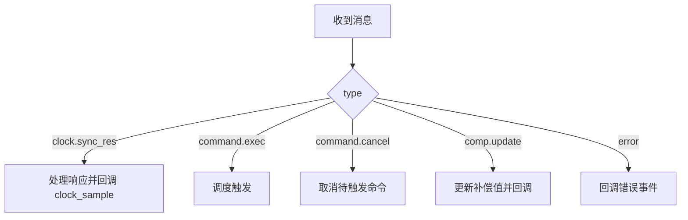
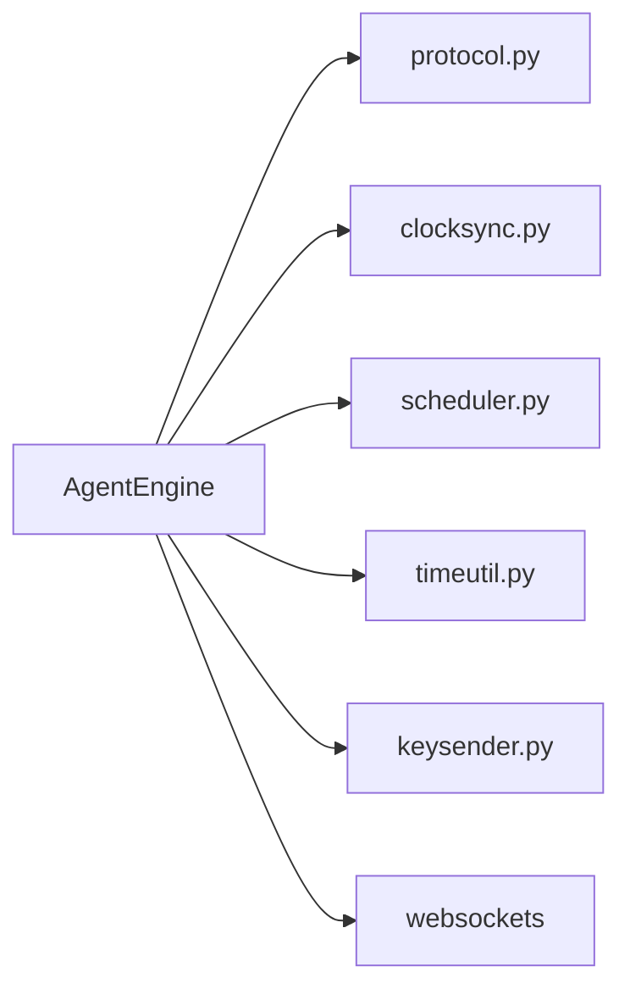

# 核心引擎架构

<cite>
**本文引用的文件**
- [engine.py](file://agent/agent/engine.py)
- [protocol.py](file://agent/agent/protocol.py)
- [clocksync.py](file://agent/agent/clocksync.py)
- [scheduler.py](file://agent/agent/scheduler.py)
- [timeutil.py](file://agent/agent/timeutil.py)
- [keysender.py](file://agent/agent/keysender.py)
- [scriptcue_agent.py](file://agent/scriptcue_agent.py)
- [README.md](file://README.md)
</cite>

## 目录
1. [简介](#简介)
2. [项目结构](#项目结构)
3. [核心组件](#核心组件)
4. [架构总览](#架构总览)
5. [详细组件分析](#详细组件分析)
6. [依赖关系分析](#依赖关系分析)
7. [性能考量](#性能考量)
8. [故障排除指南](#故障排除指南)
9. [结论](#结论)
10. [附录：使用示例与最佳实践](#附录使用示例与最佳实践)

## 简介
本文件面向 ScriptCue 被控端的核心引擎，围绕 AgentEngine 类展开，系统性阐述其事件驱动设计、线程模型（asyncio 事件循环 + 独立触发线程）、连接生命周期管理（WebSocket 建立、房间加入、指数退避重连）、消息分发机制（时钟同步响应、指令调度、取消命令、错误处理）、状态管理（就绪、连接、补偿值、心跳）以及高精度定时触发。文档同时提供初始化与回调使用的指引、性能优化建议与故障排除方法，帮助开发者快速理解并扩展被控端核心能力。

## 项目结构
被控端位于 agent/agent 目录下，核心由以下模块组成：
- engine.py：AgentEngine 主引擎，负责连接、调度、心跳、事件回调等。
- protocol.py：协议常量定义（消息类型、错误码、限制参数、重连策略、时钟同步参数）。
- clocksync.py：类 NTP 时钟同步实现，维护样本与质量评估。
- scheduler.py：高精度定时等待（粗睡眠 + 末段自旋），确保亚毫秒级精度。
- timeutil.py：本地时间工具（毫秒 Unix 时间戳）。
- keysender.py：跨平台空格键注入器（Windows SendInput / macOS CGEventPost）。
- scriptcue_agent.py：GUI 版打包入口，启动 GUI main。



图表来源
- [engine.py:31-128](file://agent/agent/engine.py#L31-L128)
- [protocol.py:1-80](file://agent/agent/protocol.py#L1-L80)
- [clocksync.py:29-106](file://agent/agent/clocksync.py#L29-L106)
- [scheduler.py:33-59](file://agent/agent/scheduler.py#L33-L59)
- [timeutil.py:9-12](file://agent/agent/timeutil.py#L9-L12)
- [keysender.py:99-126](file://agent/agent/keysender.py#L99-L126)

章节来源
- [README.md:16-28](file://README.md#L16-L28)
- [engine.py:1-24](file://agent/agent/engine.py#L1-L24)

## 核心组件
- AgentEngine：被控端同步引擎，封装 WebSocket 连接、房间加入、时钟同步、心跳上报、指令调度与触发回执、事件回调。
- ClockSync：类 NTP 时钟同步，维护采样、老化、质量评估。
- Scheduler：高精度等待，采用“粗睡眠 + 最后阈值自旋”策略。
- KeySender：跨平台空格键注入，支持自检与权限引导。
- Protocol：协议常量，统一消息类型、错误码、重连策略、同步参数。
- TimeUtil：本地毫秒时间获取。

章节来源
- [engine.py:31-128](file://agent/agent/engine.py#L31-L128)
- [clocksync.py:29-106](file://agent/agent/clocksync.py#L29-L106)
- [scheduler.py:33-59](file://agent/agent/scheduler.py#L33-L59)
- [keysender.py:99-126](file://agent/agent/keysender.py#L99-L126)
- [protocol.py:1-80](file://agent/agent/protocol.py#L1-L80)
- [timeutil.py:9-12](file://agent/agent/timeutil.py#L9-L12)

## 架构总览
AgentEngine 运行在调用方创建的 asyncio 事件循环中；指令触发在独立线程中进行，避免阻塞事件循环。连接建立后，启动密集时钟同步、维持性同步与心跳任务；收到服务器消息后统一分发处理；触发完成后通过 run_coroutine_threadsafe 回事件循环发送回执。所有 on_event 回调均在引擎线程中调用，GUI 需自行切换到 UI 线程。



图表来源
- [engine.py:106-157](file://agent/agent/engine.py#L106-L157)
- [engine.py:159-193](file://agent/agent/engine.py#L159-L193)
- [engine.py:198-212](file://agent/agent/engine.py#L198-L212)
- [engine.py:235-241](file://agent/agent/engine.py#L235-L241)
- [engine.py:297-379](file://agent/agent/engine.py#L297-L379)
- [scheduler.py:33-59](file://agent/agent/scheduler.py#L33-L59)
- [keysender.py:121-126](file://agent/agent/keysender.py#L121-L126)

## 详细组件分析

### AgentEngine 设计与生命周期
- 初始化：保存服务端地址、房间码、昵称、密码、房间名、KeySender、on_event、beep_fn；创建 ClockSync；重置补偿值、就绪标志、连接标志、token、lead_ms；初始化待触发事件字典、是否已加入标记、自动重建标记、停止标志。
- 连接生命周期：run 主循环负责指数退避重连；_connect_and_serve 建立 WebSocket，加入房间，启动密集同步、心跳、维持同步任务；异常时清理任务并断开。
- 房间加入：发送 join 消息，处理首次应答；若房间不存在且已加入过则设置自动重建；成功后更新 token、补偿值、lead_ms，重置时钟同步，设置 connected，发出 connected 事件。
- 心跳：周期性发送包含 ready、clock_quality、compensation_ms、offset、rtt、pending_command 的心跳；状态变化时立即补发。
- 消息分发：根据 type 分派到时钟同步响应、指令执行、取消命令、补偿更新、错误处理。
- 绝对时刻调度：将服务器时刻 at 换算为本地触发时刻（减去 offset 与 compensation），在独立线程中精确等待；触发前播放提示音；触发后发送回执并回调事件。
- 取消命令：收到 command.cancel 时，查找对应 pending 的 Event 并 set，回调取消事件。
- 错误处理：捕获 JSON 解析异常、网络异常、回调异常；上报 error 事件。



图表来源
- [engine.py:106-157](file://agent/agent/engine.py#L106-L157)
- [engine.py:159-193](file://agent/agent/engine.py#L159-L193)
- [engine.py:268-291](file://agent/agent/engine.py#L268-L291)
- [engine.py:297-379](file://agent/agent/engine.py#L297-L379)
- [protocol.py:71-73](file://agent/agent/protocol.py#L71-L73)

章节来源
- [engine.py:31-128](file://agent/agent/engine.py#L31-L128)
- [engine.py:159-193](file://agent/agent/engine.py#L159-L193)
- [engine.py:217-245](file://agent/agent/engine.py#L217-L245)
- [engine.py:268-291](file://agent/agent/engine.py#L268-L291)
- [engine.py:297-379](file://agent/agent/engine.py#L297-L379)
- [protocol.py:71-73](file://agent/agent/protocol.py#L71-L73)

### 线程模型与事件回调
- 事件循环：Engine 在 asyncio 事件循环中运行，负责 I/O、消息收发、任务调度。
- 触发线程：每个指令触发在独立 daemon 线程中执行，使用 threading.Event 支持取消；触发完成后通过 run_coroutine_threadsafe 回到事件循环发送回执。
- 回调线程：on_event 在引擎线程中调用，GUI 需要自行切换到 UI 线程以避免界面卡顿或崩溃。

```mermaid
sequenceDiagram
participant Loop as "事件循环"
participant Thread as "触发线程"
participant WS as "WebSocket"
participant KS as "KeySender"
Loop->>Thread : 启动_fire_worker(command_id,...)
Thread->>Thread : 精确等待到点(precise_wait_until)
Thread->>KS : press_space()
Thread->>Loop : run_coroutine_threadsafe(_send_json(receipt))
Loop->>WS : 发送回执
Loop-->>Loop : on_event("command_fired")
```

图表来源
- [engine.py:297-379](file://agent/agent/engine.py#L297-L379)
- [scheduler.py:33-59](file://agent/agent/scheduler.py#L33-L59)
- [keysender.py:121-126](file://agent/agent/keysender.py#L121-L126)

章节来源
- [engine.py:1-10](file://agent/agent/engine.py#L1-L10)
- [engine.py:297-379](file://agent/agent/engine.py#L297-L379)

### 连接生命周期与重连机制
- 连接建立：_connect_and_serve 使用 websockets.connect，设置 open_timeout、ping_interval、ping_timeout；成功后记录 ws 与 loop。
- 房间加入：_join 发送 join 消息，处理首次应答；若 ERR_ROOM_NOT_FOUND 且已加入过，设置 _auto_create=True 以便下次重连自动重建房间。
- 重连策略：run 主循环捕获异常后，按 RECONNECT_BACKOFF_S 进行指数退避，上限 RECONNECT_BACKOFF_MAX_S；每次重连前发出 reconnecting 事件。
- 断线处理：finally 块取消任务、设置 connected=False、发出 disconnected 事件。



图表来源
- [engine.py:106-157](file://agent/agent/engine.py#L106-L157)
- [engine.py:159-193](file://agent/agent/engine.py#L159-L193)
- [protocol.py:71-73](file://agent/agent/protocol.py#L71-L73)

章节来源
- [engine.py:106-157](file://agent/agent/engine.py#L106-L157)
- [engine.py:159-193](file://agent/agent/engine.py#L159-L193)
- [protocol.py:71-73](file://agent/agent/protocol.py#L71-L73)

### 消息分发机制
- 时钟同步响应：处理 CLOCK_SYNC_RES，更新样本并回调 clock_sample 事件，包含 offset、rtt、quality、samples 数量。
- 指令执行：CMD_EXEC 进入调度流程，计算本地触发时刻并启动触发线程。
- 取消命令：CMD_CANCEL 查找对应 command_id 的 Event 并 set，回调 command_cancelled 事件。
- 补偿更新：COMP_UPDATE 更新 compensation_ms 并回调 comp_changed 事件。
- 错误处理：ERROR 类型消息回调 error 事件，包含 code 与 message。



图表来源
- [engine.py:268-291](file://agent/agent/engine.py#L268-L291)

章节来源
- [engine.py:268-291](file://agent/agent/engine.py#L268-L291)

### 状态管理机制
- 就绪状态：set_ready 设置 ready 并立即补发心跳，使服务器感知就绪切换。
- 连接状态：connected 标志在连接建立时置 True，断线时置 False；用于外部判断当前连接可用性。
- 补偿值管理：compensation_ms 可本地修改并通过 AGENT_SET_COMP 上报；也可接收 COMP_UPDATE 从服务器下发更新。
- 心跳发送：周期性发送心跳，包含 ready、clock_quality、compensation_ms、offset、rtt、pending_command；状态变化时立即补发。

章节来源
- [engine.py:67-75](file://agent/agent/engine.py#L67-L75)
- [engine.py:217-245](file://agent/agent/engine.py#L217-L245)
- [engine.py:285-288](file://agent/agent/engine.py#L285-L288)

### 时钟同步与质量评估
- 密集采样：加入房间后立即发送 DENSE_SYNC_SAMPLES 次请求，间隔 DENSE_SYNC_INTERVAL_MS。
- 维持采样：每 MAINTAIN_SYNC_INTERVAL_S 发送一次请求，抑制时钟漂移。
- 样本管理：保留新鲜样本（SAMPLE_MAX_AGE_MS），按 RTT 排序保留最优一批（SAMPLE_KEEP_MAX // 2）。
- 质量分级：基于样本数量与 RTT 评估 excellent/good/poor/none，随心跳上报。

章节来源
- [engine.py:198-212](file://agent/agent/engine.py#L198-L212)
- [clocksync.py:29-106](file://agent/agent/clocksync.py#L29-L106)
- [protocol.py:75-80](file://agent/agent/protocol.py#L75-L80)

### 高精度定时与触发
- 本地触发时刻：local_fire = at - offset - compensation_ms。
- 精确等待：precise_wait_until 采用粗睡眠（最大 0.25s）+ 最后 SPIN_THRESHOLD_MS 自旋，确保亚毫秒级精度；支持取消事件打断。
- 提示音：触发前 3 秒起三次“滴”声，临近到点（<500ms）停止提示，避免干扰精确等待。
- 触发执行：调用 KeySender.press_space()；若异常则记录 status 与 detail。
- 回执发送：fired_at 换算为服务器时钟（加上 offset），发送 command.receipt；回调 command_fired 事件，包含 delta_ms。

章节来源
- [engine.py:297-379](file://agent/agent/engine.py#L297-L379)
- [scheduler.py:33-59](file://agent/agent/scheduler.py#L33-L59)
- [keysender.py:121-126](file://agent/agent/keysender.py#L121-L126)
- [protocol.py:66-80](file://agent/agent/protocol.py#L66-L80)

## 依赖关系分析
- AgentEngine 依赖：
  - protocol：消息类型、错误码、重连策略、同步参数。
  - clocksync：时钟同步与质量评估。
  - scheduler：高精度等待。
  - timeutil：本地时间。
  - keysender：按键注入。
- 外部依赖：websockets 用于 WebSocket 通信。



图表来源
- [engine.py:12-23](file://agent/agent/engine.py#L12-L23)
- [protocol.py:1-80](file://agent/agent/protocol.py#L1-L80)
- [clocksync.py:1-106](file://agent/agent/clocksync.py#L1-L106)
- [scheduler.py:1-59](file://agent/agent/scheduler.py#L1-L59)
- [timeutil.py:1-12](file://agent/agent/timeutil.py#L1-L12)
- [keysender.py:1-126](file://agent/agent/keysender.py#L1-L126)

章节来源
- [engine.py:12-23](file://agent/agent/engine.py#L12-L23)

## 性能考量
- 高精度定时：采用“粗睡眠 + 末段自旋”策略，避免 OS 调度误差导致的延迟抖动；Windows 下提升系统定时器分辨率以改善 sleep 精度。
- 时钟同步：密集采样快速收敛，维持采样抑制漂移；样本老化避免陈旧数据主导估算。
- 心跳频率：5 秒一次，平衡实时性与网络开销；状态变化时立即补发，提高响应性。
- 重连策略：指数退避降低瞬时拥塞压力，上限 10 秒避免频繁重试。
- 回调隔离：on_event 在引擎线程调用，GUI 需自行切换到 UI 线程，避免界面卡顿。
- 按键注入：原生路径最小化延迟；macOS 辅助功能权限检测与引导减少用户操作成本。

[本节为通用性能讨论，不直接分析具体文件]

## 故障排除指南
- 连接失败：检查 server_url 格式（http/https 会被转换为 ws/wss），确认端口与防火墙；查看 connecting/reconnecting/error 事件。
- 房间不存在：若 ERR_ROOM_NOT_FOUND 且已加入过，引擎会自动设置 _auto_create，下次重连重建房间；否则检查密码与房间码。
- 时钟未同步：若 offset 为 None，无法调度触发；检查网络连接与服务器授时服务；观察 clock_sample 事件中的 quality 与 samples。
- 指令未触发：检查补偿值是否正确；确认 precise_wait_until 未被取消；查看 command_fired/command_cancelled 事件。
- 按键注入失败：Windows 下可能被安全软件拦截；macOS 需授予辅助功能权限；使用 KeySender.check() 自检并遵循引导。
- 回调异常：on_event 抛异常会被捕获并记录日志；检查回调实现，避免阻塞或长时间操作。

章节来源
- [engine.py:106-157](file://agent/agent/engine.py#L106-L157)
- [engine.py:159-193](file://agent/agent/engine.py#L159-L193)
- [engine.py:297-379](file://agent/agent/engine.py#L297-L379)
- [keysender.py:107-119](file://agent/agent/keysender.py#L107-L119)

## 结论
AgentEngine 通过事件驱动与多线程模型实现了高可靠、高精度的被控端同步引擎。其连接生命周期管理、时钟同步、指令调度与触发回执形成完整闭环，配合指数退避重连与高质量时钟估计，确保在网络波动环境下仍能达到 ≤50ms 的同步精度。开发者可通过 on_event 回调灵活集成业务逻辑，结合 KeySender 与高精度调度实现稳定可靠的触发行为。

[本节为总结性内容，不直接分析具体文件]

## 附录：使用示例与最佳实践
- 初始化引擎：传入 server_url、room_code、nickname、可选 password/room_name/key_sender/on_event/beep_fn。
- 启动运行：在 asyncio 事件循环中调用 run()，引擎会持续连接并重连。
- 设置就绪：调用 set_ready(True/False) 切换就绪状态并立即补发心跳。
- 调整补偿：调用 set_compensation(ms) 本地修改补偿值并上报服务器。
- 处理事件：在 on_event 中监听 connected/disconnected/reconnecting/error/clock_sample/command_scheduled/command_fired/command_cancelled/comp_changed 等事件。
- 停止与断开：调用 stop() 停止引擎；disconnect() 主动断开当前连接。
- 最佳实践：
  - GUI 应用需在 on_event 回调中切换到 UI 线程更新界面。
  - 合理设置 lead_ms（默认 3000ms）与补偿值，确保网络抖动不影响触发精度。
  - 定期观察 clock_sample 的 quality 与 samples，必要时调整网络或服务器配置。
  - 使用 KeySender.check() 在启动时自检按键注入能力，及时引导用户授权。

章节来源
- [engine.py:31-128](file://agent/agent/engine.py#L31-L128)
- [engine.py:67-75](file://agent/agent/engine.py#L67-L75)
- [engine.py:217-245](file://agent/agent/engine.py#L217-L245)
- [engine.py:268-291](file://agent/agent/engine.py#L268-L291)
- [engine.py:297-379](file://agent/agent/engine.py#L297-L379)
- [keysender.py:107-119](file://agent/agent/keysender.py#L107-L119)
- [scriptcue_agent.py:1-10](file://agent/scriptcue_agent.py#L1-L10)
- [README.md:61-79](file://README.md#L61-L79)