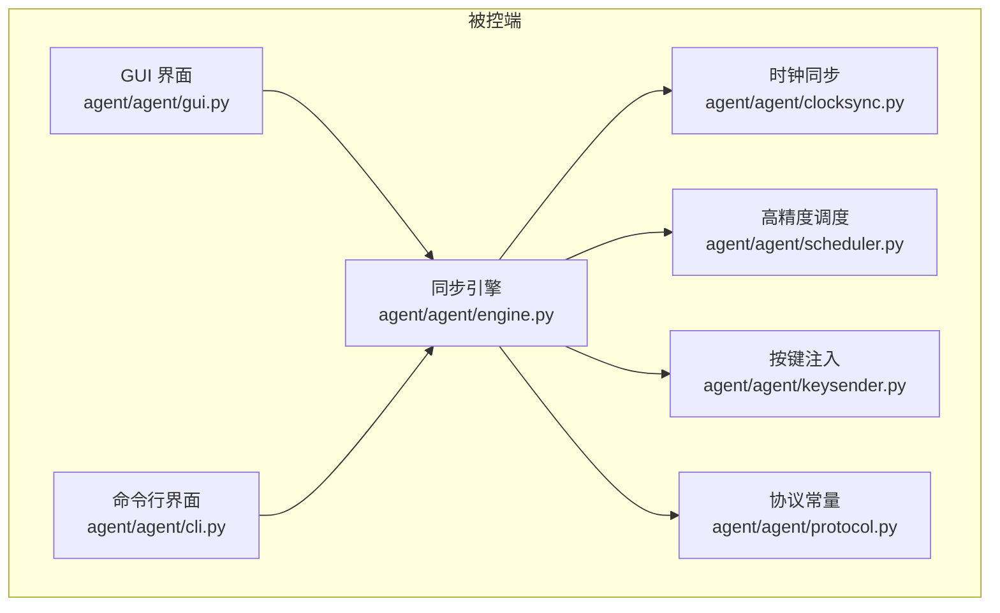
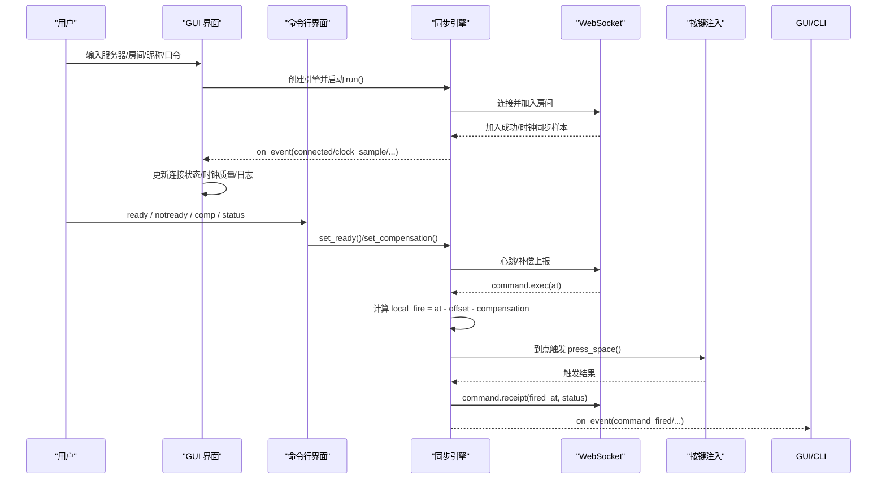
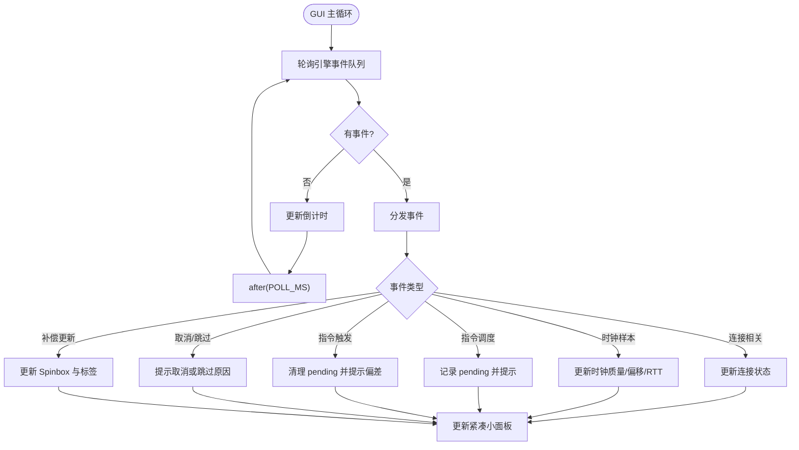
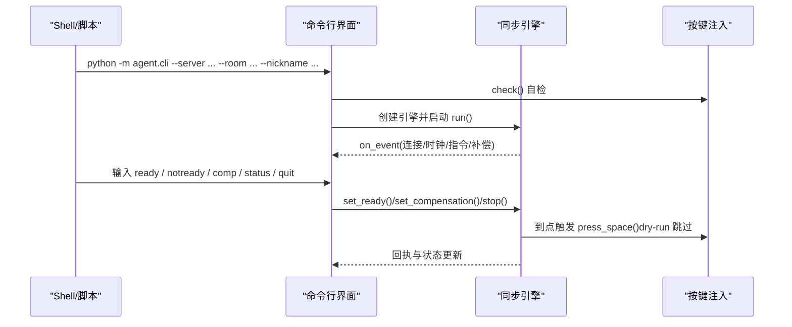
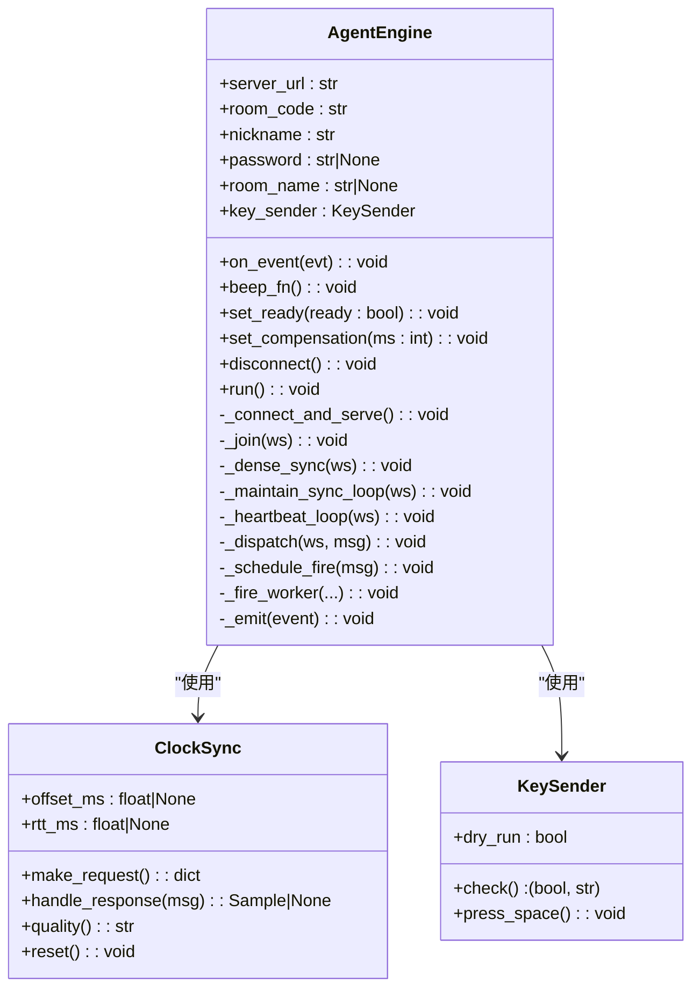
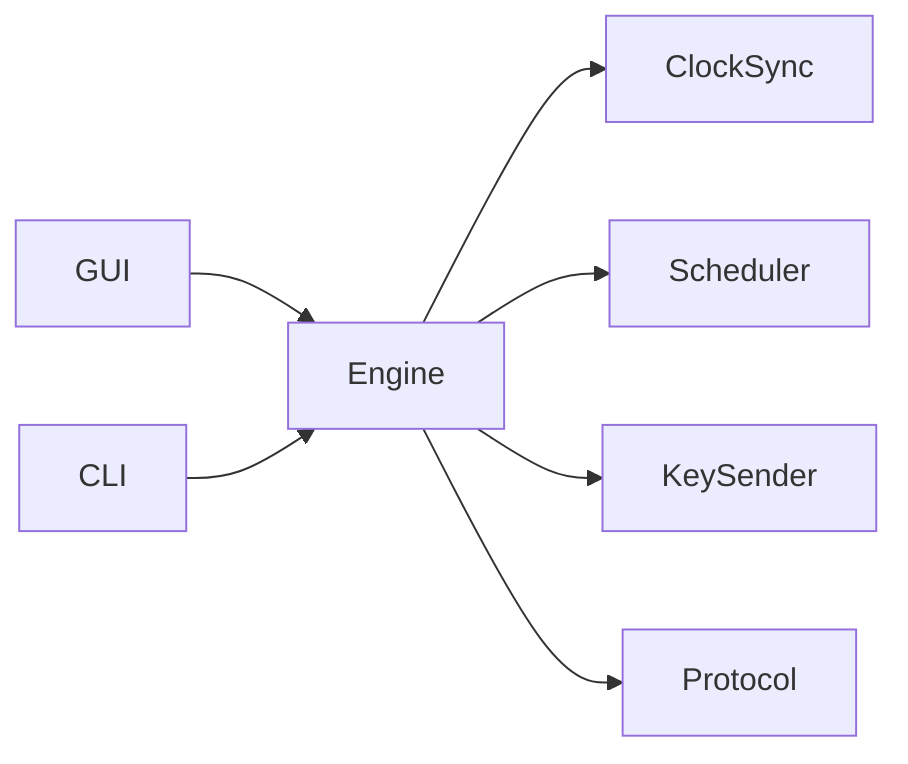

# 用户界面实现

<cite>
**本文引用的文件**
- [gui.py](file://agent/agent/gui.py)
- [cli.py](file://agent/agent/cli.py)
- [engine.py](file://agent/agent/engine.py)
- [protocol.py](file://agent/agent/protocol.py)
- [clocksync.py](file://agent/agent/clocksync.py)
- [scheduler.py](file://agent/agent/scheduler.py)
- [keysender.py](file://agent/agent/keysender.py)
- [__main__.py](file://agent/agent/__main__.py)
- [scriptcue_agent.py](file://agent/scriptcue_agent.py)
- [README.md](file://README.md)
</cite>

## 目录
1. [简介](#简介)
2. [项目结构](#项目结构)
3. [核心组件](#核心组件)
4. [架构总览](#架构总览)
5. [详细组件分析](#详细组件分析)
6. [依赖关系分析](#依赖关系分析)
7. [性能考量](#性能考量)
8. [故障排查指南](#故障排查指南)
9. [结论](#结论)
10. [附录：使用示例与定制指南](#附录使用示例与定制指南)

## 简介
本文件面向 ScriptCue 被控端用户界面的开发与维护，聚焦 GUI（Tkinter）与命令行（CLI）两种实现方式的差异、事件处理机制、界面组件结构与扩展点。文档同时覆盖时钟同步状态监控、房间信息展示、连接状态显示、用户交互控件、启动参数配置、日志输出格式与批处理支持等主题，并提供界面定制、常见问题解决方案与最佳实践建议。

## 项目结构
被控端位于 agent 目录，GUI 与 CLI 共享同一“同步引擎”AgentEngine，通过 KeySender 完成按键注入，通过 ClockSync 进行类 NTP 的时钟同步，并通过 scheduler 实现高精度定时触发。协议常量在 protocol.py 中统一定义，确保与服务端一致。

图表来源
- [gui.py:96-464](file://agent/agent/gui.py#L96-L464)
- [cli.py:104-139](file://agent/agent/cli.py#L104-L139)
- [engine.py:31-388](file://agent/agent/engine.py#L31-L388)
- [clocksync.py:29-106](file://agent/agent/clocksync.py#L29-L106)
- [scheduler.py:33-59](file://agent/agent/scheduler.py#L33-L59)
- [keysender.py:99-126](file://agent/agent/keysender.py#L99-L126)
- [protocol.py:7-80](file://agent/agent/protocol.py#L7-L80)

章节来源
- [README.md:1-86](file://README.md#L1-L86)

## 核心组件
- GUI 界面（Tkinter）：提供加入房间、连接状态、时钟同步质量、指令倒计时、就绪切换、补偿值设置、紧凑小面板、运行日志等功能。
- 命令行界面（CLI）：提供启动参数解析、交互式命令（ready/notready/comp/status/quit）、演练模式（dry-run）、标准输出日志。
- 同步引擎（AgentEngine）：负责 WebSocket 连接生命周期、时钟同步、心跳上报、指令调度与触发回执、异常与重连。
- 时钟同步（ClockSync）：类 NTP 算法，采样并估算偏移与 RTT，按质量分级上报。
- 高精度调度（Scheduler）：粗睡眠 + 末段自旋等待，保证到点触发的亚毫秒级精度。
- 按键注入（KeySender）：跨平台空格键注入，含开机自检与 macOS 辅助功能权限引导。
- 协议常量（Protocol）：消息类型、错误码、限制与同步参数，保持与服务端一致。

章节来源
- [gui.py:96-464](file://agent/agent/gui.py#L96-L464)
- [cli.py:104-139](file://agent/agent/cli.py#L104-L139)
- [engine.py:31-388](file://agent/agent/engine.py#L31-L388)
- [clocksync.py:29-106](file://agent/agent/clocksync.py#L29-L106)
- [scheduler.py:33-59](file://agent/agent/scheduler.py#L33-L59)
- [keysender.py:99-126](file://agent/agent/keysender.py#L99-L126)
- [protocol.py:7-80](file://agent/agent/protocol.py#L7-L80)

## 架构总览
GUI 与 CLI 均通过 AgentEngine 与服务器通信，引擎内部维护时钟同步、心跳、指令调度与触发回执。GUI 将引擎事件队列化并在 UI 线程轮询更新；CLI 直接打印日志。触发时由独立线程执行精确等待与按键注入，再通过回调通知引擎发送回执。

图表来源
- [gui.py:206-251](file://agent/agent/gui.py#L206-L251)
- [cli.py:65-139](file://agent/agent/cli.py#L65-L139)
- [engine.py:106-193](file://agent/agent/engine.py#L106-L193)
- [engine.py:268-388](file://agent/agent/engine.py#L268-L388)
- [keysender.py:107-126](file://agent/agent/keysender.py#L107-L126)

## 详细组件分析

### GUI 界面（Tkinter）
- 组件结构
  - 连接区：服务器地址、房间码、口令、昵称输入与加入/断开按钮。
  - 状态区：连接状态文本（颜色区分）、时钟同步质量与偏移、RTT、本地补偿值。
  - 指令倒计时区：显示最近一条待触发指令的剩余时间与状态。
  - 就绪与补偿：一键切换就绪状态；Spinbox 调整补偿值并应用。
  - 运行日志：带时间戳的滚动日志，限制行数避免内存增长。
  - 工具行：窗口置顶开关、紧凑小面板入口。
  - 紧凑小面板：可拖动、置顶、双击关闭，实时显示连接状态与倒计时。
- 事件处理机制
  - 引擎事件通过 queue.Queue 从引擎线程投递到 GUI 线程，采用 after(POLL_MS) 轮询消费。
  - 事件类型包括 connecting/connected/disconnected/reconnecting/error/clock_sample/command_scheduled/command_fired/command_cancelled/fire_skipped/comp_changed。
  - 倒计时更新基于 pending 字典与 now_ms() 计算剩余时间，颜色随临近变化。
- 异常与健壮性
  - 加入房间前校验必填项与房间码长度。
  - 补偿值输入校验为整数毫秒。
  - 关闭窗口时主动断开引擎连接。
  - 提示音函数在不同平台安全降级。
- 配置持久化
  - 保存 server/room/nickname/topmost/compensation 等配置到用户目录 JSON 文件。

图表来源
- [gui.py:291-370](file://agent/agent/gui.py#L291-L370)
- [gui.py:338-421](file://agent/agent/gui.py#L338-L421)

章节来源
- [gui.py:96-464](file://agent/agent/gui.py#L96-L464)

### 命令行界面（CLI）
- 启动参数
  - --server：服务器地址（自动转换为 ws/wss）。
  - --room：6 位房间码。
  - --nickname：设备昵称。
  - --password：可选口令。
  - --room-name：可选房间名（服务器重启后自动重建时使用）。
  - --dry-run：演练模式，不实际注入按键。
- 交互命令
  - ready / notready：切换就绪状态。
  - comp <毫秒>：设置本地补偿值。
  - status：查看连接、就绪、时钟质量、样本数、补偿值等。
  - quit / exit / q：退出程序。
- 日志输出格式
  - 统一以 [HH:MM:SS.mmm] 时间戳开头，便于与主控端/录像对时。
  - 事件类型包括连接、时钟采样、指令调度/触发/取消、补偿更新等。
- 批处理支持
  - 可通过脚本循环调用 CLI 并传入不同参数，结合标准输入/输出进行自动化控制。
  - dry-run 适合联调与演练，避免真实按键注入。

图表来源
- [cli.py:104-139](file://agent/agent/cli.py#L104-L139)
- [engine.py:106-193](file://agent/agent/engine.py#L106-L193)
- [keysender.py:107-126](file://agent/agent/keysender.py#L107-L126)

章节来源
- [cli.py:1-139](file://agent/agent/cli.py#L1-139)

### 同步引擎（AgentEngine）
- 连接生命周期
  - 标准化 URL（http/https 转 ws/wss），连接超时与心跳间隔配置。
  - 指数退避重连策略，断线后自动重试。
  - 加入房间失败时根据错误码判断是否自动重建房间。
- 时钟同步
  - 加入后立即密集采样，随后周期性维持采样。
  - 质量分级用于心跳上报，UI 展示质量与偏移、RTT。
- 指令调度与触发
  - 收到 command.exec 后计算 local_fire = at - offset - compensation。
  - 使用 precise_wait_until 进行粗睡眠 + 末段自旋等待。
  - 触发前 3 秒播放提示音（R-08），到点前 500ms 停止提示音以保证精度。
  - 触发完成后发送 command.receipt，包含 fired_at 与状态。
- 线程模型
  - 引擎运行在 asyncio 事件循环中；触发在独立线程执行。
  - on_event 回调在引擎线程中调用，GUI 需切换到 UI 线程（通过队列+after）。

图表来源
- [engine.py:31-388](file://agent/agent/engine.py#L31-L388)
- [clocksync.py:29-106](file://agent/agent/clocksync.py#L29-L106)
- [keysender.py:99-126](file://agent/agent/keysender.py#L99-L126)

章节来源
- [engine.py:31-388](file://agent/agent/engine.py#L31-L388)

### 时钟同步（ClockSync）
- 算法要点
  - 发送请求携带 t0，接收应答 ts，计算 offset = ts - (t0 + t1)/2，rtt = t1 - t0。
  - 保留新鲜样本（老化窗口），取 RTT 最小者作为可信偏移。
  - 质量分级：excellent/good/poor/none，依据样本数量与 RTT。
- 复杂度与优化
  - 样本上限与排序裁剪，避免无限增长。
  - 频繁采样但轻量计算，适合高频网络环境。

章节来源
- [clocksync.py:29-106](file://agent/agent/clocksync.py#L29-L106)

### 高精度调度（Scheduler）
- 策略
  - 粗睡眠：每次最长 0.25s，支持取消事件打断。
  - 末段自旋：最后 50ms 忙等逼近目标时刻，误差亚毫秒级。
- 平台优化
  - Windows 提升系统定时器分辨率至 1ms，改善 sleep 精度。

章节来源
- [scheduler.py:33-59](file://agent/agent/scheduler.py#L33-L59)

### 按键注入（KeySender）
- 平台实现
  - Windows：SendInput 直接注入空格键。
  - macOS：pynput 封装 CGEventPost，需辅助功能权限。
- 自检与引导
  - 启动时检查权限与注入能力，macOS 打开系统设置页面引导授权。
  - dry-run 模式跳过实际注入，便于联调。

章节来源
- [keysender.py:99-126](file://agent/agent/keysender.py#L99-L126)

## 依赖关系分析
- GUI/CLI 与引擎解耦：两者仅通过 AgentEngine 暴露的接口交互，便于替换或扩展。
- 引擎与底层模块耦合度低：ClockSync、Scheduler、KeySender 职责单一，易于测试与维护。
- 协议常量集中管理：避免硬编码字符串，降低版本不一致风险。

图表来源
- [gui.py:96-464](file://agent/agent/gui.py#L96-L464)
- [cli.py:104-139](file://agent/agent/cli.py#L104-L139)
- [engine.py:31-388](file://agent/agent/engine.py#L31-L388)
- [protocol.py:7-80](file://agent/agent/protocol.py#L7-L80)

章节来源
- [protocol.py:7-80](file://agent/agent/protocol.py#L7-L80)

## 性能考量
- 事件轮询间隔：GUI 使用 60ms 轮询引擎事件，兼顾响应性与 CPU 占用。
- 时钟采样频率：加入房间后密集采样 20 次，间隔 50ms；后续每 30s 维持一次。
- 触发精度：粗睡眠 + 末段自旋，Windows 下提升系统定时器分辨率，确保到点触发误差可控。
- 日志限制：GUI 日志行数上限 200 行，防止内存增长。
- 提示音时机：触发前 3 秒开始提示，到点前 500ms 停止，避免干扰精确等待。

[本节为通用性能讨论，不直接分析具体文件]

## 故障排查指南
- 连接问题
  - 检查服务器地址是否正确（http/https 会被自动转换）。
  - 观察 reconnecting 事件与延迟，确认网络稳定性。
  - 若房间丢失，引擎会自动尝试重建房间（需 room_name）。
- 时钟未同步
  - 若收到 fire_skipped 且原因为“时钟未同步”，等待密集采样完成后再触发。
  - 查看 clock_sample 事件中的质量与 RTT，评估网络质量。
- 触发失败
  - 检查 KeySender.check() 返回结果，macOS 需授予辅助功能权限。
  - dry-run 模式下不会实际注入按键，联调时可启用。
- 补偿值异常
  - GUI 中输入非整数会弹出警告；CLI 中 comp 命令需整数毫秒。
  - 远程补偿更新会通过 comp_changed 事件刷新 UI。
- 日志与调试
  - GUI 日志限制行数，必要时导出或临时放宽限制。
  - CLI 输出包含时间戳与详细字段，便于定位问题。

章节来源
- [engine.py:106-193](file://agent/agent/engine.py#L106-L193)
- [engine.py:268-388](file://agent/agent/engine.py#L268-L388)
- [keysender.py:107-126](file://agent/agent/keysender.py#L107-L126)
- [gui.py:206-251](file://agent/agent/gui.py#L206-L251)
- [cli.py:65-139](file://agent/agent/cli.py#L65-L139)

## 结论
GUI 与 CLI 共享同一高可靠同步引擎，前者侧重用户体验与可视化监控，后者侧重快速验证与自动化集成。通过解耦设计、严格的事件处理与高精度调度，ScriptCue 被控端能够在公网环境下实现 ≤50ms 精度的同步起播。开发者可基于现有扩展点（事件回调、提示音、按键注入）进行二次开发，满足更多业务场景需求。

[本节为总结性内容，不直接分析具体文件]

## 附录：使用示例与定制指南

### 使用示例
- GUI 版
  - 启动：python -m agent.gui
  - 操作：填写服务器、房间码、昵称、口令，点击“加入房间”；切换就绪；调整补偿值；查看紧凑小面板与日志。
- CLI 版
  - 启动：python -m agent.cli --server ws://127.0.0.1:8000 --room AB12CD --nickname 测试机
  - 命令：ready / notready / comp <毫秒> / status / quit
  - 演练：添加 --dry-run 跳过实际按键注入

章节来源
- [README.md:61-78](file://README.md#L61-L78)
- [cli.py:104-139](file://agent/agent/cli.py#L104-L139)

### 界面定制指南
- 主题配置
  - GUI 字体与颜色可在 gui.py 中调整 UI_FONT、UI_FONT_LARGE 及颜色常量。
  - 紧凑小面板背景色与字体可在 _open_panel 中修改。
- 布局调整
  - 主窗口尺寸与最小尺寸可在 _build_ui 中调整 geometry/minsize。
  - 各区域（连接区、状态区、倒计时区、就绪与补偿、日志区、工具行）可通过 pack/grid 重新排列。
- 扩展点说明
  - 事件回调：on_event 可在 GUI 中扩展更多状态展示或行为。
  - 提示音：beep_fn 可替换为自定义声音或静音。
  - 按键注入：KeySender 可替换为其他输入模拟方式（需保持接口一致）。
  - 日志：可接入外部日志系统或增加过滤级别。

章节来源
- [gui.py:96-464](file://agent/agent/gui.py#L96-L464)
- [keysender.py:99-126](file://agent/agent/keysender.py#L99-L126)

### 自定义开发指导
- 新增事件类型
  - 在 engine.py 的 _dispatch 中添加分支，并在 GUI/CLI 中处理对应事件。
- 自定义触发逻辑
  - 在 _fire_worker 中扩展触发前的准备动作或触发后的清理逻辑。
- 多平台兼容
  - 在 keysender.py 中为新平台添加实现，并确保 check() 与 press_space() 行为一致。

章节来源
- [engine.py:268-388](file://agent/agent/engine.py#L268-L388)
- [keysender.py:99-126](file://agent/agent/keysender.py#L99-L126)

### 常见问题解决方案
- 无法加入房间
  - 检查房间码是否为 6 位；确认服务器地址与端口可达。
  - 若房间不存在且曾加入过，引擎会自动尝试重建房间。
- 时钟质量差
  - 网络抖动导致 RTT 升高，等待稳定后质量会提升。
  - 可手动调整补偿值以优化触发时机。
- macOS 权限问题
  - 按照提示打开系统设置 → 隐私与安全性 → 辅助功能，勾选本程序。
  - 授权后可能需要重启程序。
- 日志过多影响性能
  - GUI 已限制日志行数；如需更详细日志，可临时调整限制或切换至 CLI 模式。

章节来源
- [gui.py:206-251](file://agent/agent/gui.py#L206-L251)
- [gui.py:360-370](file://agent/agent/gui.py#L360-L370)
- [keysender.py:107-126](file://agent/agent/keysender.py#L107-L126)