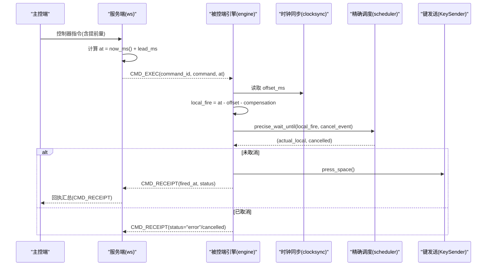
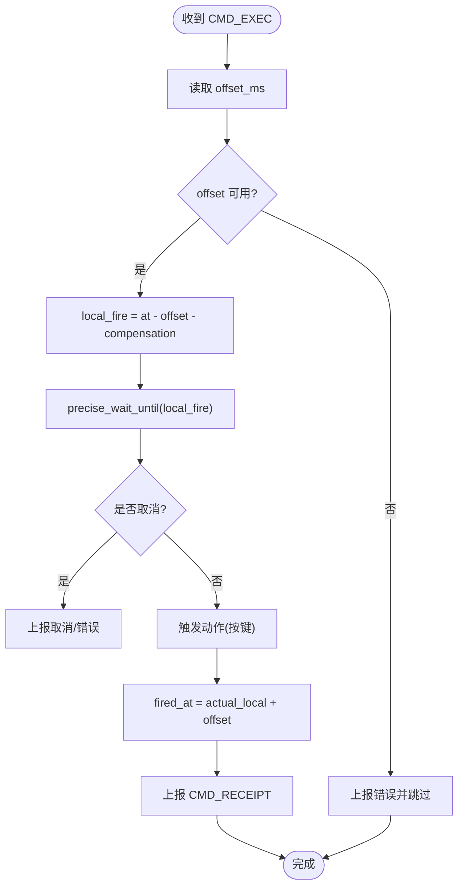
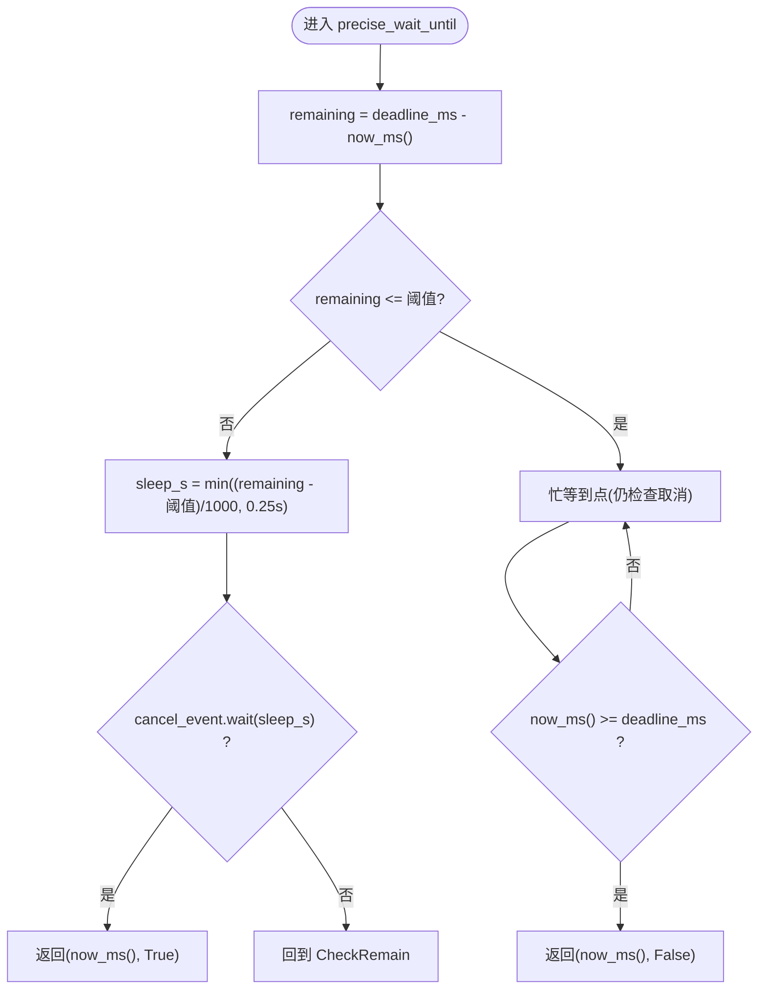
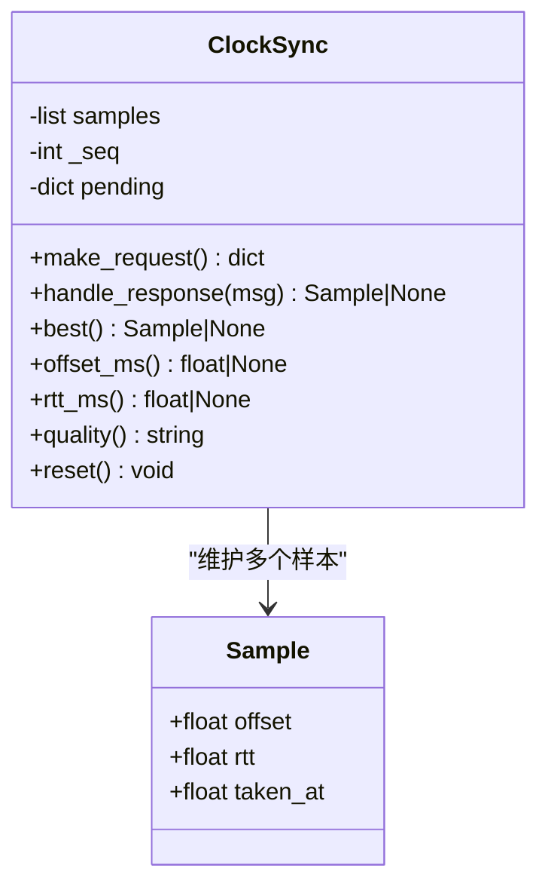
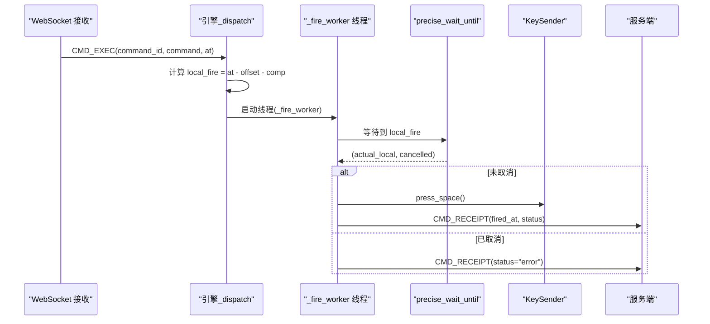
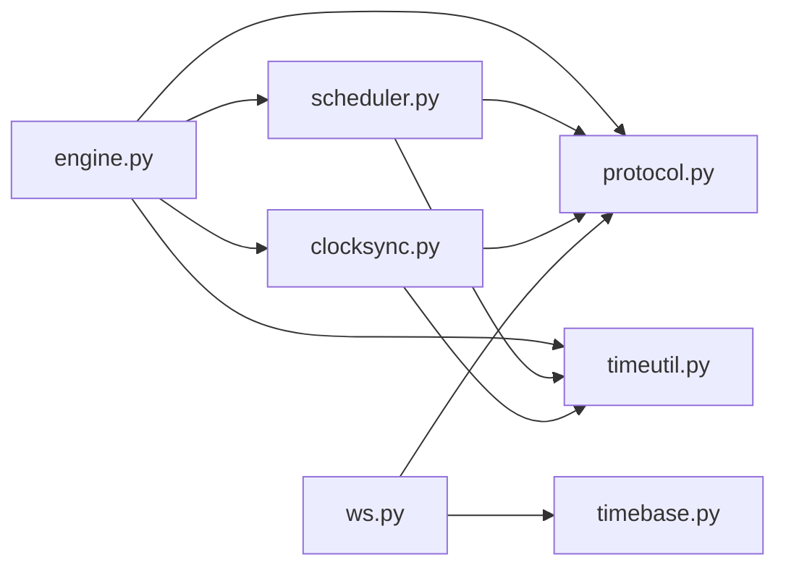

# 精确调度系统

<cite>
**本文引用的文件**
- [scheduler.py](file://agent/agent/scheduler.py)
- [timeutil.py](file://agent/agent/timeutil.py)
- [clocksync.py](file://agent/agent/clocksync.py)
- [engine.py](file://agent/agent/engine.py)
- [protocol.py](file://agent/agent/protocol.py)
- [ws.py](file://server/server/ws.py)
- [timebase.py](file://server/server/timebase.py)
- [README.md](file://README.md)
</cite>

## 目录
1. [简介](#简介)
2. [项目结构](#项目结构)
3. [核心组件](#核心组件)
4. [架构总览](#架构总览)
5. [详细组件分析](#详细组件分析)
6. [依赖关系分析](#依赖关系分析)
7. [性能考量](#性能考量)
8. [故障排除指南](#故障排除指南)
9. [结论](#结论)
10. [附录](#附录)

## 简介
本技术文档聚焦 ScriptCue 被控端的“精确调度系统”，围绕绝对时刻调度算法、时钟同步与补偿、高精度等待实现、指令调度流程、性能优化策略以及测试与排障方法展开。目标是帮助读者理解并掌握从服务器时间到本地时间的转换、补偿值应用、精确定时机制，以及如何通过忙等待与取消机制保证亚毫秒级触发精度与线程安全。

## 项目结构
被控端（Agent）与服务端（Server）通过 WebSocket 通信，采用类 NTP 的时钟同步机制，将服务器下发的绝对执行时刻转换为本地时间，并在目标时刻精确触发动作。关键模块包括：
- 时钟同步：估算本地与服务器时钟偏移
- 时间工具：提供高精度本地时间戳
- 精确调度：粗睡眠 + 末段自旋等待
- 引擎：连接管理、消息分发、指令调度与回执上报
- 协议常量：统一的消息类型与限制参数
- 服务端：授时基准、会话处理、指令下发与回执汇聚

```mermaid
graph TB
subgraph "被控端"
A["engine.py<br/>连接/心跳/调度"]
B["clocksync.py<br/>时钟同步"]
C["scheduler.py<br/>精确等待"]
D["timeutil.py<br/>本地时间"]
E["protocol.py<br/>协议常量"]
end
subgraph "服务端"
F["ws.py<br/>会话/指令/回执"]
G["timebase.py<br/>服务器时间"]
end
A --> B
A --> C
A --> D
A --> E
A < --> F
F --> G
```

**图表来源**
- [engine.py:106-157](file://agent/agent/engine.py#L106-L157)
- [clocksync.py:29-106](file://agent/agent/clocksync.py#L29-L106)
- [scheduler.py:33-58](file://agent/agent/scheduler.py#L33-L58)
- [timeutil.py:9-11](file://agent/agent/timeutil.py#L9-L11)
- [protocol.py:23-35](file://agent/agent/protocol.py#L23-L35)
- [ws.py:246-327](file://server/server/ws.py#L246-L327)
- [timebase.py:10-12](file://server/server/timebase.py#L10-L12)

**章节来源**
- [README.md:16-27](file://README.md#L16-L27)

## 核心组件
- 时钟同步（ClockSync）：基于多次 ping/pong 采样，取 RTT 最小的样本作为可信偏移，支持新鲜度过滤与质量分级。
- 精确等待（precise_wait_until）：在距离目标较远时使用可中断的粗睡眠；进入最后阈值后切换为忙等自旋，确保亚毫秒级到达。
- 引擎（AgentEngine）：负责连接生命周期、心跳上报、指令接收、时间计算、等待执行与回执发送；使用独立线程执行触发以避免阻塞事件循环。
- 时间工具（now_ms）：提供高精度本地毫秒时间戳。
- 协议常量（protocol）：定义消息类型、质量等级、重连退避、同步参数等。
- 服务端会话（ws）：处理主控端与被控端消息，下发带绝对时刻的指令，汇聚回执并通知主控端。
- 服务器时间（timebase）：统一的服务器高精度时间源。

**章节来源**
- [clocksync.py:29-106](file://agent/agent/clocksync.py#L29-L106)
- [scheduler.py:33-58](file://agent/agent/scheduler.py#L33-L58)
- [engine.py:31-388](file://agent/agent/engine.py#L31-L388)
- [timeutil.py:9-11](file://agent/agent/timeutil.py#L9-L11)
- [protocol.py:49-79](file://agent/agent/protocol.py#L49-L79)
- [ws.py:67-104](file://server/server/ws.py#L67-L104)
- [timebase.py:10-12](file://server/server/timebase.py#L10-L12)

## 架构总览
被控端加入房间后，立即进行密集时钟同步，随后周期性维持采样。收到 CMD_EXEC 指令后，引擎根据当前偏移与补偿值计算本地触发时刻，启动独立线程执行 precise_wait_until，并在到点时调用 KeySender 模拟按键，最终上报回执。



**图表来源**
- [ws.py:67-104](file://server/server/ws.py#L67-L104)
- [engine.py:297-379](file://agent/agent/engine.py#L297-L379)
- [clocksync.py:71-87](file://agent/agent/clocksync.py#L71-L87)
- [scheduler.py:33-58](file://agent/agent/scheduler.py#L33-L58)

## 详细组件分析

### 绝对时刻调度算法
- 服务器时间来源：服务端 timebase.now_ms() 提供高精度毫秒时间戳。
- 指令下发：服务端在收到控制器指令后，计算 at = now_ms() + lead_ms，并通过 CMD_EXEC 下发给被控端。
- 本地时间换算：被控端使用 ClockSync 获取 offset_ms，结合用户设置的 compensation_ms，计算 local_fire = at - offset - compensation。
- 精确等待：使用 precise_wait_until 在 local_fire 时刻触发；该函数采用“粗睡眠 + 末段自旋”策略，确保接近目标时的高精度。
- 回执上报：触发完成后，将被控端实际本地时间 actual_local 加上 offset 换算为服务器时间 fired_at，并上报 CMD_RECEIPT。



**图表来源**
- [ws.py:67-104](file://server/server/ws.py#L67-L104)
- [engine.py:297-379](file://agent/agent/engine.py#L297-L379)
- [timebase.py:10-12](file://server/server/timebase.py#L10-L12)

**章节来源**
- [ws.py:67-104](file://server/server/ws.py#L67-L104)
- [engine.py:297-379](file://agent/agent/engine.py#L297-L379)
- [timebase.py:10-12](file://server/server/timebase.py#L10-L12)

### precise_wait_until 高精度等待实现
- 输入：deadline_ms（目标本地毫秒时间）、可选 cancel_event（取消信号）。
- 策略：
  - 当剩余时间大于阈值（默认 SPIN_THRESHOLD_MS=50ms）时，使用可中断的 sleep 分段等待，最大单次睡眠时长受 COARSE_SLEEP_CHUNK_S 限制，保证取消响应及时。
  - 进入最后阈值后，切换为忙等自旋，持续检查 now_ms() 与 cancel_event，直到达到 deadline_ms 或取消。
- 返回：(实际醒来时刻, 是否被取消)。
- 平台优化：Windows 下提升系统定时器分辨率，改善 sleep 精度。



**图表来源**
- [scheduler.py:33-58](file://agent/agent/scheduler.py#L33-L58)
- [protocol.py:75-79](file://agent/agent/protocol.py#L75-L79)

**章节来源**
- [scheduler.py:33-58](file://agent/agent/scheduler.py#L33-L58)
- [protocol.py:75-79](file://agent/agent/protocol.py#L75-L79)

### 时钟同步与补偿值
- 采样模型：被控端发送 CLOCK_SYNC_REQ（携带 t0），服务端回复 CLOCK_SYNC_RES（携带 ts），被控端记录 t1，计算 offset = ts - (t0 + t1)/2，rtt = t1 - t0。
- 样本管理：保留最新且 RTT 较小的样本，设置最大保留数量与老化窗口，避免陈旧样本主导估计。
- 质量分级：根据样本数量与 RTT 给出 excellent/good/poor/none 等级，随心跳上报。
- 补偿值：用户可通过 set_compensation 修改本地补偿值，立即生效并上报服务器；服务器也可下发 COMP_UPDATE 更新被控端补偿值。



**图表来源**
- [clocksync.py:22-106](file://agent/agent/clocksync.py#L22-L106)

**章节来源**
- [clocksync.py:22-106](file://agent/agent/clocksync.py#L22-L106)
- [engine.py:217-245](file://agent/agent/engine.py#L217-L245)
- [ws.py:305-315](file://server/server/ws.py#L305-L315)

### 指令调度流程（接收→计算→等待→回执）
- 接收：引擎在事件循环中接收 JSON 消息，分派到 _dispatch。
- 计算：对 CMD_EXEC，读取 offset_ms 与 compensation_ms，计算 local_fire。
- 等待：创建独立线程执行 _fire_worker，内部调用 precise_wait_until。
- 回执：触发后计算 fired_at（服务器时间），发送 CMD_RECEIPT，并回调 on_event 事件。



**图表来源**
- [engine.py:268-379](file://agent/agent/engine.py#L268-L379)
- [scheduler.py:33-58](file://agent/agent/scheduler.py#L33-L58)

**章节来源**
- [engine.py:268-379](file://agent/agent/engine.py#L268-L379)

### 线程模型与取消机制
- 线程模型：引擎运行于 asyncio 事件循环；触发在独立线程中进行，避免忙等阻塞事件循环。
- 取消机制：每个待执行命令对应一个 threading.Event；收到 CMD_CANCEL 时设置该事件，使 precise_wait_until 立即返回。
- 线程安全：通过 run_coroutine_threadsafe 从任意线程向事件循环发送消息；引擎状态字段在构造期初始化，避免竞态。

**章节来源**
- [engine.py:31-10](file://agent/agent/engine.py#L31-L10)
- [engine.py:277-284](file://agent/agent/engine.py#L277-L284)
- [engine.py:329-379](file://agent/agent/engine.py#L329-L379)

## 依赖关系分析
- 被控端依赖：
  - engine 依赖 clocksync、scheduler、timeutil、protocol。
  - scheduler 依赖 protocol（SPIN_THRESHOLD_MS）与 timeutil（now_ms）。
  - clocksync 依赖 protocol（质量等级）与 timeutil（now_ms）。
- 服务端依赖：
  - ws 依赖 timebase（服务器时间）与 protocol（消息类型）。
  - 服务端与客户端通过 WebSocket 交换 CMD_EXEC、CMD_RECEIPT、CLOCK_SYNC_*、COMP_UPDATE 等消息。



**图表来源**
- [engine.py:19-23](file://agent/agent/engine.py#L19-L23)
- [scheduler.py:17-18](file://agent/agent/scheduler.py#L17-L18)
- [clocksync.py:13-14](file://agent/agent/clocksync.py#L13-L14)
- [ws.py:15-18](file://server/server/ws.py#L15-L18)

**章节来源**
- [engine.py:19-23](file://agent/agent/engine.py#L19-L23)
- [scheduler.py:17-18](file://agent/agent/scheduler.py#L17-L18)
- [clocksync.py:13-14](file://agent/agent/clocksync.py#L13-L14)
- [ws.py:15-18](file://server/server/ws.py#L15-L18)

## 性能考量
- 忙等待优化：
  - 仅在最后 50ms 内启用自旋，减少 CPU 占用；其余时间使用可中断 sleep，降低功耗。
  - Windows 下提升系统定时器分辨率，提高 sleep 精度。
- CPU 使用率控制：
  - 自旋期间仅做轻量比较与取消检查，避免空转过猛。
  - 提示音逻辑在临近到点前停止，防止干扰精确等待。
- 内存管理：
  - 时钟样本按 RTT 排序保留最优一批，并设置最大保留数量与老化窗口，避免无限增长。
  - 待执行命令集合使用字典存储，触发完成后及时清理。
- 网络与心跳：
  - 心跳间隔固定，包含时钟质量、偏移、RTT、补偿值等信息，便于监控与诊断。
  - 重连采用指数退避，上限 10s，避免风暴式重连。

**章节来源**
- [scheduler.py:29-58](file://agent/agent/scheduler.py#L29-L58)
- [clocksync.py:57-69](file://agent/agent/clocksync.py#L57-L69)
- [engine.py:217-245](file://agent/agent/engine.py#L217-L245)
- [protocol.py:65-79](file://agent/agent/protocol.py#L65-L79)

## 故障排除指南
- 时钟未同步：
  - 现象：收到 CMD_EXEC 后立即上报错误并跳过触发。
  - 排查：检查密集同步是否成功（DENSE_SYNC_SAMPLES=20，间隔 50ms），确认 offset_ms 非空。
  - 参考：[engine.py:304-311](file://agent/agent/engine.py#L304-L311)
- 补偿值异常：
  - 现象：补偿值超出允许范围或被拒绝。
  - 排查：确认补偿值在 [-10000, 10000] 范围内；检查服务器下发 COMP_UPDATE 是否正确。
  - 参考：[ws.py:137-151](file://server/server/ws.py#L137-L151), [ws.py:305-315](file://server/server/ws.py#L305-L315)
- 指令未触发：
  - 现象：长时间无回执或 delta_ms 过大。
  - 排查：检查 precise_wait_until 是否被取消（CMD_CANCEL），确认 local_fire 计算正确，观察 remaining_ms 与 offset。
  - 参考：[engine.py:329-379](file://agent/agent/engine.py#L329-L379)
- 提示音干扰：
  - 现象：到点前提示音影响精确等待。
  - 排查：确认在临近到点（<500ms）时停止提示音，避免打断自旋。
  - 参考：[engine.py:333-354](file://agent/agent/engine.py#L333-L354)
- 重连与恢复：
  - 现象：服务器重启导致房间丢失。
  - 排查：客户端自动重建房间（auto_create），重新加入并恢复补偿值与 lead_ms。
  - 参考：[engine.py:175-189](file://agent/agent/engine.py#L175-L189)

**章节来源**
- [engine.py:304-311](file://agent/agent/engine.py#L304-L311)
- [ws.py:137-151](file://server/server/ws.py#L137-L151)
- [ws.py:305-315](file://server/server/ws.py#L305-L315)
- [engine.py:329-379](file://agent/agent/engine.py#L329-L379)
- [engine.py:333-354](file://agent/agent/engine.py#L333-L354)
- [engine.py:175-189](file://agent/agent/engine.py#L175-L189)

## 结论
ScriptCue 被控端精确调度系统通过类 NTP 时钟同步、补偿值调整与“粗睡眠 + 末段自旋”的高精度等待策略，实现了在公网环境下 ≤50ms 的同步起播精度。其线程模型与取消机制保证了高并发下的稳定性与可响应性。配合心跳与质量分级，系统具备良好的可观测性与可维护性。

## 附录

### 调度精度测试方法
- 端到端延迟测量：
  - 在引擎回调中记录 command_scheduled 的 remaining_ms 与 command_fired 的 delta_ms，统计分布与 P95/P99。
  - 在服务端回执中核对 fired_at 与 at 的差值，评估整体链路抖动。
- 时钟质量评估：
  - 观察 clock_quality 与 rtt_ms，确保 excellent/good 占比高；若 poor/none 较多，检查网络与采样频率。
- 取消与恢复：
  - 发送 CMD_CANCEL 验证 precise_wait_until 是否能及时返回，并检查回执状态。

**章节来源**
- [engine.py:317-377](file://agent/agent/engine.py#L317-L377)
- [clocksync.py:89-99](file://agent/agent/clocksync.py#L89-L99)

### 性能基准分析
- 自旋阈值调优：
  - 调整 SPIN_THRESHOLD_MS 以平衡精度与 CPU 占用；建议保持 50ms 或在低延迟环境中微调。
- 睡眠片段长度：
  - COARSE_SLEEP_CHUNK_S=0.25s 保证取消响应及时；在高负载场景可适当缩短。
- 样本数量与老化：
  - SAMPLE_KEEP_MAX=200 与 SAMPLE_MAX_AGE_MS=600s 确保样本新鲜且不过多占用内存。

**章节来源**
- [scheduler.py:29-58](file://agent/agent/scheduler.py#L29-L58)
- [clocksync.py:16-19](file://agent/agent/clocksync.py#L16-L19)
- [protocol.py:75-79](file://agent/agent/protocol.py#L75-L79)

### 实际调度场景示例
- 单设备起播：
  - 主控端下发 play 指令，lead_ms=3000；被控端计算 local_fire，精确到点触发空格键，上报回执。
- 多设备广播：
  - 不指定 target 时，服务器向房间内所有在线设备广播 CMD_EXEC；各设备独立调度与回执。
- 动态补偿：
  - 用户通过 set_compensation 调整本地补偿值，服务器下发 COMP_UPDATE 同步；后续指令按新补偿值调度。

**章节来源**
- [ws.py:67-104](file://server/server/ws.py#L67-L104)
- [engine.py:297-379](file://agent/agent/engine.py#L297-L379)
- [ws.py:305-315](file://server/server/ws.py#L305-L315)

### 调试技巧
- 日志与事件：
  - 关注 command_scheduled、command_cancelled、command_fired、clock_sample 等事件，定位问题阶段。
- 时间轴对齐：
  - 对比 at、local_fire、actual_local、fired_at，识别偏移与补偿是否正确。
- 网络与重连：
  - 观察 reconnecting 事件与 delay_s，确认指数退避是否正常；必要时手动断开重连。

**章节来源**
- [engine.py:317-377](file://agent/agent/engine.py#L317-L377)
- [engine.py:116-127](file://agent/agent/engine.py#L116-L127)