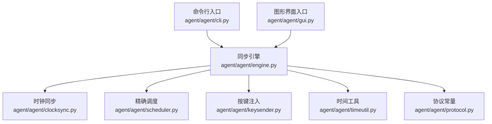
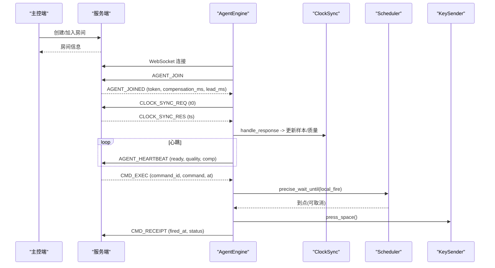
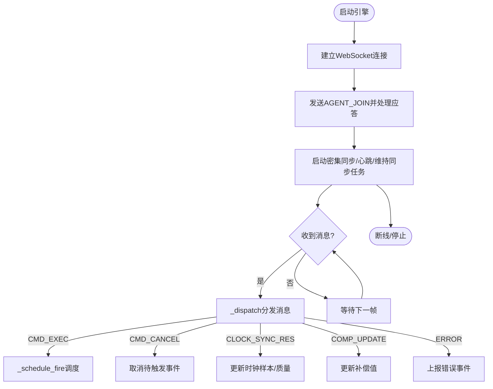
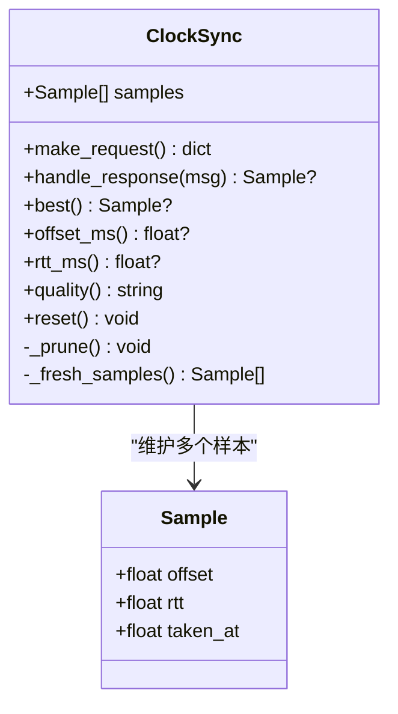
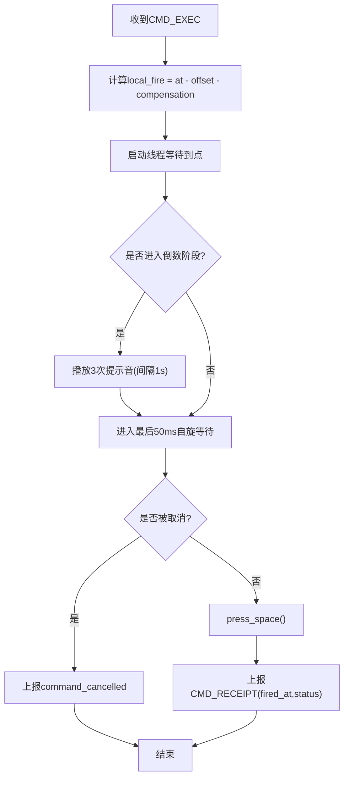
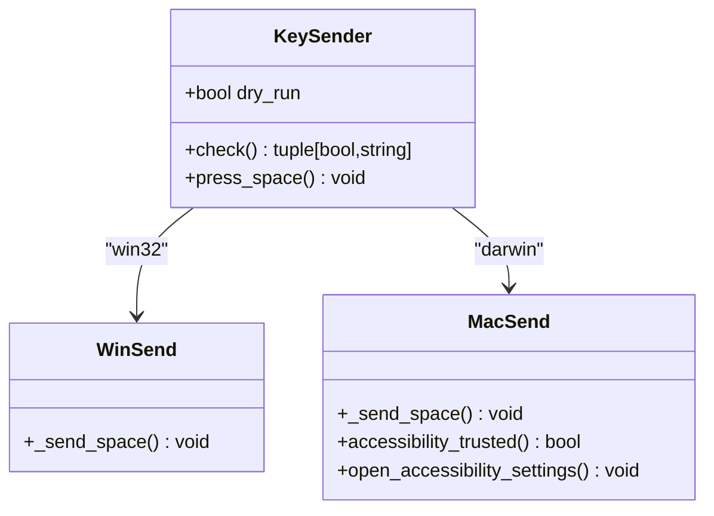
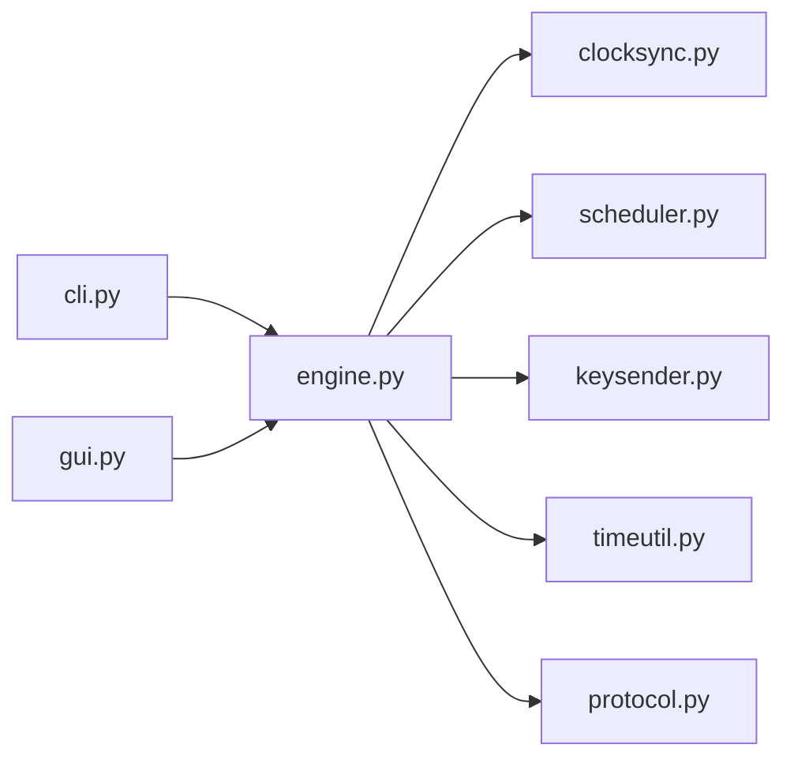

# 被控端开发指南

<cite>
**本文引用的文件**
- [engine.py](file://agent/agent/engine.py)
- [clocksync.py](file://agent/agent/clocksync.py)
- [scheduler.py](file://agent/agent/scheduler.py)
- [protocol.py](file://agent/agent/protocol.py)
- [keysender.py](file://agent/agent/keysender.py)
- [timeutil.py](file://agent/agent/timeutil.py)
- [cli.py](file://agent/agent/cli.py)
- [gui.py](file://agent/agent/gui.py)
- [README.md](file://README.md)
</cite>

## 目录
1. [引言](#引言)
2. [项目结构](#项目结构)
3. [核心组件](#核心组件)
4. [架构总览](#架构总览)
5. [详细组件分析](#详细组件分析)
6. [依赖关系分析](#依赖关系分析)
7. [性能与精度考量](#性能与精度考量)
8. [故障排查指南](#故障排查指南)
9. [结论](#结论)
10. [附录：扩展与插件开发](#附录：扩展与插件开发)

## 引言
本指南面向 ScriptCue 被控端的开发者与维护者，聚焦以下目标：
- 深入理解事件驱动引擎、线程模型与生命周期管理
- 掌握时钟同步系统（类 NTP 算法、网络延迟补偿、时钟质量评估）
- 掌握精确调度系统（绝对时刻调度、高精度定时、指令取消）
- 了解跨平台输入模拟（Windows 与 macOS 空格键注入）
- 对比 GUI 版与命令行版的实现差异
- 提供插件化扩展与自定义触发动作的实践建议

## 项目结构
被控端位于 agent/agent 目录下，采用“引擎 + 模块”的清晰分层：
- 引擎层：AgentEngine 负责连接、协议、时钟同步、调度与触发回执
- 时钟同步：ClockSync 实现类 NTP 采样、老化与质量评估
- 精确调度：precise_wait_until 实现粗睡眠+末段自旋的高精度等待
- 输入模拟：KeySender 封装 Windows/macOS 的空格键注入
- 时间工具：timeutil.now_ms 提供毫秒级本地时间
- 协议常量：protocol 定义消息类型、错误码、限制参数
- 入口：CLI 与 GUI 两个版本共用同一引擎

图表来源
- [engine.py:31-128](file://agent/agent/engine.py#L31-L128)
- [cli.py:104-134](file://agent/agent/cli.py#L104-L134)
- [gui.py:96-241](file://agent/agent/gui.py#L96-L241)

章节来源
- [README.md:16-27](file://README.md#L16-L27)
- [README.md:61-78](file://README.md#L61-L78)

## 核心组件
- AgentEngine：被控端的核心，统一处理 WebSocket 连接、心跳、时钟同步、指令调度与触发回执。所有 on_event 回调在引擎线程中调用，GUI 需自行切换到 UI 线程。
- ClockSync：维护多次时钟采样样本，按 RTT 最小选择可信偏移，支持样本老化与质量分级。
- precise_wait_until：实现“粗睡眠 + 最后 50ms 自旋”的高精度等待，支持取消事件。
- KeySender：跨平台空格键注入，Windows 使用 SendInput，macOS 使用 pynput；提供自检与权限引导。
- timeutil.now_ms：毫秒级 Unix 时间戳，保证与服务器一致的本地时间基准。
- protocol：集中定义消息类型、错误码、默认提前量、重连退避、时钟同步参数等。

章节来源
- [engine.py:1-10](file://agent/agent/engine.py#L1-L10)
- [clocksync.py:1-9](file://agent/agent/clocksync.py#L1-L9)
- [scheduler.py:1-11](file://agent/agent/scheduler.py#L1-L11)
- [keysender.py:1-8](file://agent/agent/keysender.py#L1-L8)
- [timeutil.py:1-12](file://agent/agent/timeutil.py#L1-L12)
- [protocol.py:1-80](file://agent/agent/protocol.py#L1-L80)

## 架构总览
被控端以事件驱动为核心，运行于 asyncio 事件循环中；触发执行在独立线程中进行，避免阻塞事件循环。关键流程如下：
- 连接与加入房间：建立 WebSocket，发送 AGENT_JOIN，接收 AGENT_JOINED，初始化 token、补偿值、提前量
- 时钟同步：密集采样后维持性采样，估算 offset 与 rtt，上报质量等级
- 指令调度：收到 CMD_EXEC 后计算本地触发时刻，启动线程等待到点，必要时提示音倒数
- 触发与回执：到点后通过 KeySender 注入空格键，上报 CMD_RECEIPT，包含 fired_at 与状态
- 心跳与状态：周期性上报 ready、clock_quality、compensation、pending_command 等

图表来源
- [engine.py:129-193](file://agent/agent/engine.py#L129-L193)
- [engine.py:198-211](file://agent/agent/engine.py#L198-L211)
- [engine.py:217-241](file://agent/agent/engine.py#L217-L241)
- [engine.py:297-379](file://agent/agent/engine.py#L297-L379)
- [clocksync.py:37-55](file://agent/agent/clocksync.py#L37-L55)
- [scheduler.py:33-58](file://agent/agent/scheduler.py#L33-L58)

## 详细组件分析

### 事件驱动引擎与生命周期管理
- 主循环 run：指数退避重连，异常时上报 error 并断开
- 连接服务 _connect_and_serve：建立 WS，启动密集同步、心跳、维持同步任务，断线清理
- 加入房间 _join：发送 AGENT_JOIN，处理首次应答，设置 token/compensation/lead，重置时钟
- 消息分发 _dispatch：处理时钟同步响应、指令执行、指令取消、补偿更新、错误
- 线程安全发送：_send_threadsafe 通过 run_coroutine_threadsafe 向事件循环发消息
- 停止与断开：stop 标记停止，disconnect 关闭 WS 并取消待触发事件

图表来源
- [engine.py:106-157](file://agent/agent/engine.py#L106-L157)
- [engine.py:159-193](file://agent/agent/engine.py#L159-L193)
- [engine.py:268-292](file://agent/agent/engine.py#L268-L292)

章节来源
- [engine.py:31-128](file://agent/agent/engine.py#L31-L128)
- [engine.py:129-193](file://agent/agent/engine.py#L129-L193)
- [engine.py:268-292](file://agent/agent/engine.py#L268-L292)

### 时钟同步系统（类 NTP 算法、延迟补偿、质量评估）
- 请求构造 make_request：生成 id、记录 t0，发送到服务器
- 应答处理 handle_response：计算 offset = ts - (t0 + t1)/2，rtt = t1 - t0，追加样本并修剪
- 样本老化与保留：_prune 保留 RTT 最小的前若干样本，fresh_samples 过滤过期样本
- 最佳样本 best：新鲜样本中 RTT 最小者作为可信偏移
- 质量评估 quality：基于样本数量与 RTT 阈值分为 excellent/good/poor/none
- 重连重置 reset：清空历史样本，重新密集采样

图表来源
- [clocksync.py:22-106](file://agent/agent/clocksync.py#L22-L106)

章节来源
- [clocksync.py:1-106](file://agent/agent/clocksync.py#L1-L106)
- [engine.py:198-211](file://agent/agent/engine.py#L198-L211)
- [engine.py:217-241](file://agent/agent/engine.py#L217-L241)

### 精确调度系统（绝对时刻调度、高精度定时、指令取消）
- 绝对时刻调度 _schedule_fire：根据服务器 at、offset、compensation 计算 local_fire，启动线程等待
- 高精度等待 precise_wait_until：粗睡眠（最大 0.25s 块）+ 最后 50ms 自旋，支持取消事件
- 提示音倒数：执行前 3 秒开始滴声，临近到点自动停止以避免干扰精确等待
- 指令取消：收到 CMD_CANCEL 时设置对应 threading.Event，唤醒等待线程并上报取消事件
- 触发回执：到点后注入空格键，上报 CMD_RECEIPT，包含 fired_at 与状态

图表来源
- [engine.py:297-379](file://agent/agent/engine.py#L297-L379)
- [scheduler.py:33-58](file://agent/agent/scheduler.py#L33-L58)
- [protocol.py:65-79](file://agent/agent/protocol.py#L65-L79)

章节来源
- [engine.py:297-379](file://agent/agent/engine.py#L297-L379)
- [scheduler.py:1-59](file://agent/agent/scheduler.py#L1-L59)
- [protocol.py:65-79](file://agent/agent/protocol.py#L65-L79)

### 跨平台输入模拟（Windows 与 macOS）
- Windows：使用 ctypes 调用 user32.SendInput 直接注入空格键，低延迟路径
- macOS：使用 pynput.keyboard.Controller.tap(Key.space) 注入空格键；提供辅助功能权限检测与引导
- 统一接口 KeySender：check 进行开机自检，press_space 执行实际注入；支持 dry_run 演练模式

图表来源
- [keysender.py:22-57](file://agent/agent/keysender.py#L22-L57)
- [keysender.py:63-92](file://agent/agent/keysender.py#L63-L92)
- [keysender.py:99-126](file://agent/agent/keysender.py#L99-L126)

章节来源
- [keysender.py:1-126](file://agent/agent/keysender.py#L1-L126)

### GUI 版与命令行版实现差异
- 共同点：均使用 AgentEngine 作为核心，共享时钟同步、调度与输入模拟逻辑
- 命令行版（cli.py）：
  - 通过 argparse 解析参数，启动异步事件循环运行引擎
  - 提供交互命令：ready/notready、comp <ms>、status、quit
  - 输出结构化日志便于联调与验证
- GUI 版（gui.py）：
  - 使用 tkinter 构建界面，持久化配置（服务器、房间码、昵称、补偿值、置顶）
  - 事件轮询机制：通过 queue 收集引擎事件，UI 线程定期刷新状态与倒计时
  - 提示音：Windows 使用 winsound.Beep，macOS 使用 afplay 系统音效
  - 紧凑小面板：可拖动、置顶，显示连接状态与倒计时
  - 开机自检与权限引导：macOS 检查辅助功能权限并打开系统设置页面

章节来源
- [cli.py:1-139](file://agent/agent/cli.py#L1-L139)
- [gui.py:1-464](file://agent/agent/gui.py#L1-L464)

## 依赖关系分析
被控端内部模块耦合度低、职责清晰：
- engine 依赖 clocksync、scheduler、keysender、timeutil、protocol
- gui 与 cli 仅作为入口，不重复实现核心逻辑
- keysender 仅在触发时调用，降低对事件循环的影响
- protocol 为常量中心，确保三方一致

图表来源
- [engine.py:12-24](file://agent/agent/engine.py#L12-L24)
- [cli.py:21-23](file://agent/agent/cli.py#L21-L23)
- [gui.py:25-28](file://agent/agent/gui.py#L25-L28)

章节来源
- [engine.py:12-24](file://agent/agent/engine.py#L12-L24)
- [cli.py:21-23](file://agent/agent/cli.py#L21-L23)
- [gui.py:25-28](file://agent/agent/gui.py#L25-L28)

## 性能与精度考量
- 时钟同步：密集采样 20 次（间隔 50ms），维持性采样每 30s 一次，取 RTT 最小样本提升抗抖动能力
- 高精度等待：粗睡眠块 0.25s，最后 50ms 自旋，Windows 下提升系统定时器分辨率至 1ms
- 提示音倒数：执行前 3 秒开始，临近到点自动停止，避免干扰精确等待
- 心跳上报：每 5s 上报 ready、clock_quality、compensation、pending_command，便于主控端监控
- 重连策略：指数退避（1,2,4,8s），上限 10s，提高稳定性

章节来源
- [protocol.py:65-79](file://agent/agent/protocol.py#L65-L79)
- [scheduler.py:20-30](file://agent/agent/scheduler.py#L20-L30)
- [engine.py:106-128](file://agent/agent/engine.py#L106-L128)
- [engine.py:217-241](file://agent/agent/engine.py#L217-L241)

## 故障排查指南
- 连接失败：检查 server_url 格式（http/https 自动转换为 ws/wss），确认端口与防火墙
- 加入房间失败：查看 ERROR 消息与 code，常见 room_not_found、bad_password、room_full
- 时钟未同步：若 offset 为 None，无法调度；检查网络连接与服务器授时
- 指令取消：收到 CMD_CANCEL 会设置取消事件，线程立即退出并上报取消事件
- 按键注入失败：Windows 可能被安全软件拦截；macOS 需开启辅助功能权限
- 补偿值异常：可通过 GUI 或 CLI 调整 compensation_ms，并观察质量变化

章节来源
- [engine.py:159-193](file://agent/agent/engine.py#L159-L193)
- [engine.py:297-311](file://agent/agent/engine.py#L297-L311)
- [engine.py:279-288](file://agent/agent/engine.py#L279-L288)
- [keysender.py:107-119](file://agent/agent/keysender.py#L107-L119)

## 结论
ScriptCue 被控端以事件驱动为核心，结合类 NTP 时钟同步与高精度调度，实现了公网环境下多设备 ≤50ms 精度的同步起播。引擎将协议、定时与动作解耦，CLI 与 GUI 复用同一核心，便于扩展与维护。通过合理的线程模型、样本老化与质量评估，系统在复杂网络条件下仍保持稳定与精准。

## 附录：扩展与插件开发
- 自定义触发动作：
  - 在 engine._fire_worker 中替换 KeySender.press_space 为其他动作（如鼠标点击、音频播放）
  - 保持 CMD_RECEIPT 上报格式一致，确保主控端可见状态
- 扩展时钟同步策略：
  - 在 ClockSync 中增加更多统计指标（如方差、趋势），用于更精细的质量评估
  - 调整 DENSE_SYNC_SAMPLES、MAINTAIN_SYNC_INTERVAL_S 以适应不同网络环境
- 扩展调度策略：
  - 在 precise_wait_until 中引入自适应阈值，根据历史 rtt 动态调整自旋阶段
  - 增加批量指令合并与优先级队列，优化高并发场景
- 插件化入口：
  - 在 engine.__init__ 中注册插件钩子，允许外部模块注入行为（如日志、监控、审计）
  - 通过 on_event 回调暴露细粒度事件，供第三方集成

章节来源
- [engine.py:329-379](file://agent/agent/engine.py#L329-L379)
- [clocksync.py:66-106](file://agent/agent/clocksync.py#L66-L106)
- [scheduler.py:33-58](file://agent/agent/scheduler.py#L33-L58)
- [protocol.py:43-64](file://agent/agent/protocol.py#L43-L64)