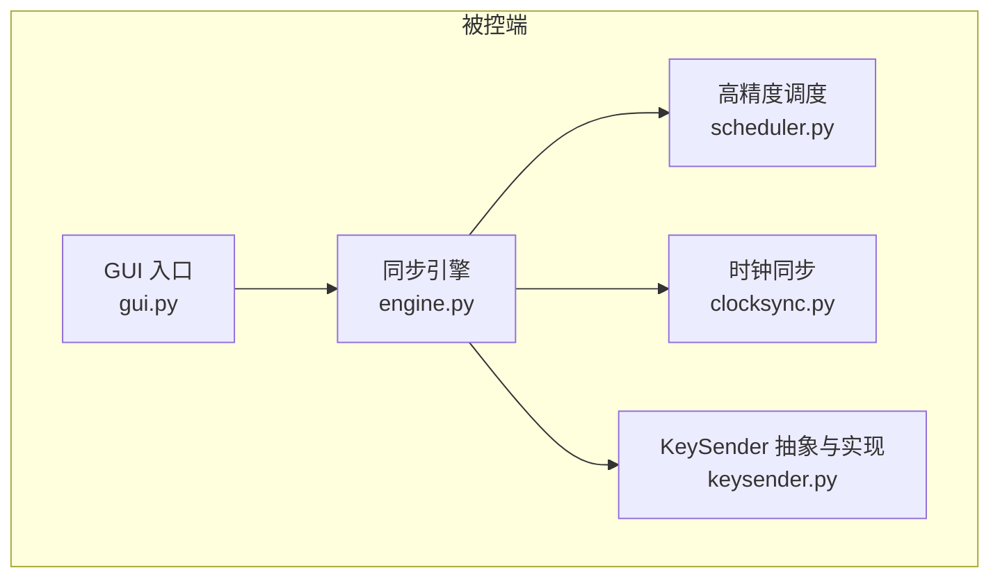
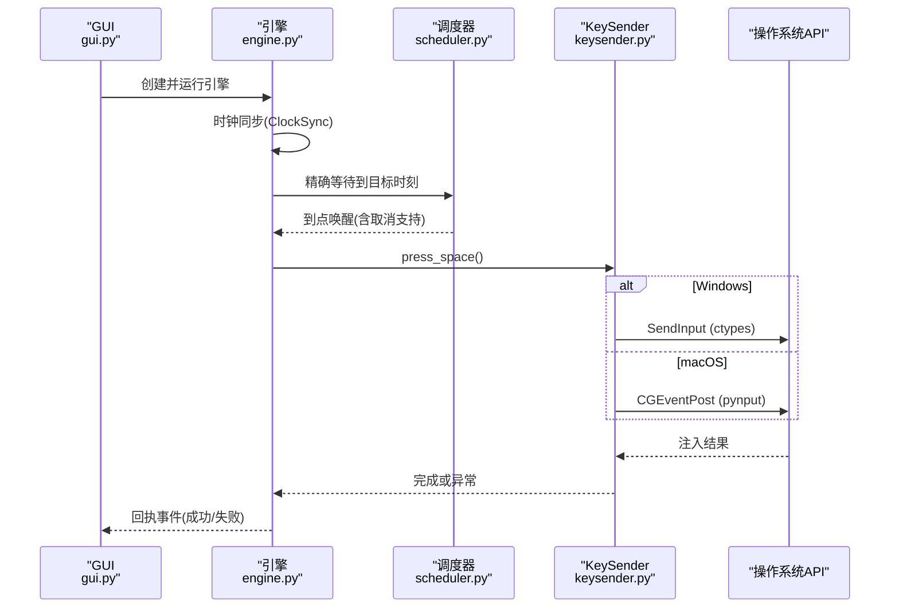
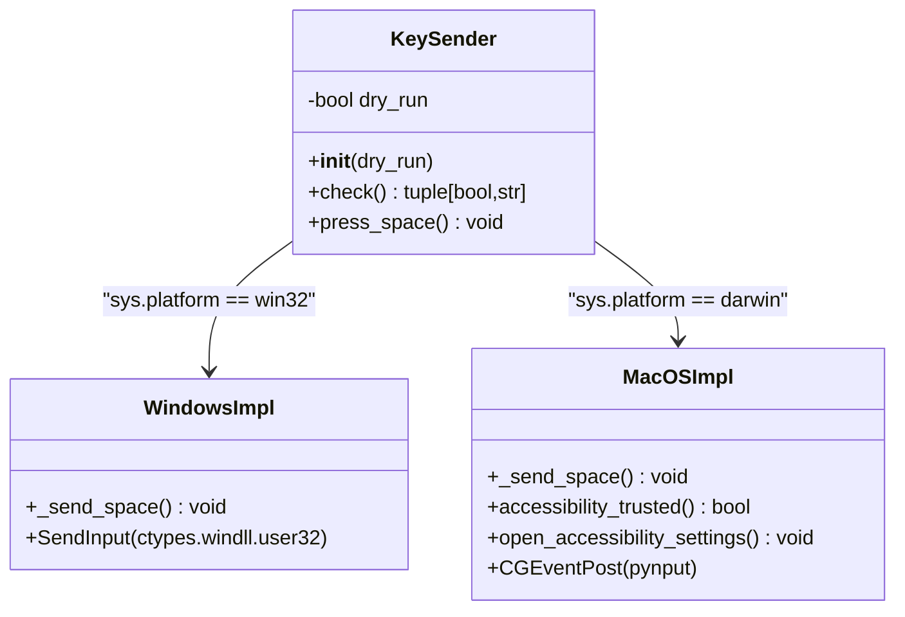
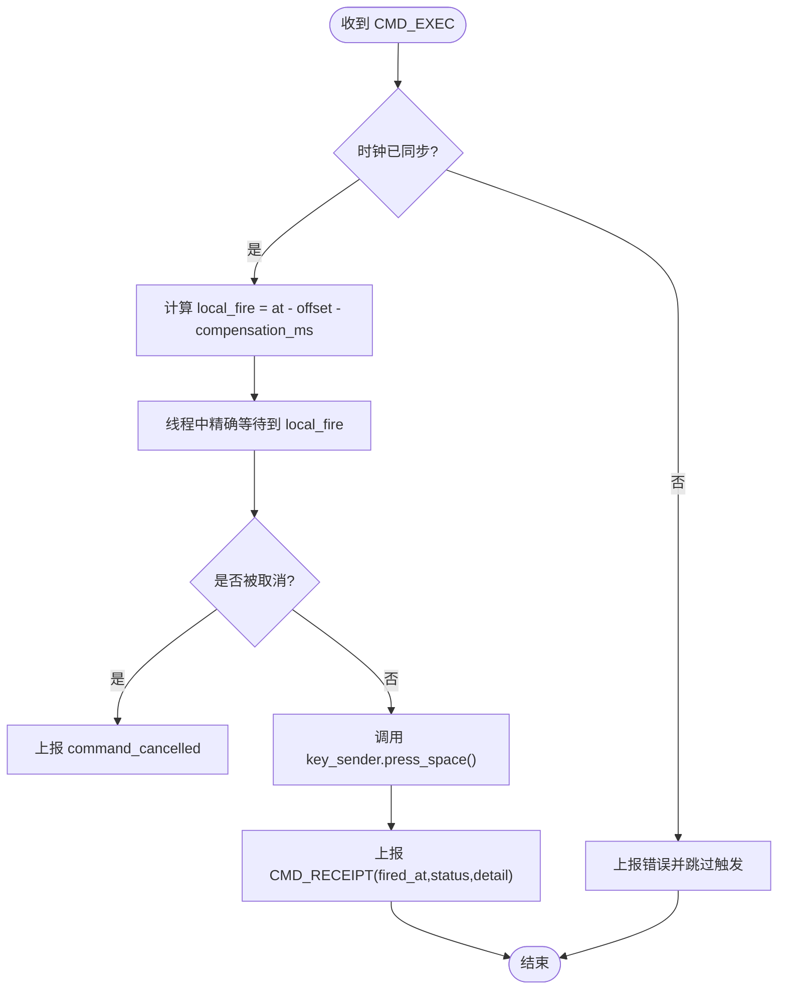
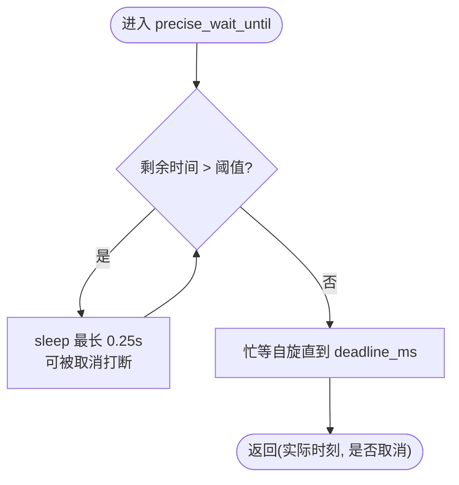
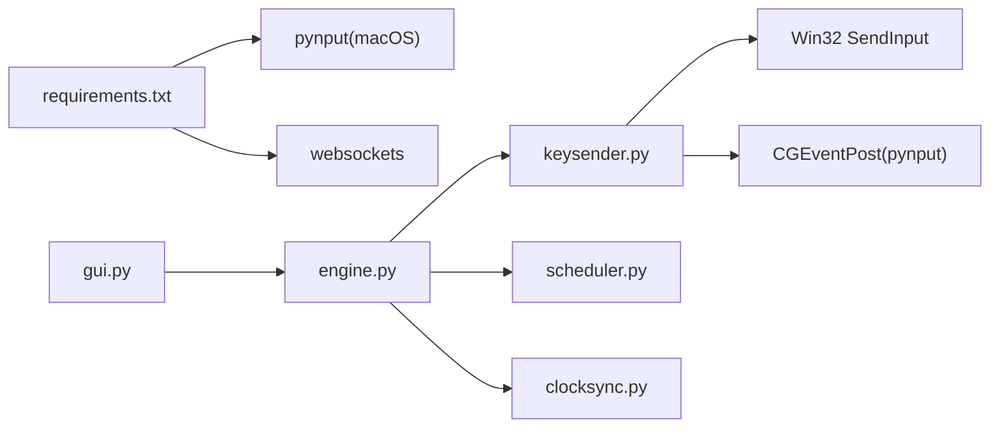

# 跨平台输入模拟

<cite>
**本文引用的文件**
- [agent/agent/keysender.py](file://agent/agent/keysender.py)
- [agent/agent/engine.py](file://agent/agent/engine.py)
- [agent/agent/gui.py](file://agent/agent/gui.py)
- [agent/agent/scheduler.py](file://agent/agent/scheduler.py)
- [agent/agent/clocksync.py](file://agent/agent/clocksync.py)
- [agent/scriptcue_agent.py](file://agent/scriptcue_agent.py)
- [agent/build_windows.ps1](file://agent/build_windows.ps1)
- [agent/build_macos.sh](file://agent/build_macos.sh)
- [agent/requirements.txt](file://agent/requirements.txt)
- [README.md](file://README.md)
</cite>

## 目录
1. [简介](#简介)
2. [项目结构](#项目结构)
3. [核心组件](#核心组件)
4. [架构总览](#架构总览)
5. [详细组件分析](#详细组件分析)
6. [依赖关系分析](#依赖关系分析)
7. [性能考虑](#性能考虑)
8. [故障诊断指南](#故障诊断指南)
9. [结论](#结论)
10. [附录：示例与配置](#附录示例与配置)

## 简介
本开发文档聚焦于 ScriptCue 被控端的“跨平台输入模拟系统”，围绕 KeySender 抽象接口及其在 Windows 与 macOS 上的具体实现，系统性说明键盘输入模拟的技术路径、错误处理机制、权限要求（尤其是 macOS 辅助功能权限）、跨平台兼容性测试方法、性能优化技巧与故障诊断流程。同时给出实际按键模拟示例与平台特定配置说明，帮助开发者快速理解并扩展该子系统。

## 项目结构
被控端位于 agent 目录，采用 Python 实现，通过 PyInstaller 打包为单文件或应用包。关键模块包括：
- keysender.py：跨平台空格键注入抽象与平台实现
- engine.py：同步引擎，负责连接、时钟同步、绝对时刻调度与触发回执
- gui.py：GUI 入口，集成开机自检与权限引导
- scheduler.py：高精度定时调度（粗睡眠 + 末段自旋）
- clocksync.py：类 NTP 时钟同步
- build_*.sh/.ps1：平台打包脚本
- requirements.txt：运行时依赖（macOS 需要 pynput）

图表来源
- [agent/agent/gui.py:1-200](file://agent/agent/gui.py#L1-L200)
- [agent/agent/engine.py:1-120](file://agent/agent/engine.py#L1-L120)
- [agent/agent/scheduler.py:1-40](file://agent/agent/scheduler.py#L1-L40)
- [agent/agent/clocksync.py:1-73](file://agent/agent/clocksync.py#L1-L73)
- [agent/agent/keysender.py:1-126](file://agent/agent/keysender.py#L1-L126)

章节来源
- [README.md:1-86](file://README.md#L1-L86)
- [agent/scriptcue_agent.py:1-10](file://agent/scriptcue_agent.py#L1-L10)

## 核心组件
- KeySender：跨平台空格键注入的统一抽象，提供 check() 自检与 press_space() 注入；内部根据 sys.platform 选择 Windows SendInput 或 macOS CGEventPost（经 pynput）。
- AgentEngine：接收服务器指令，基于本地时钟偏移与补偿值计算精确触发时刻，调用 scheduler 等待到点，再调用 KeySender 执行注入，并上报回执。
- Scheduler：实现“粗睡眠 + 最后 50ms 自旋”的高精度等待，Windows 下提升系统定时器分辨率以改善 sleep 精度。
- ClockSync：类 NTP 算法估算服务器与本地时钟偏移，取 RTT 最小样本作为可信偏移。
- GUI：启动时进行 macOS 辅助功能权限检查与引导，随后执行开机自检（R-11），并展示运行状态与日志。

章节来源
- [agent/agent/keysender.py:1-126](file://agent/agent/keysender.py#L1-L126)
- [agent/agent/engine.py:1-388](file://agent/agent/engine.py#L1-L388)
- [agent/agent/scheduler.py:1-58](file://agent/agent/scheduler.py#L1-L58)
- [agent/agent/clocksync.py:1-73](file://agent/agent/clocksync.py#L1-L73)
- [agent/agent/gui.py:1-200](file://agent/agent/gui.py#L1-L200)

## 架构总览
下图展示了从 GUI 启动到按键注入的完整调用链，以及各模块之间的交互关系。

图表来源
- [agent/agent/gui.py:420-463](file://agent/agent/gui.py#L420-L463)
- [agent/agent/engine.py:297-379](file://agent/agent/engine.py#L297-L379)
- [agent/agent/scheduler.py:33-58](file://agent/agent/scheduler.py#L33-L58)
- [agent/agent/keysender.py:22-93](file://agent/agent/keysender.py#L22-L93)

## 详细组件分析

### KeySender 抽象与平台实现
KeySender 提供统一的跨平台接口：
- __init__(dry_run=False)：初始化并校验平台支持
- check() -> (bool, str)：开机自检，验证注入能力；macOS 上先检查辅助功能权限
- press_space() -> None：向前台窗口模拟按下并释放空格键

平台差异：
- Windows：使用 ctypes 直接调用 Win32 SendInput API，构造 KEYBDINPUT 数组发送按下与释放事件，返回计数用于错误判断。
- macOS：通过 pynput.keyboard.Controller().tap(Key.space) 封装 CGEventPost；并提供 accessibility_trusted() 检测 AXIsProcessTrusted() 与 open_accessibility_settings() 打开系统设置页面。

图表来源
- [agent/agent/keysender.py:14-126](file://agent/agent/keysender.py#L14-L126)

章节来源
- [agent/agent/keysender.py:1-126](file://agent/agent/keysender.py#L1-L126)

### 同步引擎与触发流程
AgentEngine 负责：
- 连接生命周期管理（指数退避重连）
- 时钟同步（密集采样 + 维持性采样）
- 绝对时刻调度（将服务器时间 at 转换为本地 local_fire = at - offset - compensation_ms）
- 触发回调（beep_fn）与按键注入（key_sender.press_space()）
- 回执上报（CMD_RECEIPT，包含 fired_at、status、detail）

图表来源
- [agent/agent/engine.py:297-379](file://agent/agent/engine.py#L297-L379)

章节来源
- [agent/agent/engine.py:1-388](file://agent/agent/engine.py#L1-L388)

### 高精度调度器
Scheduler 实现“粗睡眠 + 末段自旋”策略：
- 距离目标较远时使用 sleep 分段等待（最大 0.25s 一段，可被取消事件打断）
- 进入最后 SPIN_THRESHOLD_MS（默认约 50ms）切换忙等自旋，逼近目标时刻，误差亚毫秒级
- Windows 下通过 timeBeginPeriod(1) 提升系统定时器分辨率，改善 sleep 精度

图表来源
- [agent/agent/scheduler.py:1-58](file://agent/agent/scheduler.py#L1-L58)

章节来源
- [agent/agent/scheduler.py:1-58](file://agent/agent/scheduler.py#L1-L58)

### 时钟同步
ClockSync 采用类 NTP 算法：
- 客户端发送请求携带 t0，服务器回复 ts，客户端记录 t1
- 估算 offset = ts - (t0 + t1)/2，rtt = t1 - t0
- 保留最新且 RTT 最小的若干样本，避免陈旧样本主导

章节来源
- [agent/agent/clocksync.py:1-73](file://agent/agent/clocksync.py#L1-L73)

### GUI 启动与权限引导
GUI 在启动时：
- 若为 macOS，循环提示用户授予辅助功能权限，并打开系统设置页面
- 创建 KeySender 并执行 check() 自检，失败则弹窗提示
- 提供就绪开关、补偿值编辑、日志显示等功能

章节来源
- [agent/agent/gui.py:1-200](file://agent/agent/gui.py#L1-L200)
- [agent/agent/gui.py:420-463](file://agent/agent/gui.py#L420-L463)

## 依赖关系分析
- KeySender 在 Windows 上无第三方依赖（仅 ctypes/wintypes）
- KeySender 在 macOS 上依赖 pynput（通过 CGEventPost 封装）
- Engine 依赖 scheduler、clocksync、protocol、timeutil
- GUI 依赖 engine、keysender、timeutil，并使用 tkinter 构建界面
- 打包脚本分别针对 Windows 与 macOS 生成单文件或应用包

图表来源
- [agent/requirements.txt:1-6](file://agent/requirements.txt#L1-L6)
- [agent/agent/keysender.py:22-93](file://agent/agent/keysender.py#L22-L93)
- [agent/agent/engine.py:1-30](file://agent/agent/engine.py#L1-L30)

章节来源
- [agent/requirements.txt:1-6](file://agent/requirements.txt#L1-L6)
- [agent/build_windows.ps1:1-15](file://agent/build_windows.ps1#L1-L15)
- [agent/build_macos.sh:1-20](file://agent/build_macos.sh#L1-L20)

## 性能考虑
- 注入延迟：Windows 使用 SendInput 直调，延迟最低（1~5ms）；macOS 通过 pynput 封装 CGEventPost，延迟略高但仍满足实时需求
- 调度精度：采用“粗睡眠 + 末段自旋”策略，Windows 下提升系统定时器分辨率，确保 sleep 不睡过头；自旋阶段忙等逼近目标时刻，误差控制在亚毫秒级
- 时钟同步：多次采样取 RTT 最小样本，降低网络抖动对偏移估计的影响；维护性采样抑制时钟漂移
- 资源占用：触发线程独立运行，避免阻塞事件循环；取消事件保证及时退出等待

章节来源
- [agent/agent/scheduler.py:1-58](file://agent/agent/scheduler.py#L1-L58)
- [agent/agent/clocksync.py:1-73](file://agent/agent/clocksync.py#L1-L73)
- [agent/agent/keysender.py:1-126](file://agent/agent/keysender.py#L1-L126)

## 故障诊断指南
- 权限问题（macOS）
  - 现象：check() 返回未获得辅助功能权限
  - 处理：GUI 循环提示并打开系统设置页面；用户需勾选本程序后重启
  - 参考：accessibility_trusted() 与 open_accessibility_settings()
- 注入失败（Windows）
  - 现象：SendInput 返回计数小于期望值
  - 处理：检查安全软件拦截；确认前台窗口存在
  - 参考：_send_space() 中的错误抛出
- 时钟未同步
  - 现象：无法调度触发，上报“时钟未同步”
  - 处理：等待密集采样完成；检查网络连接
  - 参考：engine._schedule_fire() 中的分支逻辑
- 触发被取消
  - 现象：command_cancelled 事件
  - 处理：检查是否有取消指令；确认 cancel_event 未被误触发
  - 参考：engine._fire_worker() 中的取消分支
- 打包与首次运行
  - Windows：未签名程序可能触发 SmartScreen 提示
  - macOS：未签名应用需右键→打开；首次运行需授权辅助功能
  - 参考：build_*.sh/.ps1 注释

章节来源
- [agent/agent/keysender.py:67-93](file://agent/agent/keysender.py#L67-L93)
- [agent/agent/keysender.py:46-57](file://agent/agent/keysender.py#L46-L57)
- [agent/agent/engine.py:304-311](file://agent/agent/engine.py#L304-L311)
- [agent/agent/engine.py:356-379](file://agent/agent/engine.py#L356-L379)
- [agent/build_windows.ps1:1-15](file://agent/build_windows.ps1#L1-L15)
- [agent/build_macos.sh:1-20](file://agent/build_macos.sh#L1-L20)

## 结论
KeySender 抽象接口成功屏蔽了 Windows 与 macOS 的平台差异，提供了统一的按键注入能力。结合高精度调度与类 NTP 时钟同步，系统在公网环境下实现了低延迟、高精度的同步起播。完善的错误处理与权限引导机制提升了用户体验与稳定性。建议在生产环境中关注 macOS 辅助功能权限配置与 Windows 安全软件拦截问题，并通过控制台或 GUI 日志进行故障定位。

## 附录：示例与配置

### 实际按键模拟示例
- 空格键注入：KeySender.press_space() 在前台窗口模拟按下并释放空格键
- 自检流程：KeySender.check() 在启动时验证注入能力，macOS 上优先检查辅助功能权限
- 触发时机：Engine 在精确到点时调用 KeySender，并上报回执

章节来源
- [agent/agent/keysender.py:99-126](file://agent/agent/keysender.py#L99-L126)
- [agent/agent/engine.py:356-379](file://agent/agent/engine.py#L356-L379)

### 平台特定配置说明
- Windows
  - 无需额外权限；注意安全软件可能拦截 SendInput
  - 打包命令：在 agent/ 目录执行 build_windows.ps1
- macOS
  - 需要辅助功能权限；GUI 启动时会引导用户授权
  - 打包命令：在 agent/ 目录执行 build_macos.sh；首次运行需右键→打开
  - 依赖：pynput（通过 requirements.txt 条件安装）

章节来源
- [agent/build_windows.ps1:1-15](file://agent/build_windows.ps1#L1-L15)
- [agent/build_macos.sh:1-20](file://agent/build_macos.sh#L1-L20)
- [agent/requirements.txt:1-6](file://agent/requirements.txt#L1-L6)
- [agent/agent/gui.py:420-463](file://agent/agent/gui.py#L420-L463)