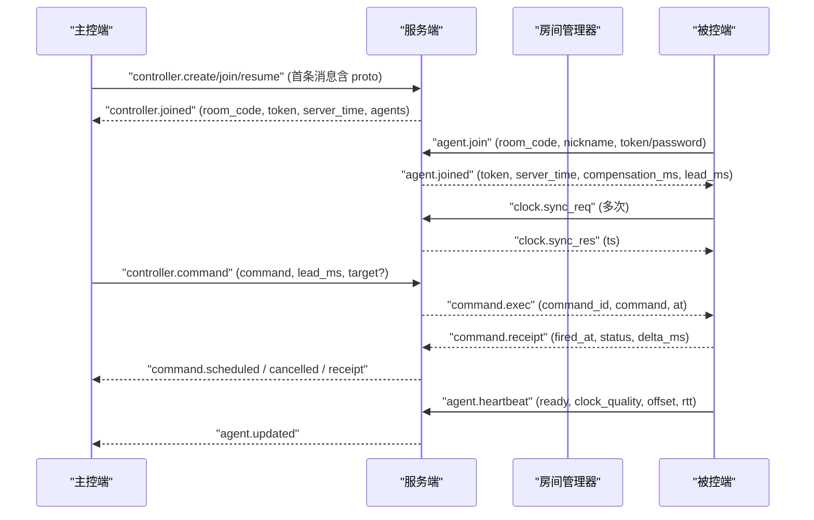
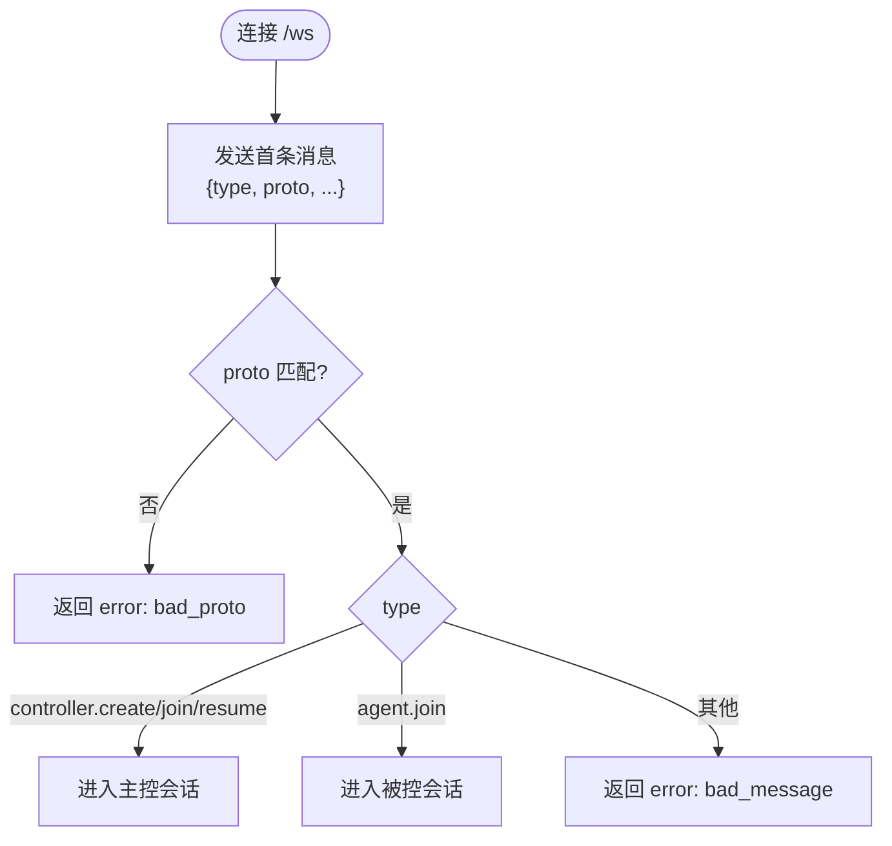
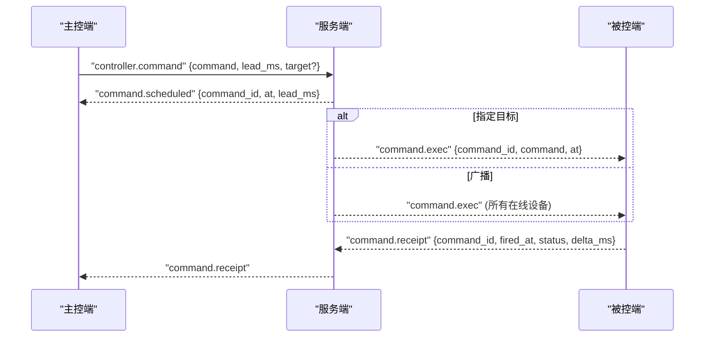
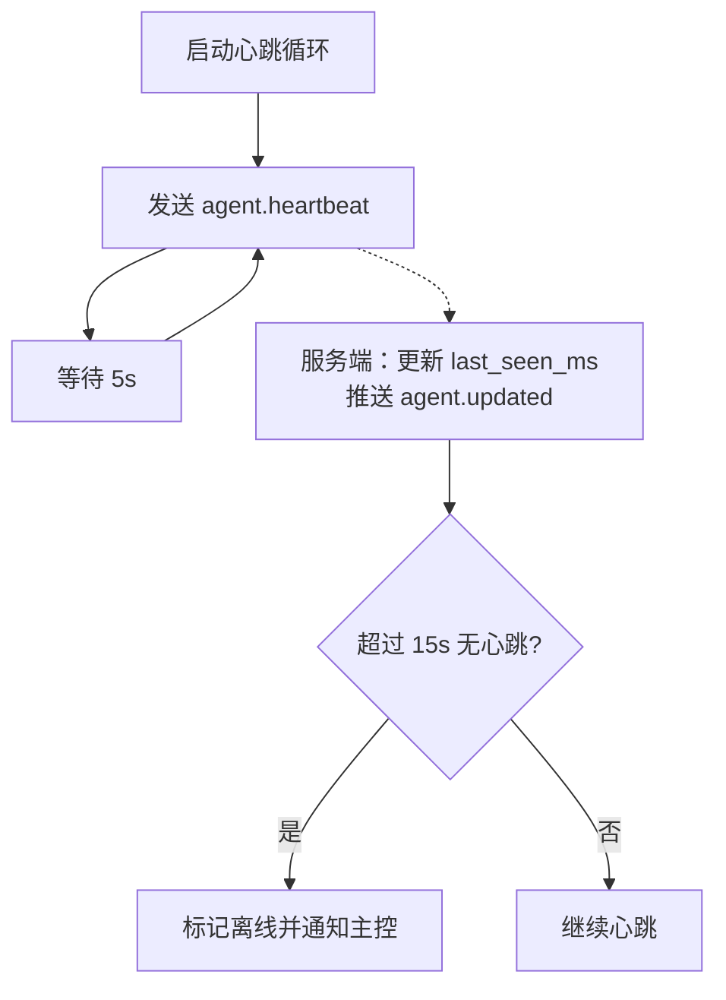
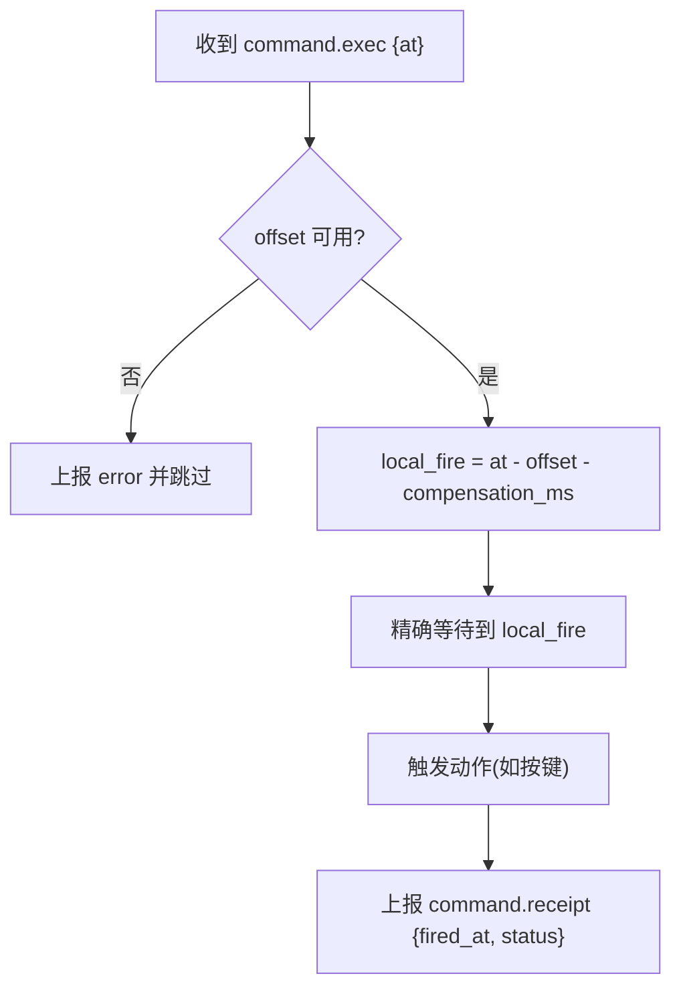
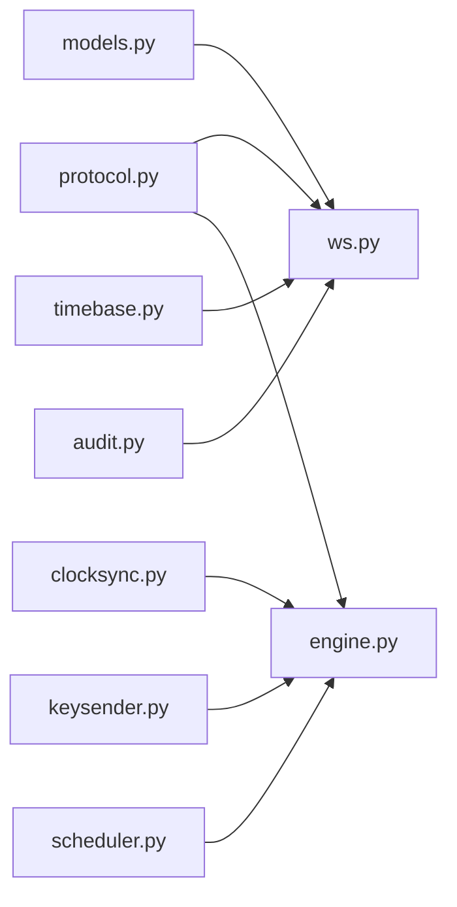

# 通信协议规范

<cite>
**本文引用的文件**
- [README.md](file://README.md)
- [server/server/protocol.py](file://server/server/protocol.py)
- [agent/agent/protocol.py](file://agent/agent/protocol.py)
- [server/server/ws.py](file://server/server/ws.py)
- [server/server/models.py](file://server/server/models.py)
- [server/server/main.py](file://server/server/main.py)
- [agent/agent/engine.py](file://agent/agent/engine.py)
- [agent/agent/clocksync.py](file://agent/agent/clocksync.py)
- [controller/app.js](file://controller/app.js)
</cite>

## 目录
1. [简介](#简介)
2. [项目结构](#项目结构)
3. [核心组件](#核心组件)
4. [架构总览](#架构总览)
5. [详细组件分析](#详细组件分析)
6. [依赖关系分析](#依赖关系分析)
7. [性能考量](#性能考量)
8. [故障排查指南](#故障排查指南)
9. [结论](#结论)
10. [附录：版本升级与兼容性、客户端实现示例、调试工具](#附录版本升级与兼容性客户端实现示例调试工具)

## 简介
本规范定义 ScriptCue 的 WebSocket 文本 JSON 通信协议，覆盖主控端（浏览器）、服务端（FastAPI）与被控端（Python 进程）三方交互。协议采用版本化 JSON 文本格式，支持房间管理、设备注册、指令下发、状态同步、时钟同步与心跳机制，目标是让多设备在公网环境下以毫秒级精度同步执行“起播/暂停/测试”等指令。

## 项目结构
- 服务端：提供 WebSocket 长连接、房间与会话管理、指令广播、状态汇聚、审计日志与空闲清理。
- 主控端：网页应用，负责创建/加入房间、下发指令、查看设备状态与回执。
- 被控端：加入房间后持续进行类 NTP 时钟同步；收到带绝对执行时刻的指令后，本地高精度定时触发动作并上报回执。

```mermaid
graph TB
subgraph "主控端"
CUI["浏览器主控页面"]
end
subgraph "服务端"
WS["WebSocket 处理"]
RM["房间管理器"]
AUD["审计日志"]
end
subgraph "被控端"
AE["AgentEngine"]
CS["ClockSync"]
KS["KeySender(可选)"]
end
CUI --> WS
WS --> RM
WS --> AUD
WS < --> AE
AE --> CS
AE --> KS
```

图表来源
- [server/server/ws.py:15-360](file://server/server/ws.py#L15-L360)
- [server/server/models.py:64-157](file://server/server/models.py#L64-L157)
- [agent/agent/engine.py:31-388](file://agent/agent/engine.py#L31-L388)
- [agent/agent/clocksync.py:29-106](file://agent/agent/clocksync.py#L29-L106)

章节来源
- [README.md:7-28](file://README.md#L7-L28)

## 核心组件
- 协议常量与版本：服务端权威定义，被控端维护等价副本，双方必须保持一致并在升级时递增版本号。
- 会话模型：Room 与 AgentSession 描述房间与会话状态、在线情况、时钟质量、待执行指令等。
- WebSocket 路由：统一 /ws 端点，首条消息声明角色（主控或被控），后续按类型分发。
- 时钟同步：被控端通过 ping/pong 采样估算偏移与 RTT，取最小 RTT 样本作为可信偏移。
- 指令调度：服务器计算绝对执行时刻 at，向目标或全体在线设备下发 CMD_EXEC；设备到点后触发并上报回执。
- 心跳与离线判定：被控端周期性上报心跳；服务端基于最近一次心跳时间判定离线。

章节来源
- [server/server/protocol.py:1-80](file://server/server/protocol.py#L1-L80)
- [agent/agent/protocol.py:1-80](file://agent/agent/protocol.py#L1-L80)
- [server/server/models.py:17-117](file://server/server/models.py#L17-L117)
- [server/server/ws.py:15-360](file://server/server/ws.py#L15-L360)
- [agent/agent/clocksync.py:29-106](file://agent/agent/clocksync.py#L29-L106)
- [agent/agent/engine.py:198-241](file://agent/agent/engine.py#L198-L241)

## 架构总览
协议围绕“房间 + 会话 + 指令 + 时钟”展开。主控端创建/加入房间，被控端加入房间并上报时钟质量；主控端下发指令，服务器计算绝对执行时刻并广播给在线设备；设备到点触发并上报回执；服务端汇总状态推送给主控端。



图表来源
- [server/server/ws.py:154-360](file://server/server/ws.py#L154-L360)
- [server/server/models.py:64-117](file://server/server/models.py#L64-L117)
- [agent/agent/engine.py:159-241](file://agent/agent/engine.py#L159-L241)
- [agent/agent/clocksync.py:37-55](file://agent/agent/clocksync.py#L37-L55)

## 详细组件分析

### 协议版本与消息类型
- 版本字段：所有首条消息必须包含 "proto" 字段，与服务端期望版本一致，否则返回错误。
- 消息类型：
  - 主控 → 服务器：controller.create / controller.join / controller.resume / controller.command / controller.cancel / controller.set_comp
  - 服务器 → 主控：controller.joined / command.scheduled / command.cancelled / agent.updated / agent.left / error
  - 被控 → 服务器：agent.join / agent.heartbeat / agent.set_comp / clock.sync_req / command.receipt
  - 服务器 → 被控：agent.joined / clock.sync_res / command.exec / command.cancel / comp.update / error
- 指令类型：play / pause / test
- 时钟质量：excellent / good / poor / none
- 错误码：bad_proto / room_not_found / bad_password / room_full / not_controller / bad_command / no_such_agent / bad_message

章节来源
- [server/server/protocol.py:9-80](file://server/server/protocol.py#L9-L80)
- [agent/agent/protocol.py:7-80](file://agent/agent/protocol.py#L7-L80)
- [server/server/ws.py:349-360](file://server/server/ws.py#L349-L360)

### WebSocket 连接建立与认证流程
- 统一端点：/ws
- 首条消息：必须为 JSON 对象，包含 "type" 和 "proto"。根据 type 分派到主控或被控会话。
- 主控认证：
  - create：创建房间，返回 room_code、token、server_time、当前 agents 列表。
  - join：验证房间是否存在及口令；若存在则加入。
  - resume：断线重连，使用 token 恢复会话。
- 被控认证：
  - join：携带 room_code、nickname，可选 password 或 token；可设置 auto_create 以便服务器重启后自动重建房间。
  - 成功后返回 token、server_time、compensation_ms、lead_ms。
- 错误处理：非法消息、版本不匹配、房间不存在、口令错误、房间满等，均返回 error 消息。



图表来源
- [server/server/ws.py:334-360](file://server/server/ws.py#L334-L360)

章节来源
- [server/server/ws.py:154-360](file://server/server/ws.py#L154-L360)
- [server/server/models.py:64-117](file://server/server/models.py#L64-L117)
- [agent/agent/engine.py:159-193](file://agent/agent/engine.py#L159-L193)

### 房间管理与设备注册
- 房间生命周期：内存存储，无持久化；空闲超过 24h 自动销毁。
- 设备上限：每房间最多 20 台设备（1 大屏 + 最多 19 口述员）。
- 设备加入：
  - 首次加入生成 session_id、token；绑定 WebSocket。
  - 旧连接顶替：同 session 的新连接会关闭旧连接。
  - 口令校验：房间有口令时需正确密码。
- 状态聚合：设备上线/下线/就绪/时钟质量变化均推送 agent.updated 给主控。

章节来源
- [server/server/models.py:64-117](file://server/server/models.py#L64-L117)
- [server/server/ws.py:246-327](file://server/server/ws.py#L246-L327)
- [server/server/main.py:54-61](file://server/server/main.py#L54-L61)

### 指令下发与状态同步
- 指令下发：
  - 主控发送 controller.command，包含 command、lead_ms、可选 target。
  - 服务器计算 at = now_ms() + lead_ms，记录 pending_commands。
  - 若指定 target，仅发给该设备；否则广播给所有在线设备。
  - 返回 command.scheduled 给主控。
- 指令取消：
  - 主控发送 controller.cancel，服务器移除 pending 并通知相关设备。
  - 返回 command.cancelled 给主控。
- 回执与超时：
  - 设备到点触发后上报 command.receipt，包含 fired_at、status、delta_ms。
  - 服务器汇总并推送 command.receipt 给主控；超过回执窗口仍未回执则清理。
- 补偿值调整：
  - 主控可通过 controller.set_comp 为某设备设置补偿值。
  - 被控也可通过 agent.set_comp 上报本地补偿值。
  - 服务器下发 comp.update 并推送 agent.updated。



图表来源
- [server/server/ws.py:67-134](file://server/server/ws.py#L67-L134)
- [server/server/models.py:100-117](file://server/server/models.py#L100-L117)

章节来源
- [server/server/ws.py:67-152](file://server/server/ws.py#L67-L152)
- [server/server/models.py:100-117](file://server/server/models.py#L100-L117)

### 时钟同步与心跳机制
- 时钟同步：
  - 被控端密集采样：加入房间后连续发送 clock.sync_req，间隔固定时长。
  - 服务器立即回复 clock.sync_res，携带 ts。
  - 被控端计算 offset = ts - (t0 + t1)/2，rtt = t1 - t0；保留最新且 RTT 最小的样本作为可信偏移。
  - 维持性采样：每隔固定周期发送一次请求，抑制时钟漂移。
- 心跳：
  - 被控端每 5 秒发送 agent.heartbeat，包含 ready、clock_quality、offset、rtt、pending_command。
  - 服务端更新设备状态并推送 agent.updated；若 15 秒内未收到心跳，标记离线并通知主控。



图表来源
- [agent/agent/engine.py:217-241](file://agent/agent/engine.py#L217-L241)
- [server/server/ws.py:214-226](file://server/server/ws.py#L214-L226)
- [server/server/main.py:40-52](file://server/server/main.py#L40-L52)

章节来源
- [agent/agent/clocksync.py:37-106](file://agent/agent/clocksync.py#L37-L106)
- [agent/agent/engine.py:198-241](file://agent/agent/engine.py#L198-L241)
- [server/server/ws.py:214-226](file://server/server/ws.py#L214-L226)
- [server/server/main.py:40-52](file://server/server/main.py#L40-L52)

### 绝对时刻调度与触发
- 服务器计算 at = now_ms() + lead_ms，下发 command.exec。
- 被控端将 at 换算为本地时刻 local_fire = at - offset - compensation_ms。
- 使用高精度等待到点触发；触发前可播放提示音（可选）。
- 触发后将 fired_at 换算回服务器时钟并上报 command.receipt。



图表来源
- [agent/agent/engine.py:297-379](file://agent/agent/engine.py#L297-L379)

章节来源
- [agent/agent/engine.py:297-379](file://agent/agent/engine.py#L297-L379)

## 依赖关系分析
- 服务端 ws.py 依赖 protocol 常量、models 房间与会话、timebase 时间戳、audit 审计日志。
- 被控端 engine.py 依赖 protocol 常量、clocksync 时钟同步、keysender 动作注入、scheduler 精确等待。
- 主控端 app.js 直接实现协议逻辑，依赖浏览器 WebSocket API。



图表来源
- [server/server/ws.py:15-19](file://server/server/ws.py#L15-L19)
- [agent/agent/engine.py:12-23](file://agent/agent/engine.py#L12-L23)

章节来源
- [server/server/ws.py:15-19](file://server/server/ws.py#L15-L19)
- [agent/agent/engine.py:12-23](file://agent/agent/engine.py#L12-L23)

## 性能考量
- 时钟同步采用多次采样与最小 RTT 选择，降低网络抖动影响。
- 指令提前量默认 3000ms，可在主控端配置；过大增加延迟，过小易受抖动影响。
- 心跳间隔 5 秒，离线判定 15 秒，平衡实时性与开销。
- 房间空闲 24 小时自动销毁，避免资源占用。
- 状态推送节流：服务端对 agent.updated 推送有一定节流策略，减少主控端压力。

[本节为通用指导，无需具体文件引用]

## 故障排查指南
- 版本不匹配：检查客户端 proto 与服务端 PROTO_VERSION 是否一致。
- 房间不存在：确认房间码是否正确，或启用 auto_create 以便服务器重启后自动重建。
- 口令错误：检查房间口令是否设置以及输入是否正确。
- 房间已满：达到最大设备数限制，需等待设备离开或扩容。
- 指令无效：command 不在允许列表中，或目标设备不存在。
- 消息格式错误：确保首条消息为 JSON 对象，且包含必要字段。
- 时钟未同步：被控端无法调度，需等待足够采样并观察 clock_quality。

章节来源
- [server/server/ws.py:349-360](file://server/server/ws.py#L349-L360)
- [server/server/ws.py:67-152](file://server/server/ws.py#L67-L152)
- [agent/agent/engine.py:304-311](file://agent/agent/engine.py#L304-L311)

## 结论
ScriptCue 协议通过版本化 JSON 文本、房间与会话模型、时钟同步与绝对时刻调度，实现了跨设备的低延迟同步执行。主控端、服务端与被控端职责清晰，消息流完整，具备可扩展性与容错能力。遵循本规范可实现稳定可靠的多人协同场景。

[本节为总结，无需具体文件引用]

## 附录：版本升级与兼容性、客户端实现示例、调试工具

### 协议版本升级指南
- 修改协议时必须同时更新服务端与被控端的 protocol.py，并递增 PROTO_VERSION。
- 客户端在首条消息中携带 proto 字段，服务端校验失败返回 bad_proto。
- 新增字段应向后兼容：忽略未知字段；删除字段需考虑旧客户端行为。
- 建议发布前在独立环境验证主控端、被控端与服务端互通。

章节来源
- [server/server/protocol.py:1-10](file://server/server/protocol.py#L1-L10)
- [agent/agent/protocol.py:1-8](file://agent/agent/protocol.py#L1-L8)
- [server/server/ws.py:349-351](file://server/server/ws.py#L349-L351)

### 客户端实现示例
- 主控端（浏览器）：
  - 连接 /ws，发送 controller.create/join/resume。
  - 接收 controller.joined 后保存 token、room_code、server_time。
  - 下发指令 controller.command，监听 command.scheduled/cancelled/receipt。
  - 参考实现路径：[controller/app.js](file://controller/app.js)
- 被控端（Python）：
  - 连接 /ws，发送 agent.join，接收 agent.joined。
  - 启动时钟同步与心跳循环，处理 command.exec 并上报回执。
  - 参考实现路径：[agent/agent/engine.py](file://agent/agent/engine.py)

章节来源
- [controller/app.js:50-134](file://controller/app.js#L50-L134)
- [agent/agent/engine.py:159-241](file://agent/agent/engine.py#L159-L241)

### 调试工具使用方法
- 命令行版被控端：
  - 启动命令：python -m agent.cli --server ws://... --room <房间码> --nickname <昵称> [--password <口令>] [--room-name <房间名>] [--dry-run]
  - 交互命令：ready / notready / comp <毫秒> / status / quit
  - 输出事件包括连接、时钟采样、指令调度与触发偏差等。
  - 参考实现路径：[agent/agent/cli.py](file://agent/agent/cli.py)
- 服务端健康检查：
  - GET /healthz 返回 proto、server_time、rooms 数量。
  - 参考实现路径：[server/server/main.py](file://server/server/main.py)

章节来源
- [agent/agent/cli.py:104-134](file://agent/agent/cli.py#L104-L134)
- [server/server/main.py:78-85](file://server/server/main.py#L78-L85)