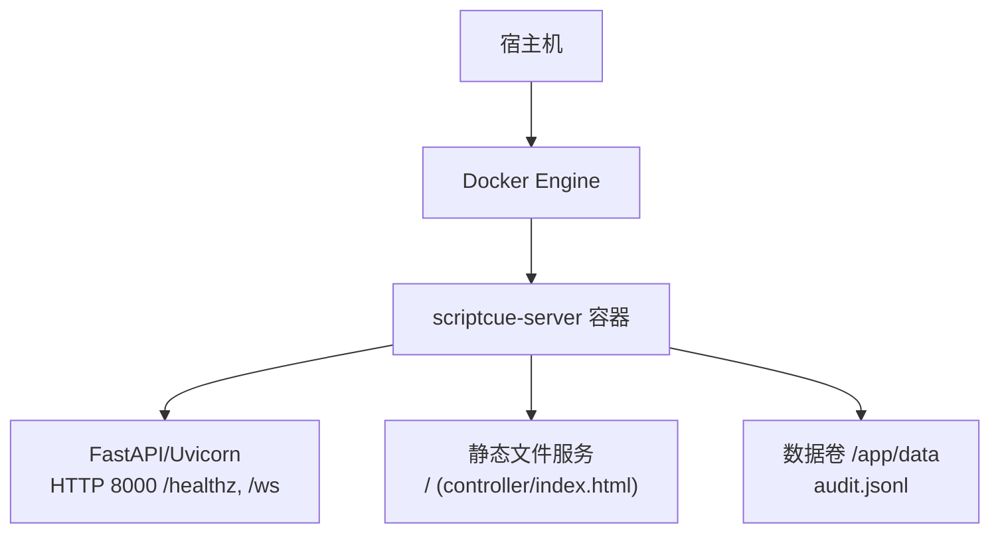
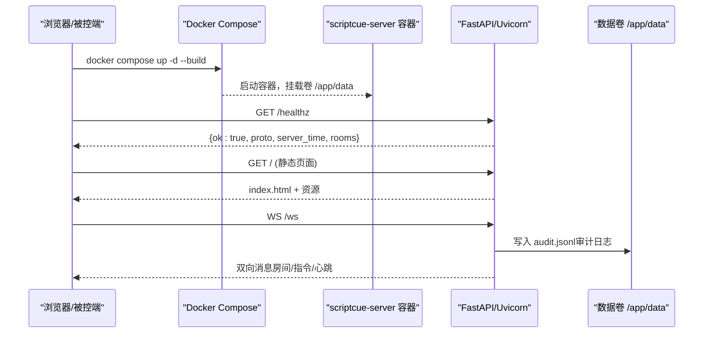
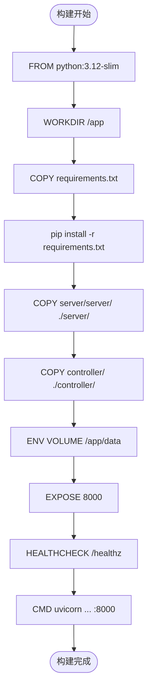
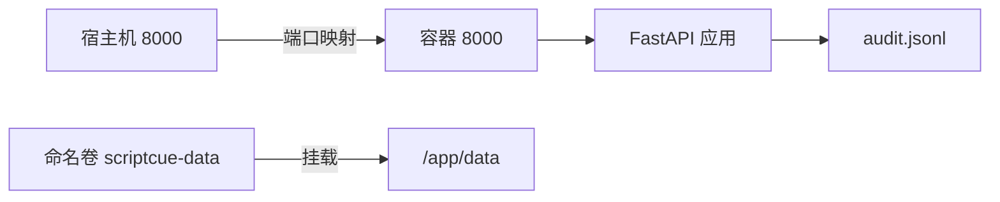
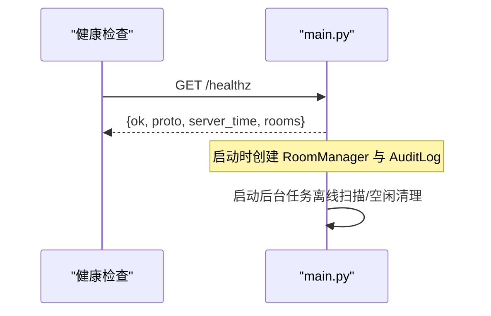
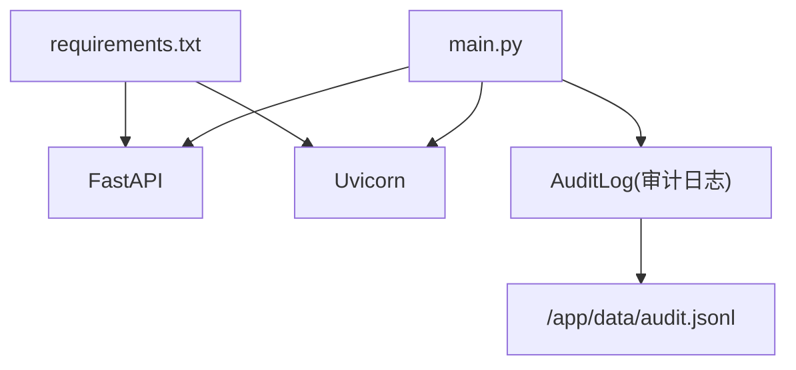

# Docker 容器化部署

<cite>
**本文引用的文件**
- [server/Dockerfile](file://server/Dockerfile)
- [docker-compose.yml](file://docker-compose.yml)
- [server/requirements.txt](file://server/requirements.txt)
- [server/server/main.py](file://server/server/main.py)
- [server/server/audit.py](file://server/server/audit.py)
- [server/server/models.py](file://server/server/models.py)
- [controller/index.html](file://controller/index.html)
- [.dockerignore](file://.dockerignore)
- [README.md](file://README.md)
</cite>

## 目录
1. [简介](#简介)
2. [项目结构](#项目结构)
3. [核心组件](#核心组件)
4. [架构总览](#架构总览)
5. [详细组件分析](#详细组件分析)
6. [依赖关系分析](#依赖关系分析)
7. [性能与资源限制](#性能与资源限制)
8. [故障排查指南](#故障排查指南)
9. [结论](#结论)
10. [附录：多环境部署与生产优化](#附录多环境部署与生产优化)

## 简介
本指南面向 ScriptCue 服务端的 Docker 容器化部署，覆盖镜像构建、依赖安装、文件复制、端口暴露、健康检查、数据持久化、编排配置、环境变量、安全加固、资源限制以及多环境与生产优化建议。文档基于仓库内现有 Dockerfile、docker-compose 与服务端代码实现进行说明，并提供可直接执行的命令示例与最佳实践。

## 项目结构
ScriptCue 服务端采用 FastAPI + Uvicorn 提供 HTTP 与 WebSocket 接口，静态主控页面由服务端直接托管；运行时审计日志写入可挂载的数据卷，确保重启不丢失。Docker 镜像以 Python 精简基础镜像构建，仅安装必要依赖并暴露 8000 端口。

图表来源
- [server/Dockerfile:1-24](file://server/Dockerfile#L1-L24)
- [server/server/main.py:75-98](file://server/server/main.py#L75-L98)
- [docker-compose.yml:1-15](file://docker-compose.yml#L1-L15)

章节来源
- [README.md:9-20](file://README.md#L9-L20)
- [server/Dockerfile:1-24](file://server/Dockerfile#L1-L24)
- [docker-compose.yml:1-15](file://docker-compose.yml#L1-L15)

## 核心组件
- 镜像构建（Dockerfile）
  - 基础镜像：python:3.12-slim
  - 工作目录：/app
  - 依赖安装：通过 requirements.txt 安装 FastAPI 与 Uvicorn
  - 文件复制：复制 server/server 与 controller 到镜像中
  - 数据卷：/app/data 用于审计日志等持久化数据
  - 端口：EXPOSE 8000
  - 健康检查：定期访问 /healthz 判定存活
  - 启动命令：uvicorn 运行 FastAPI 应用，监听 0.0.0.0:8000

- 服务编排（docker-compose.yml）
  - 服务名：scriptcue-server
  - 构建上下文：仓库根目录，指定 Dockerfile 路径
  - 端口映射：宿主机 8000 -> 容器 8000
  - 数据卷：命名卷 scriptcue-data 挂载至 /app/data
  - 重启策略：unless-stopped

- 服务端应用（main.py）
  - 环境变量：SC_DATA_DIR、SC_CONTROLLER_DIR、SC_DEFAULT_LEAD_MS、SC_LOG_LEVEL
  - 路由：/healthz 健康检查、/ws WebSocket 入口、/ 静态页面托管
  - 后台任务：离线设备扫描、空闲房间清理
  - 审计日志：写入 SC_DATA_DIR/audit.jsonl

章节来源
- [server/Dockerfile:1-24](file://server/Dockerfile#L1-L24)
- [docker-compose.yml:1-15](file://docker-compose.yml#L1-L15)
- [server/server/main.py:1-98](file://server/server/main.py#L1-L98)
- [server/requirements.txt:1-3](file://server/requirements.txt#L1-L3)

## 架构总览
下图展示从客户端到服务端的请求流程，包括健康检查、WebSocket 连接与静态页面加载。

图表来源
- [server/Dockerfile:18-23](file://server/Dockerfile#L18-L23)
- [server/server/main.py:75-98](file://server/server/main.py#L75-L98)
- [server/server/audit.py:17-37](file://server/server/audit.py#L17-L37)
- [docker-compose.yml:1-15](file://docker-compose.yml#L1-L15)

## 详细组件分析

### 镜像构建与运行（Dockerfile）
- 基础镜像选择：使用 python:3.12-slim，体积较小且满足 Python 3.12+ 要求。
- 依赖安装：通过 requirements.txt 安装 FastAPI 与 Uvicorn，启用 --no-cache-dir 减小镜像体积。
- 文件复制：将 server/server 与 controller 复制到镜像，便于运行时提供 API 与静态页面。
- 数据卷：声明 /app/data 为 VOLUME，部署时通过卷或绑定挂载保留审计日志。
- 健康检查：HEALTHCHECK 每 30s 调用 /healthz，超时 3s，重试 3 次。
- 启动命令：使用 uvicorn 启动 FastAPI 应用，监听 0.0.0.0:8000。

图表来源
- [server/Dockerfile:1-24](file://server/Dockerfile#L1-L24)

章节来源
- [server/Dockerfile:1-24](file://server/Dockerfile#L1-L24)
- [server/requirements.txt:1-3](file://server/requirements.txt#L1-L3)

### 服务编排（docker-compose.yml）
- 服务定义：scriptcue-server，构建上下文为仓库根目录，指定 Dockerfile 路径。
- 端口映射：宿主机 8000 映射到容器 8000。
- 数据卷：命名卷 scriptcue-data 挂载到 /app/data，保证审计日志持久化。
- 重启策略：unless-stopped，异常退出自动重启。

图表来源
- [docker-compose.yml:1-15](file://docker-compose.yml#L1-L15)

章节来源
- [docker-compose.yml:1-15](file://docker-compose.yml#L1-L15)

### 服务端应用与环境变量（main.py）
- 环境变量
  - SC_DATA_DIR：审计日志目录，默认指向仓库 server/data，Docker 内为 /app/data。
  - SC_CONTROLLER_DIR：主控端静态目录，默认指向仓库 controller。
  - SC_DEFAULT_LEAD_MS：指令默认提前量（毫秒）。
  - SC_LOG_LEVEL：日志级别，默认 INFO。
- 路由与功能
  - /healthz：返回服务状态、协议版本、服务器时间与房间数。
  - /ws：WebSocket 长连接，处理房间与会话逻辑。
  - /：静态页面托管（index.html），供主控端使用。
- 后台任务
  - 离线设备扫描：检测心跳超时并标记离线。
  - 空闲房间清理：超过阈值销毁空闲房间。

图表来源
- [server/server/main.py:28-37](file://server/server/main.py#L28-L37)
- [server/server/main.py:63-98](file://server/server/main.py#L63-L98)

章节来源
- [server/server/main.py:1-98](file://server/server/main.py#L1-L98)
- [server/server/audit.py:17-37](file://server/server/audit.py#L17-L37)
- [server/server/models.py:1-157](file://server/server/models.py#L1-L157)

### 静态主控页面（controller/index.html）
- 提供房间创建/加入、设备列表、指令下发与回执展示等功能。
- 由服务端静态托管，访问根路径即可打开主控界面。

章节来源
- [controller/index.html:1-98](file://controller/index.html#L1-L98)

## 依赖关系分析
- 运行时依赖
  - FastAPI：Web 框架，提供路由与 WebSocket 支持。
  - Uvicorn：ASGI 服务器，承载 FastAPI 应用。
- 构建期依赖
  - Python 3.12 精简镜像，减少镜像体积。
- 外部集成点
  - 数据卷 /app/data：审计日志持久化。
  - 端口 8000：HTTP/WS 对外暴露。

图表来源
- [server/requirements.txt:1-3](file://server/requirements.txt#L1-L3)
- [server/server/main.py:22-37](file://server/server/main.py#L22-L37)
- [server/server/audit.py:17-37](file://server/server/audit.py#L17-L37)

章节来源
- [server/requirements.txt:1-3](file://server/requirements.txt#L1-L3)
- [server/server/main.py:22-37](file://server/server/main.py#L22-L37)
- [server/server/audit.py:17-37](file://server/server/audit.py#L17-L37)

## 性能与资源限制
- 健康检查
  - 已内置 HEALTHCHECK 访问 /healthz，间隔 30s，超时 3s，重试 3 次。建议在编排层结合健康状态进行滚动更新或流量切换。
- 资源限制（推荐）
  - CPU：根据并发与指令调度频率设置上限，避免影响时钟同步精度。
  - 内存：FastAPI + Uvicorn 通常轻量，但需预留审计日志写入与房间会话的内存开销。
  - I/O：审计日志为追加写，建议使用本地 SSD 或高性能云盘以提升吞吐。
- 网络
  - 仅暴露 8000 端口，建议通过反向代理（如 Nginx/Traefik）统一入口，开启 TLS 终止与限流。
- 日志
  - 调整 SC_LOG_LEVEL 控制输出级别；生产建议 INFO 或 WARN，避免 DEBUG 产生过大日志。

[本节为通用指导，不直接分析具体文件]

## 故障排查指南
- 健康检查失败
  - 检查 /healthz 是否可达；确认端口映射与健康检查参数。
  - 查看容器日志定位启动错误。
- 审计日志未持久化
  - 确认数据卷 scriptcue-data 已正确挂载至 /app/data。
  - 检查权限与磁盘空间。
- 静态页面无法访问
  - 确认 controller 目录已复制到镜像，且 SC_CONTROLLER_DIR 指向正确路径。
- WebSocket 连接失败
  - 检查防火墙与反向代理配置，确保 /ws 路径透传。
  - 查看房间内成员状态与心跳是否正常。

章节来源
- [server/Dockerfile:20-23](file://server/Dockerfile#L20-L23)
- [server/server/main.py:75-98](file://server/server/main.py#L75-L98)
- [server/server/audit.py:17-37](file://server/server/audit.py#L17-L37)

## 结论
ScriptCue 服务端已具备完善的 Docker 化基础：精简镜像、明确依赖、健康检查、数据持久化与简洁的编排配置。按照本指南执行构建与部署命令，即可快速上线；在生产环境中建议结合反向代理、TLS、资源限制与安全加固策略进一步提升稳定性与安全性。

[本节为总结性内容，不直接分析具体文件]

## 附录：多环境部署与生产优化

### 构建与运行命令示例
- 构建镜像（在仓库根目录执行）
  - docker build -f server/Dockerfile -t scriptcue-server .
- 运行容器（单实例）
  - docker run -d -p 8000:8000 -v scriptcue-data:/app/data --name scriptcue-server scriptcue-server
- 使用 Compose 启动
  - docker compose up -d --build

章节来源
- [README.md:44-55](file://README.md#L44-L55)
- [docker-compose.yml:1-15](file://docker-compose.yml#L1-L15)
- [server/Dockerfile:1-24](file://server/Dockerfile#L1-L24)

### 环境变量配置
- SC_DATA_DIR：审计日志目录，Docker 内默认 /app/data，可通过卷挂载持久化。
- SC_CONTROLLER_DIR：主控端静态目录，默认指向仓库 controller。
- SC_DEFAULT_LEAD_MS：指令默认提前量（毫秒）。
- SC_LOG_LEVEL：日志级别，默认 INFO。

章节来源
- [server/server/main.py:6-9](file://server/server/main.py#L6-L9)
- [server/server/main.py:28-37](file://server/server/main.py#L28-L37)

### 健康检查与编排增强
- 健康检查已在镜像中配置，可在编排层增加 depends_on 条件与 healthcheck 联动。
- 建议配合反向代理进行负载均衡与 TLS 终止。

章节来源
- [server/Dockerfile:20-23](file://server/Dockerfile#L20-L23)
- [docker-compose.yml:1-15](file://docker-compose.yml#L1-L15)

### 数据持久化与备份
- 审计日志位于 /app/data/audit.jsonl，通过命名卷或绑定挂载持久化。
- 建议定期备份数据卷，或在存储层启用快照与异地容灾。

章节来源
- [server/server/audit.py:17-37](file://server/server/audit.py#L17-L37)
- [server/Dockerfile:14-16](file://server/Dockerfile#L14-L16)

### 安全加固建议
- 最小权限原则：容器以非 root 用户运行（可在镜像中新增用户与权限配置）。
- 网络隔离：仅暴露必要端口，使用内部网络隔离其他服务。
- 输入校验与限流：通过反向代理对请求速率与大小进行限制。
- 敏感信息：避免将密钥写入镜像，使用环境变量或密钥管理服务注入。

[本节为通用指导，不直接分析具体文件]

### 多环境策略
- 开发环境：直接使用 docker compose 启动，开启较详细日志。
- 测试环境：独立命名卷与端口，模拟真实负载。
- 生产环境：
  - 使用反向代理（Nginx/Traefik）统一入口，开启 HTTPS。
  - 资源限制：CPU/内存上限，防止资源争用。
  - 监控告警：采集健康检查状态与应用指标，设置告警阈值。
  - 灰度发布：通过滚动更新与蓝绿/金丝雀策略降低风险。

[本节为通用指导，不直接分析具体文件]