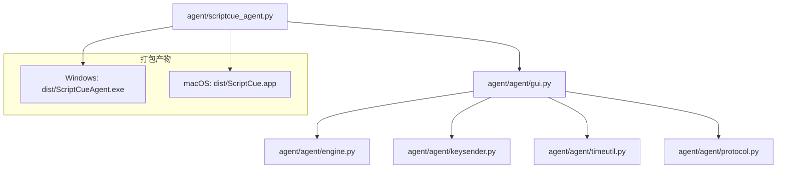
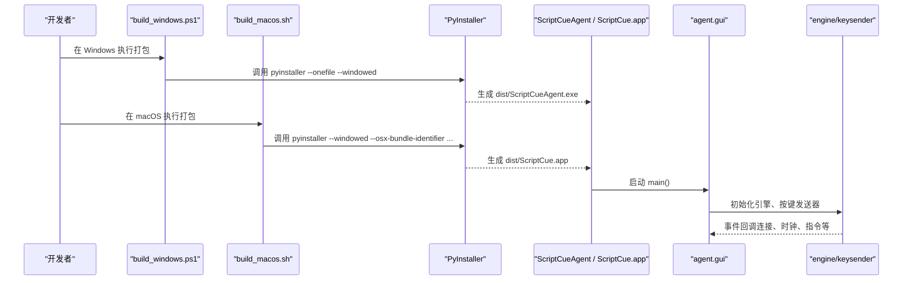
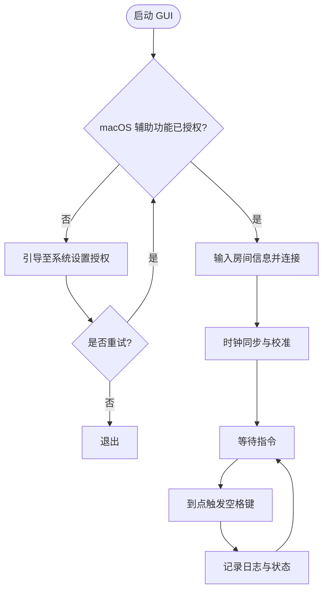
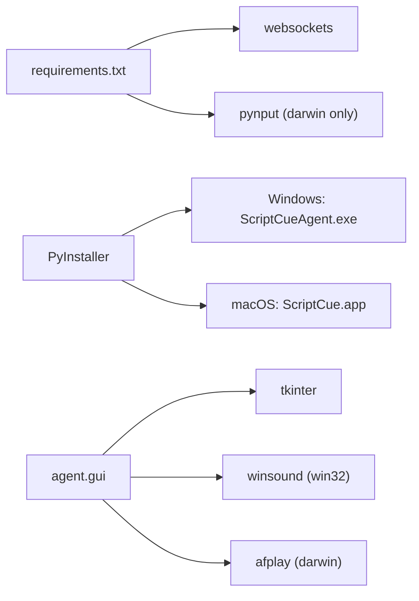

# 应用打包发布

<cite>
**本文引用的文件**
- [agent/build_windows.ps1](file://agent/build_windows.ps1)
- [agent/build_macos.sh](file://agent/build_macos.sh)
- [agent/scriptcue_agent.py](file://agent/scriptcue_agent.py)
- [agent/requirements.txt](file://agent/requirements.txt)
- [agent/agent/gui.py](file://agent/agent/gui.py)
- [README.md](file://README.md)
</cite>

## 目录
1. [简介](#简介)
2. [项目结构](#项目结构)
3. [核心组件](#核心组件)
4. [架构总览](#架构总览)
5. [详细组件分析](#详细组件分析)
6. [依赖关系分析](#依赖关系分析)
7. [性能与体积优化](#性能与体积优化)
8. [故障排查指南](#故障排查指南)
9. [版本管理与更新机制](#版本管理与更新机制)
10. [用户分发流程](#用户分发流程)
11. [结论](#结论)

## 简介
本指南面向 ScriptCue 被控端（Agent）的打包与发布，覆盖 Windows 与 macOS 两大平台。内容包括：
- Windows 平台的 PowerShell 打包脚本使用方法、PyInstaller 配置要点、图标集成与数字签名流程建议
- macOS 平台的 Shell 打包脚本使用方法、权限设置、代码签名与公证、分发准备
- 跨平台兼容性检查与测试方法
- 版本管理策略、更新机制与用户分发流程

## 项目结构
被控端位于 agent 目录，采用 Python + PyInstaller 单文件/应用包方式打包；GUI 基于 tkinter，关键入口为 scriptcue_agent.py，实际业务逻辑由 agent.gui 提供。

图表来源
- [agent/scriptcue_agent.py:1-10](file://agent/scriptcue_agent.py#L1-L10)
- [agent/agent/gui.py:1-40](file://agent/agent/gui.py#L1-L40)

章节来源
- [README.md:7-14](file://README.md#L7-L14)
- [agent/scriptcue_agent.py:1-10](file://agent/scriptcue_agent.py#L1-L10)

## 核心组件
- 打包入口：scriptcue_agent.py 仅负责导入并调用 GUI 主函数，便于 PyInstaller 聚焦打包目标
- GUI 主程序：agent/gui.py 实现连接、时钟同步、指令倒计时、补偿值配置、日志输出等
- 平台差异：
  - Windows 使用 winsound 提示音
  - macOS 使用 afplay 播放系统音效，并通过辅助功能权限引导确保按键模拟可用
- 依赖：websockets（跨平台）、pynput（仅在 macOS 下需要）

章节来源
- [agent/scriptcue_agent.py:1-10](file://agent/scriptcue_agent.py#L1-L10)
- [agent/agent/gui.py:1-40](file://agent/agent/gui.py#L1-L40)
- [agent/requirements.txt:1-6](file://agent/requirements.txt#L1-L6)

## 架构总览
下图展示从打包脚本到最终可执行文件的构建流程，以及运行时关键模块的交互。

图表来源
- [agent/build_windows.ps1:1-15](file://agent/build_windows.ps1#L1-L15)
- [agent/build_macos.sh:1-20](file://agent/build_macos.sh#L1-L20)
- [agent/scriptcue_agent.py:1-10](file://agent/scriptcue_agent.py#L1-L10)
- [agent/agent/gui.py:1-40](file://agent/agent/gui.py#L1-L40)

## 详细组件分析

### Windows 打包脚本（PowerShell）
- 作用：使用 PyInstaller 将 scriptcue_agent.py 打包为单文件可执行程序
- 关键参数：
  - --noconfirm：非交互式确认
  - --onefile：单文件模式
  - --windowed：隐藏控制台窗口
  - --name：指定输出文件名
- 产物：dist/ScriptCueAgent.exe
- 注意事项：未签名程序首次运行会触发 SmartScreen 提示，需按指引处理

章节来源
- [agent/build_windows.ps1:1-15](file://agent/build_windows.ps1#L1-L15)

#### Windows 图标集成
- 当前脚本未包含图标参数。若需集成图标，可在 PyInstaller 命令中添加 --icon 参数指向 .ico 文件路径
- 建议在 build_windows.ps1 中新增变量保存图标路径，并在 pyinstaller 命令中使用该变量

#### Windows 数字签名流程（建议）
- 使用代码签名证书对生成的 exe 进行签名，可降低 SmartScreen 警告概率
- 常见做法：
  - 使用 signtool 对 dist/ScriptCueAgent.exe 进行签名
  - 在 CI/CD 中注入证书与密码，自动化签名
- 注意：签名前请确保二进制已完整构建并通过基础测试

### macOS 打包脚本（Shell）
- 作用：使用 PyInstaller 将 scriptcue_agent.py 打包为 macOS 应用包
- 关键参数：
  - --windowed：无控制台窗口
  - --osx-bundle-identifier：设置 Bundle Identifier（如 com.scriptcue.agent）
  - --collect-submodules pynput：确保 pynput 子模块被收集
- 产物：dist/ScriptCue.app
- 注意事项：当前未做签名与公证，首次打开需右键→打开，详见首次打开指引

章节来源
- [agent/build_macos.sh:1-20](file://agent/build_macos.sh#L1-L20)

#### macOS 权限设置
- 辅助功能权限：GUI 启动时会检测并引导用户开启“辅助功能”权限，以便模拟按键
- 若权限未授予，应用将无法正常工作；请按弹窗提示完成授权后重启应用

章节来源
- [agent/agent/gui.py:433-454](file://agent/agent/gui.py#L433-L454)

#### macOS 代码签名与公证（建议）
- 代码签名：使用 Apple Developer 证书对 ScriptCue.app 进行签名
- 公证：对签名后的应用执行 xcrun altool 或 notarytool 进行公证，提升信任度
- 建议在 build_macos.sh 中增加可选步骤，根据环境变量决定是否签名与公证

### 运行时关键流程（GUI）
- 启动：scriptcue_agent.py 调用 agent.gui.main()
- 连接：输入服务器地址、房间码、昵称等信息后建立 WebSocket 连接
- 时钟同步：持续采样网络延迟与偏移，计算本地可信时间
- 指令调度：收到带绝对执行时刻的指令后，本地高精度定时触发空格键
- 提示音：Windows 使用 winsound，macOS 使用 afplay
- 紧凑面板：支持置顶小面板显示状态与倒计时

图表来源
- [agent/agent/gui.py:206-239](file://agent/agent/gui.py#L206-L239)
- [agent/agent/gui.py:301-354](file://agent/agent/gui.py#L301-L354)
- [agent/agent/gui.py:433-454](file://agent/agent/gui.py#L433-L454)

章节来源
- [agent/scriptcue_agent.py:1-10](file://agent/scriptcue_agent.py#L1-L10)
- [agent/agent/gui.py:1-40](file://agent/agent/gui.py#L1-L40)

## 依赖关系分析
- 运行时依赖：
  - websockets：跨平台 WebSocket 通信
  - pynput：仅在 macOS 下通过 requirements.txt 条件安装
- 打包依赖：
  - PyInstaller：用于生成 Windows 单文件与 macOS 应用包
- GUI 依赖：
  - tkinter：跨平台 GUI 框架
  - 平台特定：winsound（Windows）、afplay（macOS）

图表来源
- [agent/requirements.txt:1-6](file://agent/requirements.txt#L1-L6)
- [agent/agent/gui.py:71-89](file://agent/agent/gui.py#L71-L89)

章节来源
- [agent/requirements.txt:1-6](file://agent/requirements.txt#L1-L6)
- [agent/agent/gui.py:71-89](file://agent/agent/gui.py#L71-L89)

## 性能与体积优化
- 单文件 vs 应用包：
  - Windows 使用 --onefile 便于分发，但首次解压有开销
  - macOS 使用应用包，便于后续签名与公证
- 模块收集：
  - macOS 显式收集 pynput 子模块，避免运行时缺失
- 资源精简：
  - 避免引入不必要的第三方库
  - 合理划分模块，减少静态资源嵌入

[本节为通用指导，不直接分析具体文件]

## 故障排查指南
- Windows SmartScreen 提示：
  - 现象：首次运行弹出安全警告
  - 处理：点击“更多信息”→“仍要运行”，或为程序添加数字签名
- macOS 首次打开限制：
  - 现象：双击无法打开或提示来自未识别开发者
  - 处理：右键→打开，或在“系统设置→隐私与安全性”中允许
- 辅助功能权限未授予：
  - 现象：无法模拟按键
  - 处理：按 GUI 引导进入系统设置，勾选本程序后重启
- 网络连接失败：
  - 现象：无法加入房间或频繁重连
  - 处理：检查服务器地址、防火墙与代理设置

章节来源
- [agent/build_windows.ps1:12-15](file://agent/build_windows.ps1#L12-L15)
- [agent/build_macos.sh:17-20](file://agent/build_macos.sh#L17-L20)
- [agent/agent/gui.py:433-454](file://agent/agent/gui.py#L433-L454)

## 版本管理与更新机制
- 版本号约定：
  - 建议使用语义化版本（主版本.次版本.修订号），例如 1.2.3
  - 在打包脚本中读取版本号并写入元数据（如需）
- 变更日志：
  - 维护 CHANGELOG.md，记录每次发布的改进与修复
- 更新机制建议：
  - 服务端下发版本信息，客户端定期比对并提示更新
  - 下载新包后替换旧版本，保留用户配置目录
- 回滚策略：
  - 保留上一版本备份，出现严重问题时快速回滚

[本节为通用指导，不直接分析具体文件]

## 用户分发流程
- Windows 分发：
  - 产物：dist/ScriptCueAgent.exe
  - 建议：对 exe 进行数字签名，降低 SmartScreen 警告
  - 分发渠道：内部站点、企业软件商店、邮件附件（注意杀毒软件误报）
- macOS 分发：
  - 产物：dist/ScriptCue.app
  - 建议：代码签名+公证，提升信任度与用户体验
  - 分发渠道：DMG 安装包、企业内部分发、TestFlight（不适用）
- 文档与指引：
  - 提供首次打开指引（含权限设置）
  - 提供常见问题解答（FAQ）

章节来源
- [agent/build_windows.ps1:1-15](file://agent/build_windows.ps1#L1-L15)
- [agent/build_macos.sh:1-20](file://agent/build_macos.sh#L1-L20)
- [README.md:74-79](file://README.md#L74-L79)

## 结论
- Windows 与 macOS 均通过 PyInstaller 完成打包，脚本简洁明确
- 当前未启用数字签名与公证，首次运行存在安全提示，建议在生产环境启用签名以提升信任度
- GUI 具备完善的权限引导与自检逻辑，确保在不同平台下的可用性
- 建议完善版本管理与更新机制，配合服务端实现平滑升级

[本节为总结性内容，不直接分析具体文件]