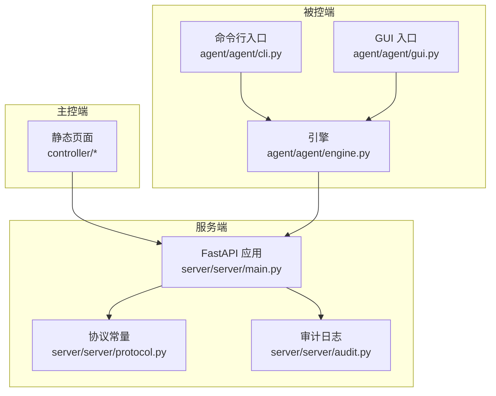
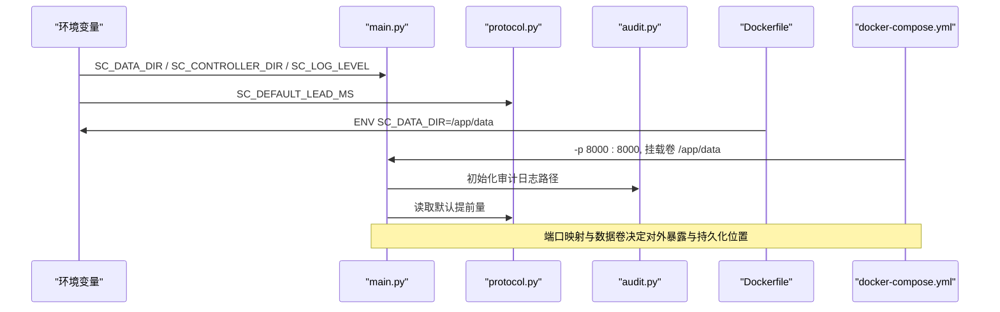
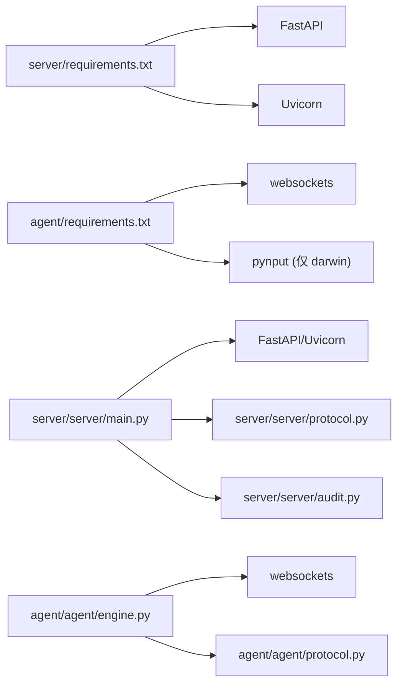

# 环境配置管理

<cite>
**本文引用的文件**
- [README.md](file://README.md)
- [docker-compose.yml](file://docker-compose.yml)
- [server/Dockerfile](file://server/Dockerfile)
- [server/server/main.py](file://server/server/main.py)
- [server/server/protocol.py](file://server/server/protocol.py)
- [server/server/audit.py](file://server/server/audit.py)
- [server/requirements.txt](file://server/requirements.txt)
- [agent/requirements.txt](file://agent/requirements.txt)
- [agent/agent/cli.py](file://agent/agent/cli.py)
- [agent/agent/engine.py](file://agent/agent/engine.py)
- [agent/agent/gui.py](file://agent/agent/gui.py)
</cite>

## 目录
1. [简介](#简介)
2. [项目结构](#项目结构)
3. [核心组件](#核心组件)
4. [架构总览](#架构总览)
5. [详细组件分析](#详细组件分析)
6. [依赖关系分析](#依赖关系分析)
7. [性能与调优建议](#性能与调优建议)
8. [故障排除指南](#故障排除指南)
9. [结论](#结论)
10. [附录：环境变量与配置清单](#附录环境变量与配置清单)

## 简介
本指南聚焦 ScriptCue 系统的环境配置管理，覆盖服务端与被控端的关键环境变量、Python 依赖管理（含版本锁定与冲突解决）、开发/生产环境差异、以及配置验证与故障排除方法。目标是帮助你在本地开发、容器化部署和生产环境中稳定运行系统，并具备快速定位和修复配置问题的能力。

## 项目结构
ScriptCue 由三部分构成：
- 服务端：基于 FastAPI + Uvicorn，提供 WebSocket 通信、房间管理、时钟基准、指令广播与审计日志。
- 主控端：静态网页，由服务端托管，用于导播控制。
- 被控端：Python 程序，负责时钟同步、精确到点触发按键事件。

图表来源
- [server/server/main.py:1-98](file://server/server/main.py#L1-L98)
- [server/server/protocol.py:1-80](file://server/server/protocol.py#L1-L80)
- [server/server/audit.py:1-37](file://server/server/audit.py#L1-L37)
- [agent/agent/engine.py:1-388](file://agent/agent/engine.py#L1-L388)
- [agent/agent/cli.py:1-139](file://agent/agent/cli.py#L1-L139)
- [agent/agent/gui.py:41-85](file://agent/agent/gui.py#L41-L85)

章节来源
- [README.md:7-21](file://README.md#L7-L21)

## 核心组件
- 服务端启动与配置加载：通过环境变量注入数据目录、主控端目录、默认提前量等；内置健康检查接口便于容器编排与健康探测。
- 被控端连接与参数：支持命令行参数与环境变量组合，GUI 持久化配置到用户目录 JSON 文件。
- 依赖管理：服务端与被控端分别维护 requirements.txt，使用范围约束避免破坏性升级。

章节来源
- [server/server/main.py:1-98](file://server/server/main.py#L1-L98)
- [server/server/protocol.py:67-79](file://server/server/protocol.py#L67-L79)
- [agent/agent/cli.py:104-139](file://agent/agent/cli.py#L104-L139)
- [agent/agent/gui.py:41-85](file://agent/agent/gui.py#L41-L85)
- [server/requirements.txt:1-3](file://server/requirements.txt#L1-L3)
- [agent/requirements.txt:1-6](file://agent/requirements.txt#L1-L6)

## 架构总览
下图展示关键运行时配置如何影响服务行为：

图表来源
- [server/server/main.py:28-37](file://server/server/main.py#L28-L37)
- [server/server/protocol.py:72-73](file://server/server/protocol.py#L72-L73)
- [server/Dockerfile:14-23](file://server/Dockerfile#L14-L23)
- [docker-compose.yml:1-15](file://docker-compose.yml#L1-L15)

## 详细组件分析

### 服务端环境变量与配置
- 日志级别：SC_LOG_LEVEL，默认 INFO。用于控制 Python logging 输出粒度。
- 数据目录：SC_DATA_DIR，默认仓库内 server/data；Docker 镜像中预设为 /app/data，并通过卷持久化。
- 主控端目录：SC_CONTROLLER_DIR，默认仓库内 controller；若不存在则仅暴露 WebSocket 与健康检查。
- 默认提前量：SC_DEFAULT_LEAD_MS，默认 3000ms，影响指令执行提前时间。

说明
- 上述变量在模块导入或启动时读取，直接影响日志、文件写入路径与调度策略。
- 健康检查接口 /healthz 可用于容器健康探测与外部监控。

章节来源
- [server/server/main.py:6-10](file://server/server/main.py#L6-L10)
- [server/server/main.py:28-37](file://server/server/main.py#L28-L37)
- [server/server/main.py:78-85](file://server/server/main.py#L78-L85)
- [server/server/protocol.py:72-73](file://server/server/protocol.py#L72-L73)

### 被控端配置方式
- 命令行参数：--server、--room、--nickname、--password、--room-name、--dry-run。
- GUI 配置：保存在用户目录下的 JSON 配置文件（Windows 为 %APPDATA%/ScriptCue/agent_config.json，macOS/Linux 为 ~/.config/ScriptCue/agent_config.json），用于记住上次设置。
- 引擎内部参数：lead_ms 从服务器返回或协议默认值获取；compensation_ms 可动态调整并上报。

章节来源
- [agent/agent/cli.py:104-139](file://agent/agent/cli.py#L104-L139)
- [agent/agent/gui.py:41-85](file://agent/agent/gui.py#L41-L85)
- [agent/agent/engine.py:31-55](file://agent/agent/engine.py#L31-L55)
- [agent/agent/engine.py:159-192](file://agent/agent/engine.py#L159-L192)

### 容器化与端口
- 镜像暴露端口：8000。
- docker-compose 将宿主机 8000 映射到容器 8000。
- 数据卷 scriptcue-data 挂载至 /app/data，确保审计日志持久化。

章节来源
- [server/Dockerfile:14-23](file://server/Dockerfile#L14-L23)
- [docker-compose.yml:1-15](file://docker-compose.yml#L1-L15)

### 依赖管理与版本锁定
- 服务端依赖：fastapi、uvicorn[standard]，使用范围约束防止主版本破坏性升级。
- 被控端依赖：websockets；可选 pynput（仅在 macOS 平台）；打包工具 pyinstaller 注释保留，按需启用。
- 版本锁定建议：
  - 使用 pip freeze > requirements.lock 生成锁文件，CI/CD 安装时使用固定版本。
  - 对 websockets、fastapi、uvicorn 等关键库进行最小/最大版本约束，避免自动升级导致兼容性问题。
  - 当出现依赖冲突时，优先统一 Python 版本（≥3.10），并使用虚拟环境隔离。

章节来源
- [server/requirements.txt:1-3](file://server/requirements.txt#L1-L3)
- [agent/requirements.txt:1-6](file://agent/requirements.txt#L1-L6)
- [README.md:29-32](file://README.md#L29-L32)

### 开发环境与生产环境差异
- 开发环境
  - 日志级别：可设置为 DEBUG 以获取更多调试信息。
  - 前端目录：确保 SC_CONTROLLER_DIR 指向有效的 controller 目录，以便浏览器访问主控端。
  - 端口：本地 uvicorn 默认 8000，可通过命令行参数调整。
- 生产环境
  - 日志级别：建议 INFO 或 WARNING，减少 I/O 开销。
  - 数据目录：通过环境变量或卷挂载到持久化存储，避免重启丢失审计日志。
  - 提前量：根据网络质量调整 SC_DEFAULT_LEAD_MS，平衡精度与鲁棒性。
  - 安全：仅暴露必要端口（8000），配合反向代理与 TLS 终止。

章节来源
- [server/server/main.py:28-37](file://server/server/main.py#L28-L37)
- [server/server/main.py:78-98](file://server/server/main.py#L78-L98)
- [server/server/protocol.py:72-73](file://server/server/protocol.py#L72-L73)

## 依赖关系分析

图表来源
- [server/requirements.txt:1-3](file://server/requirements.txt#L1-L3)
- [agent/requirements.txt:1-6](file://agent/requirements.txt#L1-L6)
- [server/server/main.py:19-26](file://server/server/main.py#L19-L26)
- [agent/agent/engine.py:12-23](file://agent/agent/engine.py#L12-L23)

章节来源
- [server/requirements.txt:1-3](file://server/requirements.txt#L1-L3)
- [agent/requirements.txt:1-6](file://agent/requirements.txt#L1-L6)

## 性能与调优建议
- 日志级别：生产环境降低日志级别以减少磁盘 I/O 与 CPU 占用。
- 提前量：根据网络 RTT 与抖动调整 SC_DEFAULT_LEAD_MS，确保指令有足够缓冲。
- 心跳与离线判定：保持默认心跳间隔与离线阈值，避免误判。
- 资源限制：容器化部署时合理设置内存与 CPU 限制，避免被控端机器因按键注入阻塞 UI。

章节来源
- [server/server/main.py:28-37](file://server/server/main.py#L28-L37)
- [server/server/protocol.py:75-79](file://server/server/protocol.py#L75-L79)

## 故障排除指南
- 无法访问主控端页面
  - 检查 SC_CONTROLLER_DIR 是否指向有效目录；若缺失，服务端仅提供 WebSocket 与健康检查。
  - 确认端口映射正确（docker-compose 默认 8000）。
- 审计日志未持久化
  - 确认 SC_DATA_DIR 已正确设置且可写；Docker 环境下需挂载卷至 /app/data。
- 被控端无法连接
  - 检查 --server 地址格式（http(s) 会被转换为 ws(s)），并确保防火墙放行端口。
  - 查看 CLI 输出的连接与重连日志，确认网络可达性与认证信息。
- 指令未触发或延迟大
  - 检查时钟同步状态（offset、rtt、quality），必要时调整补偿值 comp。
  - 适当增大 SC_DEFAULT_LEAD_MS 以提升鲁棒性。

章节来源
- [server/server/main.py:93-98](file://server/server/main.py#L93-L98)
- [server/server/audit.py:17-37](file://server/server/audit.py#L17-L37)
- [agent/agent/cli.py:104-139](file://agent/agent/cli.py#L104-L139)
- [agent/agent/engine.py:106-128](file://agent/agent/engine.py#L106-L128)

## 结论
通过合理配置环境变量、管理 Python 依赖、区分开发与生产环境，并结合容器化部署与健康检查，可以稳定运行 ScriptCue 系统。建议在 CI/CD 中引入依赖锁定与配置校验，持续监控日志与指标，及时优化提前量与日志级别，保障高精度同步起播的可靠性。

## 附录：环境变量与配置清单
- 服务端
  - SC_LOG_LEVEL：日志级别，默认 INFO。
  - SC_DATA_DIR：审计日志数据目录，默认 <repo>/server/data；Docker 内为 /app/data。
  - SC_CONTROLLER_DIR：主控端静态目录，默认 <repo>/controller。
  - SC_DEFAULT_LEAD_MS：指令默认提前量（毫秒），默认 3000。
- 容器化
  - 端口：8000（容器内），通过 docker-compose 映射到宿主机。
  - 数据卷：scriptcue-data 挂载至 /app/data。
- 被控端
  - 命令行参数：--server、--room、--nickname、--password、--room-name、--dry-run。
  - GUI 配置：用户目录 JSON 文件（Windows：%APPDATA%/ScriptCue/agent_config.json；macOS/Linux：~/.config/ScriptCue/agent_config.json）。

章节来源
- [server/server/main.py:6-10](file://server/server/main.py#L6-L10)
- [server/server/main.py:28-37](file://server/server/main.py#L28-L37)
- [server/Dockerfile:14-23](file://server/Dockerfile#L14-L23)
- [docker-compose.yml:1-15](file://docker-compose.yml#L1-L15)
- [agent/agent/cli.py:104-139](file://agent/agent/cli.py#L104-L139)
- [agent/agent/gui.py:41-85](file://agent/agent/gui.py#L41-L85)