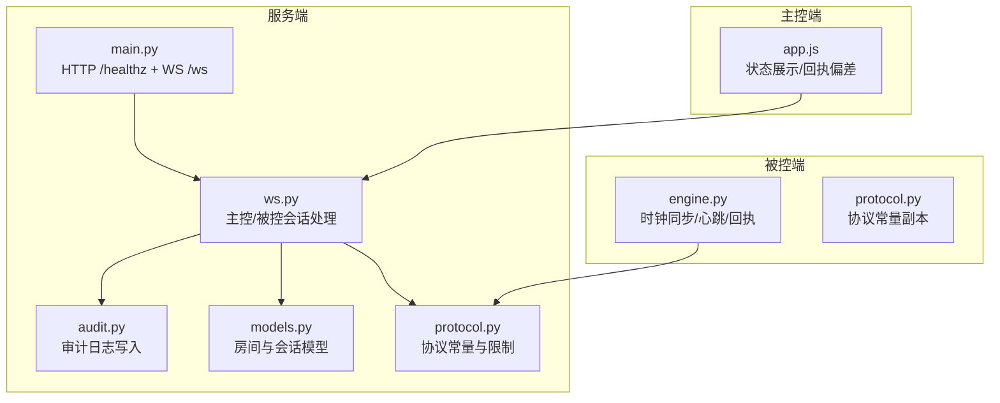
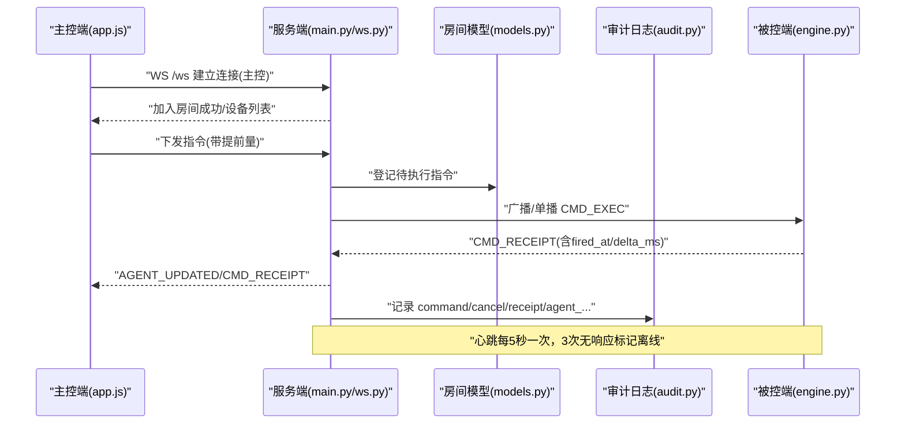
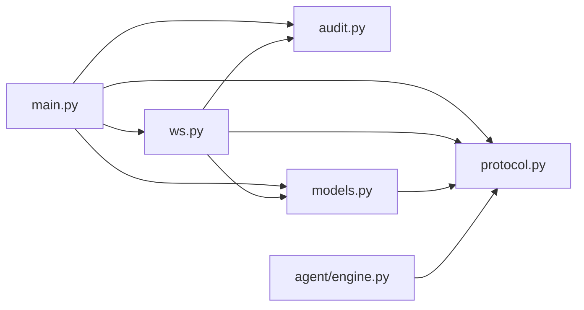

# 监控告警

<cite>
**本文引用的文件**
- [server/server/main.py](file://server/server/main.py)
- [server/server/ws.py](file://server/server/ws.py)
- [server/server/audit.py](file://server/server/audit.py)
- [server/server/models.py](file://server/server/models.py)
- [server/server/protocol.py](file://server/server/protocol.py)
- [agent/agent/engine.py](file://agent/agent/engine.py)
- [agent/agent/protocol.py](file://agent/agent/protocol.py)
- [controller/app.js](file://controller/app.js)
- [README.md](file://README.md)
</cite>

## 目录
1. [简介](#简介)
2. [项目结构](#项目结构)
3. [核心组件](#核心组件)
4. [架构总览](#架构总览)
5. [详细组件分析](#详细组件分析)
6. [依赖关系分析](#依赖关系分析)
7. [性能考虑](#性能考虑)
8. [故障排查指南](#故障排查指南)
9. [结论](#结论)
10. [附录](#附录)

## 简介
本指南面向 ScriptCue 系统的运维与演出保障人员，聚焦“监控与告警”主题，覆盖以下要点：
- 健康检查端点的使用方法与扩展方式
- 审计日志的配置、格式与管理（含轮转建议）
- 性能监控指标采集方案（WebSocket 连接数、指令处理延迟、设备状态统计）
- 告警规则配置与通知机制建议
- 常见问题定位与诊断方法

## 项目结构
ScriptCue 由服务端、主控端网页与被控端三部分组成。监控与告警相关能力主要分布在下述模块：
- 服务端提供 HTTP 健康检查端点与 WebSocket 会话处理，并记录审计日志
- 被控端周期性上报心跳与时钟质量，触发回执上报执行偏差
- 主控端展示设备状态与最近回执偏差，便于人工观察

图表来源
- [server/server/main.py:78-90](file://server/server/main.py#L78-L90)
- [server/server/ws.py:154-207](file://server/server/ws.py#L154-L207)
- [server/server/audit.py:17-36](file://server/server/audit.py#L17-L36)
- [server/server/models.py:17-117](file://server/server/models.py#L17-L117)
- [server/server/protocol.py:67-79](file://server/server/protocol.py#L67-L79)
- [agent/agent/engine.py:217-241](file://agent/agent/engine.py#L217-L241)
- [controller/app.js:240-262](file://controller/app.js#L240-L262)

章节来源
- [README.md:16-27](file://README.md#L16-L27)
- [server/server/main.py:1-10](file://server/server/main.py#L1-L10)

## 核心组件
- 健康检查端点：/healthz，返回服务版本、时间戳、房间数量等基础信息
- WebSocket 会话：/ws 统一接入，区分主控端与被控端角色，承载心跳、指令、回执
- 审计日志：JSON Lines 格式，记录关键事件（命令下发、取消、回执、设备上下线等）
- 房间与会话模型：内存存储房间、设备会话、待执行指令与状态推送
- 协议常量：定义消息类型、错误码、限制参数（如心跳间隔、离线判定、回执超时等）
- 被控端引擎：负责时钟同步、心跳上报、精确调度与回执上报

章节来源
- [server/server/main.py:78-90](file://server/server/main.py#L78-L90)
- [server/server/ws.py:154-207](file://server/server/ws.py#L154-L207)
- [server/server/audit.py:17-36](file://server/server/audit.py#L17-L36)
- [server/server/models.py:17-117](file://server/server/models.py#L17-L117)
- [server/server/protocol.py:67-79](file://server/server/protocol.py#L67-L79)
- [agent/agent/engine.py:217-241](file://agent/agent/engine.py#L217-L241)

## 架构总览
下图展示了从主控端到被控端的指令流转、回执回传与健康检查路径，以及审计日志的落盘位置。

图表来源
- [server/server/ws.py:154-207](file://server/server/ws.py#L154-L207)
- [server/server/ws.py:228-243](file://server/server/ws.py#L228-L243)
- [server/server/audit.py:24-32](file://server/server/audit.py#L24-L32)
- [server/server/protocol.py:67-79](file://server/server/protocol.py#L67-L79)
- [agent/agent/engine.py:297-379](file://agent/agent/engine.py#L297-L379)

## 详细组件分析

### 健康检查端点与自定义健康检查
- 内置端点：GET /healthz
  - 返回字段包括：是否可用、协议版本、服务器时间、当前房间数量
  - 适用于负载均衡器或编排系统的基础存活探测
- 扩展建议：在 FastAPI 应用中增加更多探针
  - 依赖项检查：数据库/磁盘空间/端口占用
  - 业务就绪：房间管理器初始化完成、审计日志句柄可用
  - 资源水位：CPU/内存/文件描述符使用率
  - 外部依赖：NTP/时间源可达性、网络连通性
- 实现要点
  - 将健康检查逻辑封装为独立函数，按路由挂载
  - 对耗时操作设置超时与降级策略，避免影响主请求链路
  - 通过环境变量控制开关与阈值，便于不同环境差异化配置

章节来源
- [server/server/main.py:78-85](file://server/server/main.py#L78-L85)

### 审计日志：配置、格式与管理
- 文件格式：JSON Lines，每条记录包含时间戳、事件类型及上下文字段
- 写入策略：线程锁保护下的同步追加写，适合低吞吐场景
- 存储位置：由环境变量 SC_DATA_DIR 指定，默认位于 server/data；审计文件名为 audit.jsonl
- 事件类型示例：command、cancel、receipt、agent_join、agent_disconnect、agent_offline、room_expired、controller_join/leave 等
- 管理建议
  - 日志轮转：基于文件大小或时间进行切割（如 logrotate），保留策略按合规要求设定
  - 压缩归档：对历史日志进行 gzip 压缩，降低存储成本
  - 索引与检索：将 JSON Lines 导入日志系统（如 Elasticsearch/Loki）以便查询与可视化
  - 安全与权限：限制数据目录访问权限，避免未授权读取
  - 异常处理：写入失败时记录异常日志，必要时触发告警

章节来源
- [server/server/audit.py:17-36](file://server/server/audit.py#L17-L36)
- [server/server/main.py:32-37](file://server/server/main.py#L32-L37)
- [server/server/ws.py:100-104](file://server/server/ws.py#L100-L104)
- [server/server/ws.py:117-134](file://server/server/ws.py#L117-L134)
- [server/server/ws.py:228-243](file://server/server/ws.py#L228-L243)
- [server/server/ws.py:283-289](file://server/server/ws.py#L283-L289)
- [server/server/ws.py:322-327](file://server/server/ws.py#L322-L327)
- [server/server/main.py:40-61](file://server/server/main.py#L40-L61)

### 性能监控指标采集方案
- 指标类别与来源
  - WebSocket 连接数：服务端维护的房间与会话集合可导出当前在线设备数、主控连接数
  - 指令处理延迟：通过回执中的 fired_at 与 at 计算 delta_ms，统计分布（均值、P95/P99）
  - 设备状态统计：在线/离线、就绪状态、时钟质量等级、偏移与 RTT
  - 错误与异常：协议不匹配、房间不存在、口令错误、消息格式错误等
- 采集方式
  - 进程内指标：在 ws.py 中统计连接生命周期、消息类型计数、回执延迟直方图
  - 健康检查增强：在 /healthz 中暴露关键计数器快照（如房间数、在线设备数）
  - 审计日志解析：将 audit.jsonl 中的 receipt 事件抽取为延迟指标
  - 被控端上报：心跳中包含 clock_quality、clock_offset_ms、clock_rtt_ms，用于评估时钟同步质量
- 可视化与告警
  - 将指标推送到时序数据库（Prometheus/TimescaleDB）并通过 Grafana 展示
  - 基于阈值与趋势设置告警规则（见下节）

章节来源
- [server/server/ws.py:228-243](file://server/server/ws.py#L228-L243)
- [server/server/models.py:40-52](file://server/server/models.py#L40-L52)
- [server/server/protocol.py:67-79](file://server/server/protocol.py#L67-L79)
- [agent/agent/engine.py:217-241](file://agent/agent/engine.py#L217-L241)
- [controller/app.js:240-262](file://controller/app.js#L240-L262)

### 告警规则配置与通知机制
- 建议规则
  - 服务可用性：/healthz 连续失败 N 次
  - 设备离线：同一房间超过 3 次心跳无响应（约 15 秒）的设备数突增
  - 指令延迟：delta_ms 超过阈值（例如 ±50ms）的比例上升
  - 时钟质量：clock_quality 为 poor/none 的设备占比过高
  - 错误率：ERR_* 错误码频率异常升高
  - 房间空闲：长时间无活动房间数量增长（资源清理策略生效）
- 通知渠道
  - 邮件/短信/企业微信/钉钉机器人
  - 与现有告警平台集成（如 Alertmanager、PagerDuty）
- 实施建议
  - 将规则以配置文件形式管理，支持热更新
  - 对告警进行去重与抑制，避免风暴
  - 结合审计日志与指标进行根因分析

章节来源
- [server/server/protocol.py:67-79](file://server/server/protocol.py#L67-L79)
- [server/server/main.py:40-51](file://server/server/main.py#L40-L51)
- [server/server/ws.py:228-243](file://server/server/ws.py#L228-L243)
- [agent/agent/engine.py:217-241](file://agent/agent/engine.py#L217-L241)

### 常见问题监控与诊断
- 设备无法上线
  - 检查 /healthz 是否正常
  - 查看审计日志 agent_join/agent_disconnect 事件
  - 确认房间是否存在、口令是否正确
- 指令未触发或延迟大
  - 检查回执 delta_ms 分布，定位网络抖动或本地时钟偏移过大
  - 关注 clock_quality 与 clock_offset_ms，必要时调整补偿值
- 主控端显示异常
  - 检查 WS 连接是否建立成功
  - 查看 ERR_* 错误码与消息内容
- 房间资源泄漏
  - 观察空闲房间销毁逻辑是否生效
  - 核对 last_active_ms 更新时机

章节来源
- [server/server/main.py:78-85](file://server/server/main.py#L78-L85)
- [server/server/ws.py:154-207](file://server/server/ws.py#L154-L207)
- [server/server/ws.py:228-243](file://server/server/ws.py#L228-L243)
- [server/server/audit.py:24-32](file://server/server/audit.py#L24-L32)
- [controller/app.js:240-262](file://controller/app.js#L240-L262)

## 依赖关系分析
- 模块耦合
  - main.py 依赖 ws.py、audit.py、models.py、protocol.py
  - ws.py 依赖 protocol.py、models.py、audit.py、timebase
  - models.py 依赖 protocol.py、timebase
  - engine.py（被控端）依赖 protocol.py、clocksync、scheduler、keysender
- 潜在风险
  - 高并发下审计日志写入成为瓶颈（当前为同步追加写）
  - 房间与会话纯内存存储，重启后需依赖客户端重建
  - 心跳与回执依赖网络稳定性，需合理设置超时与重试

图表来源
- [server/server/main.py:22-37](file://server/server/main.py#L22-L37)
- [server/server/ws.py:15-18](file://server/server/ws.py#L15-L18)
- [server/server/models.py:9-10](file://server/server/models.py#L9-L10)
- [agent/agent/engine.py:19-23](file://agent/agent/engine.py#L19-L23)

章节来源
- [server/server/main.py:22-37](file://server/server/main.py#L22-L37)
- [server/server/ws.py:15-18](file://server/server/ws.py#L15-L18)
- [server/server/models.py:9-10](file://server/server/models.py#L9-L10)
- [agent/agent/engine.py:19-23](file://agent/agent/engine.py#L19-L23)

## 性能考虑
- 心跳与离线判定
  - 心跳间隔 5 秒，3 次无响应（约 15 秒）判定离线，兼顾实时性与开销
- 指令回执窗口
  - 到期后等待回执窗口为 8 秒，超出则清理待执行记录，防止内存泄漏
- 房间空闲销毁
  - 空闲超过 24 小时自动销毁，释放内存资源
- 审计日志写入
  - 当前为同步追加写，适合低吞吐；若未来日志量增大，建议异步化与批量写入
- 时钟同步
  - 密集采样 20 次，维持采样间隔 30 秒，确保高精度调度

章节来源
- [server/server/protocol.py:67-79](file://server/server/protocol.py#L67-L79)
- [server/server/ws.py:107-114](file://server/server/ws.py#L107-L114)
- [server/server/main.py:54-61](file://server/server/main.py#L54-L61)
- [agent/agent/protocol.py:75-79](file://agent/agent/protocol.py#L75-L79)

## 故障排查指南
- 快速定位
  - 使用 /healthz 验证服务存活与基本状态
  - 查看审计日志中的关键事件：agent_join/agent_disconnect、command/cancel/receipt、agent_offline、room_expired
  - 在主控端观察设备状态与最近回执偏差，识别异常设备
- 常见错误码
  - bad_proto：协议版本不匹配
  - room_not_found：房间不存在
  - bad_password：口令错误
  - room_full：房间已满
  - bad_command：未知指令
  - no_such_agent：设备不存在
  - bad_message：消息格式错误
- 处理步骤
  - 若设备频繁离线：检查网络与心跳配置，确认 AGENT_OFFLINE_S 与 HEARTBEAT_INTERVAL_S
  - 若指令延迟大：检查 clock_quality、clock_offset_ms、clock_rtt_ms，调整补偿值
  - 若房间未销毁：检查空闲判定逻辑与 last_active_ms 更新

章节来源
- [server/server/main.py:78-85](file://server/server/main.py#L78-L85)
- [server/server/audit.py:24-32](file://server/server/audit.py#L24-L32)
- [server/server/protocol.py:57-65](file://server/server/protocol.py#L57-L65)
- [server/server/protocol.py:67-79](file://server/server/protocol.py#L67-L79)
- [controller/app.js:240-262](file://controller/app.js#L240-L262)

## 结论
ScriptCue 已具备基础的健康检查与审计日志能力，配合心跳与回执机制可实现对设备状态与指令执行的监控。建议在现有基础上：
- 扩展 /healthz 以暴露更多运行时指标
- 引入指标采集与可视化平台，建立告警规则与通知机制
- 优化审计日志的轮转与归档策略，提升可观测性与可维护性

## 附录
- 环境变量
  - SC_DATA_DIR：审计日志存储目录
  - SC_CONTROLLER_DIR：主控端静态页面目录
  - SC_DEFAULT_LEAD_MS：指令默认提前量（毫秒）
  - SC_LOG_LEVEL：日志级别
- 关键常量参考
  - 心跳间隔：5 秒
  - 离线判定：3 次心跳无响应（约 15 秒）
  - 回执超时窗口：8 秒
  - 房间空闲 TTL：24 小时
  - 最大设备数：每房间 20（1 大屏 + 最多 19 台口述员）

章节来源
- [server/server/main.py:6-9](file://server/server/main.py#L6-L9)
- [server/server/protocol.py:67-79](file://server/server/protocol.py#L67-L79)