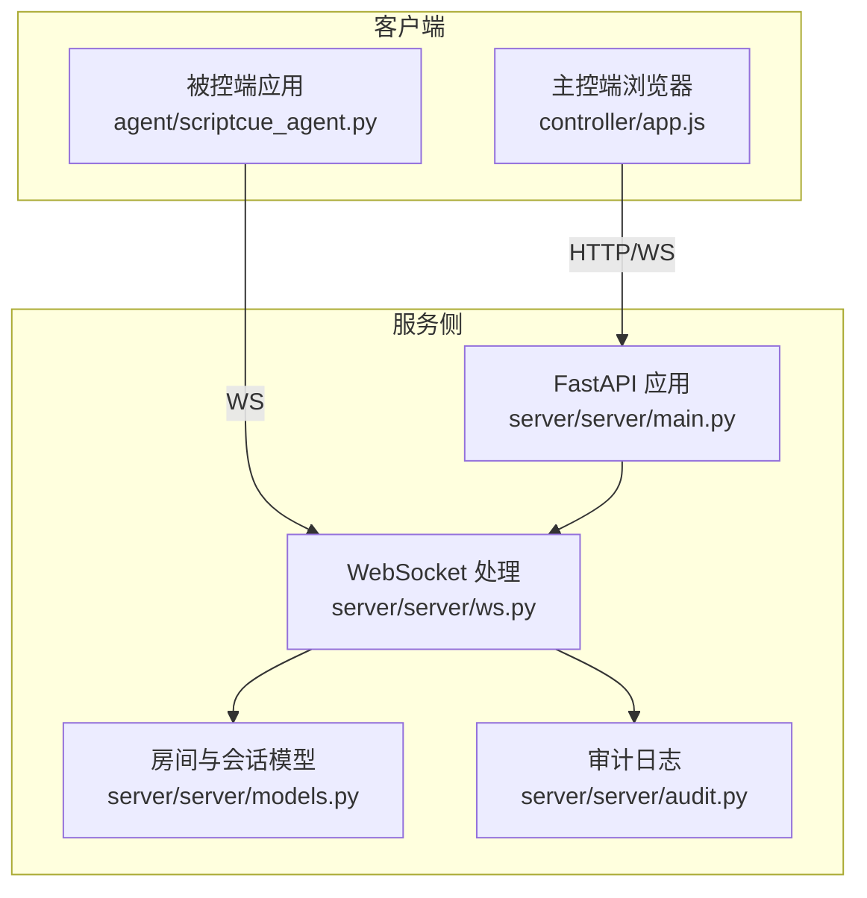
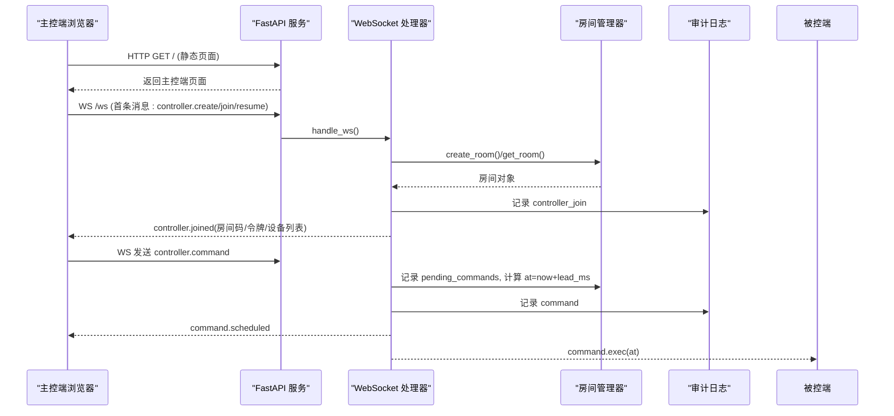
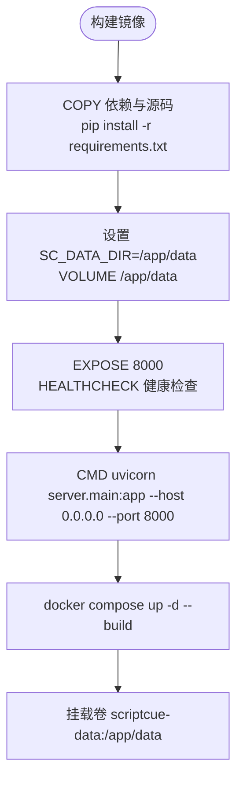
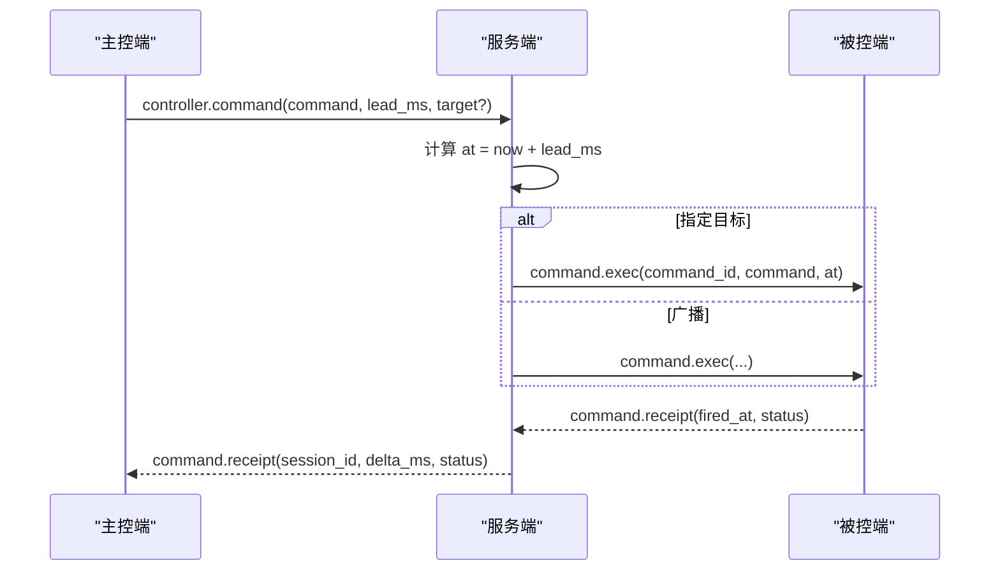
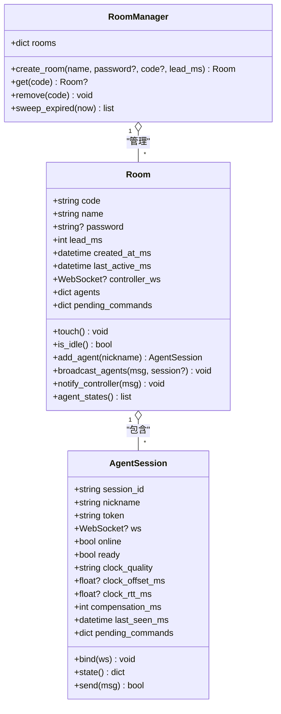
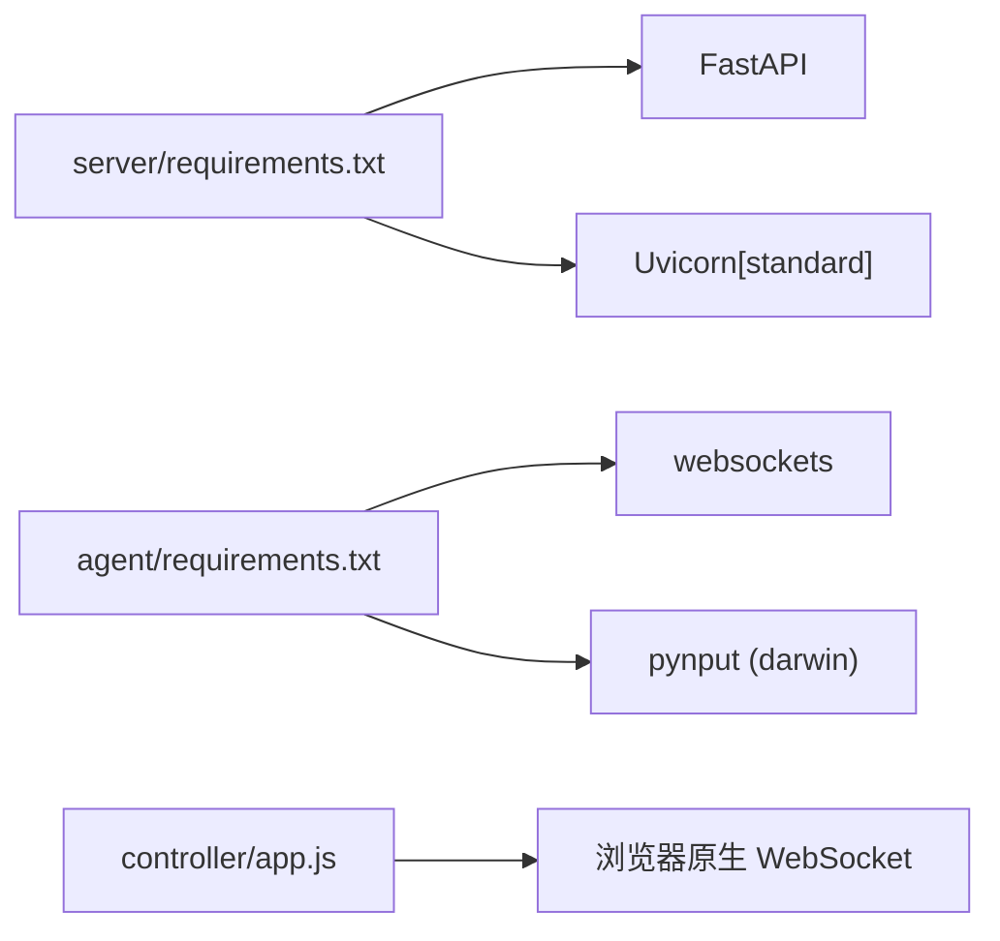

# 部署与运维

<cite>
**本文引用的文件**
- [README.md](file://README.md)
- [docker-compose.yml](file://docker-compose.yml)
- [server/Dockerfile](file://server/Dockerfile)
- [server/server/main.py](file://server/server/main.py)
- [server/server/protocol.py](file://server/server/protocol.py)
- [server/server/ws.py](file://server/server/ws.py)
- [server/server/models.py](file://server/server/models.py)
- [server/server/audit.py](file://server/server/audit.py)
- [agent/build_windows.ps1](file://agent/build_windows.ps1)
- [agent/build_macos.sh](file://agent/build_macos.sh)
- [agent/scriptcue_agent.py](file://agent/scriptcue_agent.py)
- [controller/app.js](file://controller/app.js)
</cite>

## 目录
1. [简介](#简介)
2. [项目结构](#项目结构)
3. [核心组件](#核心组件)
4. [架构总览](#架构总览)
5. [详细组件分析](#详细组件分析)
6. [依赖关系分析](#依赖关系分析)
7. [性能考虑](#性能考虑)
8. [故障诊断指南](#故障诊断指南)
9. [结论](#结论)
10. [附录：生产部署清单](#附录生产部署清单)

## 简介
本指南面向 ScriptCue 系统的部署与运维，覆盖 Docker 容器化部署、数据持久化、环境变量配置、性能调优、监控告警、被控端打包发布（Windows/macOS）、环境/依赖/版本管理策略，以及常见问题的故障诊断方法。系统由服务端（FastAPI + WebSocket）、主控端（静态网页）与被控端（Python 单文件应用）组成，支持公网环境下多设备高精度同步起播。

## 项目结构
- server：服务端（FastAPI + WebSocket），提供房间管理、指令调度、时钟基准、审计日志等能力；通过 Docker 镜像构建并运行。
- controller：主控端静态页面，由服务端静态托管，用于创建/加入房间、下发指令、查看回执与设备状态。
- agent：被控端（Python），支持 GUI 与命令行模式，使用 PyInstaller 打包为 Windows 可执行或 macOS 应用包。
- docs：协议与使用说明文档（仓库中未展开）。

图表来源
- [server/server/main.py:1-98](file://server/server/main.py#L1-L98)
- [server/server/ws.py:1-360](file://server/server/ws.py#L1-L360)
- [server/server/models.py:1-157](file://server/server/models.py#L1-L157)
- [server/server/audit.py:1-37](file://server/server/audit.py#L1-L37)
- [controller/app.js:1-522](file://controller/app.js#L1-L522)

章节来源
- [README.md:7-21](file://README.md#L7-L21)

## 核心组件
- 服务端入口与生命周期：加载配置、挂载静态资源、启动后台任务（离线检测、空闲房间清理）、暴露健康检查与 WebSocket 端点。
- WebSocket 会话路由：根据首条消息类型区分主控端与被控端会话，处理房间创建/加入、指令下发/取消、补偿值设置、心跳与回执。
- 房间与会话模型：内存存储房间与会话，维护在线状态、时钟质量、待执行指令队列与过期清理。
- 审计日志：JSON Lines 格式记录关键事件（指令、回执、设备上下线、房间重建等）。
- 主控端前端：连接服务器、展示设备列表、倒计时与回执汇总、防误触长按确认。
- 被控端打包：PyInstaller 一键打包为单文件可执行程序，便于分发与安装。

章节来源
- [server/server/main.py:12-98](file://server/server/main.py#L12-L98)
- [server/server/ws.py:67-360](file://server/server/ws.py#L67-L360)
- [server/server/models.py:17-157](file://server/server/models.py#L17-L157)
- [server/server/audit.py:17-37](file://server/server/audit.py#L17-L37)
- [controller/app.js:50-134](file://controller/app.js#L50-L134)
- [agent/scriptcue_agent.py:1-10](file://agent/scriptcue_agent.py#L1-L10)

## 架构总览
ScriptCue 采用“服务端集中调度 + 两端独立部署”的架构。主控端通过浏览器访问服务端提供的静态页面，建立 WebSocket 长连接进行房间管理与指令下发；被控端通过 WebSocket 与服务端保持时钟同步与指令执行。所有关键操作均写入审计日志，便于演出后复盘。

图表来源
- [server/server/main.py:78-98](file://server/server/main.py#L78-L98)
- [server/server/ws.py:154-208](file://server/server/ws.py#L154-L208)
- [server/server/ws.py:67-115](file://server/server/ws.py#L67-L115)
- [server/server/audit.py:24-33](file://server/server/audit.py#L24-L33)

## 详细组件分析

### 服务端容器化与编排
- 镜像构建：基于 Python 3.12 slim 镜像，安装 FastAPI/Uvicorn 依赖，复制服务端代码与主控端静态资源，暴露 8000 端口，定义健康检查与健康探针。
- 数据持久化：通过环境变量 SC_DATA_DIR 指定数据目录，并在镜像中声明 VOLUME /app/data；在 Compose 中映射命名卷 scriptcue-data，确保审计日志与运行时数据持久化。
- 编排配置：docker-compose.yml 定义单一服务，端口映射 8000:8000，自动重启策略 unless-stopped。

图表来源
- [server/Dockerfile:1-24](file://server/Dockerfile#L1-L24)
- [docker-compose.yml:1-15](file://docker-compose.yml#L1-L15)

章节来源
- [server/Dockerfile:1-24](file://server/Dockerfile#L1-L24)
- [docker-compose.yml:1-15](file://docker-compose.yml#L1-L15)

### 环境变量与配置管理
- SC_DATA_DIR：审计日志与运行时数据目录，默认指向仓库 server/data；Docker 内为 /app/data。
- SC_CONTROLLER_DIR：主控端静态目录，默认指向仓库 controller；若不存在则仅暴露 WebSocket 与健康检查。
- SC_DEFAULT_LEAD_MS：指令默认提前量（毫秒），模块导入期读取，影响默认参数绑定。
- SC_LOG_LEVEL：日志级别，默认 INFO。

建议：
- 生产环境通过环境变量注入以上配置，避免硬编码路径与常量。
- 将敏感信息（如口令）通过外部配置管理（如密钥管理服务）注入，不在镜像中固化。

章节来源
- [server/server/main.py:28-35](file://server/server/main.py#L28-L35)
- [server/server/protocol.py:72-73](file://server/server/protocol.py#L72-L73)

### WebSocket 会话与指令流程
- 首条消息校验：要求 JSON 对象且 proto 版本匹配，否则返回错误。
- 主控端会话：支持创建房间、加入房间、恢复会话；处理指令下发、取消、补偿值设置。
- 被控端会话：支持加入房间、心跳上报、时钟同步请求、补偿值设置、指令回执。
- 指令调度：服务器计算 at = now + lead_ms，广播给目标或被控端全体；超过回执窗口后清理待执行记录。

图表来源
- [server/server/ws.py:67-115](file://server/server/ws.py#L67-L115)
- [server/server/ws.py:228-244](file://server/server/ws.py#L228-L244)

章节来源
- [server/server/ws.py:50-61](file://server/server/ws.py#L50-L61)
- [server/server/ws.py:154-208](file://server/server/ws.py#L154-L208)
- [server/server/ws.py:246-328](file://server/server/ws.py#L246-L328)

### 房间与会话模型
- 房间：包含房间码、名称、口令、提前量、创建/活跃时间、主控连接、成员集合、待执行指令队列。
- 会话：唯一 session_id、昵称、令牌、在线/就绪状态、时钟质量与偏移、RTT、补偿值、最后可见时间、待执行指令映射。
- 限制：每房间最多 20 台设备；空闲超 24h 的房间自动销毁；心跳超时（3 次无响应）标记离线。

图表来源
- [server/server/models.py:17-157](file://server/server/models.py#L17-L157)

章节来源
- [server/server/models.py:17-157](file://server/server/models.py#L17-L157)

### 审计日志
- 格式：JSON Lines，每条记录包含时间戳、事件类型与字段。
- 写入：线程锁保护，追加写并立即 flush；异常时记录日志。
- 用途：指令下发、取消、回执、设备上下线、房间重建等关键事件均可追溯。

章节来源
- [server/server/audit.py:17-37](file://server/server/audit.py#L17-L37)

### 主控端前端
- 连接管理：自动重连与退避；首次消息携带房间信息与令牌。
- 指令下发：防误触长按确认；倒计时显示；回执汇总与偏差可视化。
- 设备状态：在线/就绪/离线、时钟质量、偏移与 RTT、最近触发偏差。

章节来源
- [controller/app.js:50-134](file://controller/app.js#L50-L134)
- [controller/app.js:198-298](file://controller/app.js#L198-L298)
- [controller/app.js:316-389](file://controller/app.js#L316-L389)

### 被控端打包与发布
- Windows：PowerShell 脚本使用 PyInstaller 生成单文件 exe；首次运行可能触发 SmartScreen 提示。
- macOS：Shell 脚本生成 .app 应用包；当前未签名与公证，首次打开需右键→打开。
- 入口：scriptcue_agent.py 作为 PyInstaller 打包入口，调用 GUI 主函数。

章节来源
- [agent/build_windows.ps1:1-15](file://agent/build_windows.ps1#L1-L15)
- [agent/build_macos.sh:1-20](file://agent/build_macos.sh#L1-L20)
- [agent/scriptcue_agent.py:1-10](file://agent/scriptcue_agent.py#L1-L10)

## 依赖关系分析
- 服务端依赖：FastAPI、Uvicorn（标准版）；通过 requirements.txt 锁定版本范围。
- 被控端依赖：websockets；macOS 平台额外依赖 pynput；打包阶段可选 pyinstaller。
- 主控端：纯前端，无后端依赖，由服务端静态托管。

图表来源
- [server/requirements.txt:1-3](file://server/requirements.txt#L1-L3)
- [agent/requirements.txt:1-6](file://agent/requirements.txt#L1-L6)
- [controller/app.js:33-48](file://controller/app.js#L33-L48)

章节来源
- [server/requirements.txt:1-3](file://server/requirements.txt#L1-L3)
- [agent/requirements.txt:1-6](file://agent/requirements.txt#L1-L6)

## 性能考虑
- 指令提前量：默认 3000ms，可通过环境变量 SC_DEFAULT_LEAD_MS 调整；ws 层对 lead_ms 进行范围钳制（最小 500ms，最大 60000ms）。
- 心跳与离线判定：心跳间隔 5s，连续 3 次无响应判定离线（15s）；后台任务每秒扫描，减少假在线。
- 房间空闲回收：空闲超 24h 的房间自动销毁，释放内存与会话。
- 回执窗口：指令到期后等待回执 8000ms，超时清理待执行记录，避免堆积。
- 日志写入：审计日志采用线程锁与同步追加写，适合低吞吐场景；高并发下可考虑异步落盘或缓冲队列。

优化建议：
- 在高延迟网络环境下适当增大提前量，降低抖动对精度的影响。
- 监控心跳失败率与回执缺失率，定位网络或客户端问题。
- 合理设置日志级别与轮转策略，避免磁盘占用过大。

章节来源
- [server/server/protocol.py:67-79](file://server/server/protocol.py#L67-L79)
- [server/server/ws.py:22-27](file://server/server/ws.py#L22-L27)
- [server/server/main.py:40-61](file://server/server/main.py#L40-L61)
- [server/server/ws.py:107-115](file://server/server/ws.py#L107-L115)

## 故障诊断指南
- 健康检查：/healthz 返回 ok、协议版本、服务器时间与房间数；Docker HEALTHCHECK 定期探测。
- 常见问题：
  - 主控端无法连接：检查防火墙与端口映射；确认浏览器同源策略与 WSS 证书（若使用 HTTPS）。
  - 被控端无法加入房间：确认房间码大小写与口令；检查 auto_create 是否启用。
  - 指令未执行：核对 lead_ms 与网络延迟；查看回执与审计日志中的 delta_ms。
  - 设备频繁离线：检查心跳间隔与网络稳定性；观察 last_seen 与 clock_quality。
- 日志定位：
  - 审计日志位于 SC_DATA_DIR/audit.jsonl，可按事件类型过滤（command、receipt、agent_offline、room_expired 等）。
  - 服务端日志级别可通过 SC_LOG_LEVEL 调整，便于调试。

章节来源
- [server/server/main.py:78-85](file://server/server/main.py#L78-L85)
- [server/server/ws.py:334-360](file://server/server/ws.py#L334-L360)
- [server/server/audit.py:24-33](file://server/server/audit.py#L24-L33)

## 结论
ScriptCue 以轻量、易部署为核心设计，通过 Docker 与 Compose 实现快速上线，配合环境变量与卷挂载满足生产环境的配置与持久化需求。主控端与被控端职责清晰，指令调度与审计日志完善，便于运维监控与问题定位。建议在生产环境中结合日志聚合、指标采集与告警规则，形成完整的可观测性体系。

## 附录：生产部署清单
- 镜像构建与运行
  - 在仓库根目录执行构建命令，使用 server/Dockerfile 构建镜像。
  - 使用 docker-compose.yml 启动服务，映射端口与数据卷。
- 环境变量
  - SC_DATA_DIR：数据目录（审计日志），Docker 内默认 /app/data。
  - SC_CONTROLLER_DIR：主控端静态目录，默认 controller。
  - SC_DEFAULT_LEAD_MS：指令默认提前量（毫秒）。
  - SC_LOG_LEVEL：日志级别。
- 数据持久化
  - 使用命名卷 scriptcue-data 挂载到 /app/data，确保审计日志与运行时数据不丢失。
- 监控与告警
  - 健康检查：/healthz 与 Docker HEALTHCHECK。
  - 指标采集：可集成 Prometheus 抓取 Uvicorn/FastAPI 指标（如需扩展）。
  - 日志聚合：收集 audit.jsonl 与 stdout/stderr 日志至集中式日志系统。
- 被控端发布
  - Windows：执行 build_windows.ps1，产物 dist/ScriptCueAgent.exe。
  - macOS：执行 build_macos.sh，产物 dist/ScriptCue.app。
  - 签名与公证：建议在生产分发前进行代码签名与公证，提升用户体验与安全性。
- 版本控制策略
  - 协议版本 PROTO_VERSION 变更时需同步更新文档与两端副本。
  - 依赖版本通过 requirements.txt 锁定范围，定期评估升级。
  - 镜像标签建议使用语义化版本（如 v1.2.3），便于回滚与追踪。

章节来源
- [server/Dockerfile:1-24](file://server/Dockerfile#L1-L24)
- [docker-compose.yml:1-15](file://docker-compose.yml#L1-L15)
- [server/server/main.py:28-35](file://server/server/main.py#L28-L35)
- [server/server/protocol.py:9-9](file://server/server/protocol.py#L9-L9)
- [agent/build_windows.ps1:1-15](file://agent/build_windows.ps1#L1-L15)
- [agent/build_macos.sh:1-20](file://agent/build_macos.sh#L1-L20)