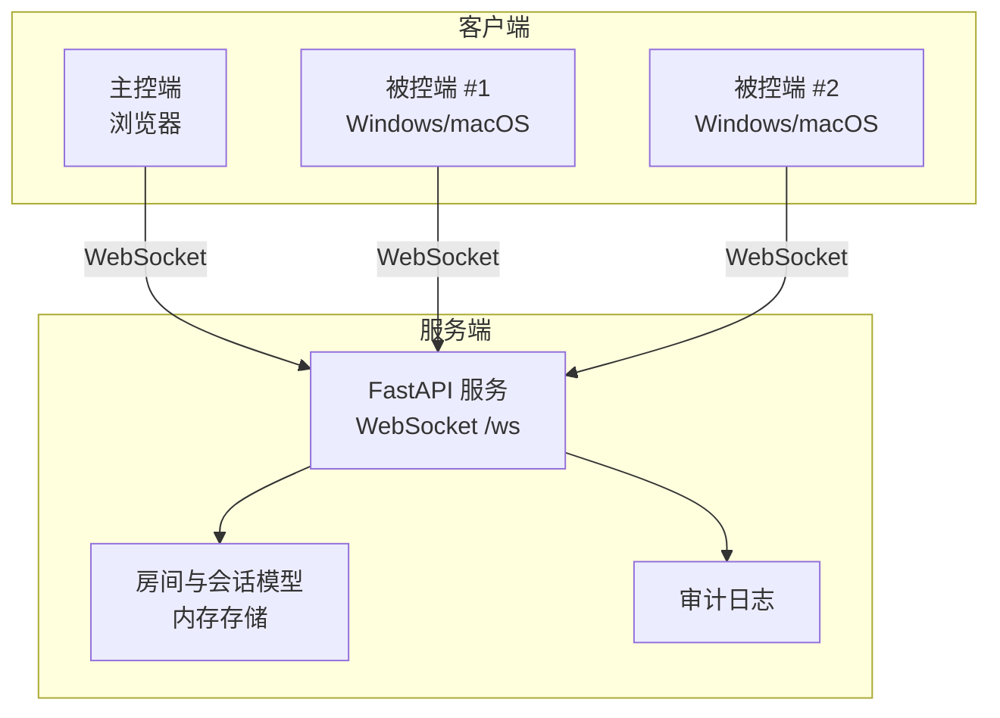
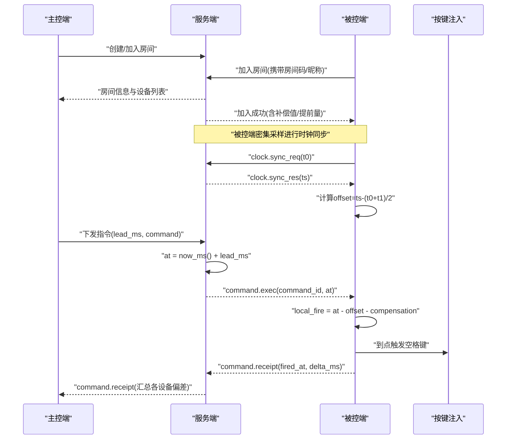
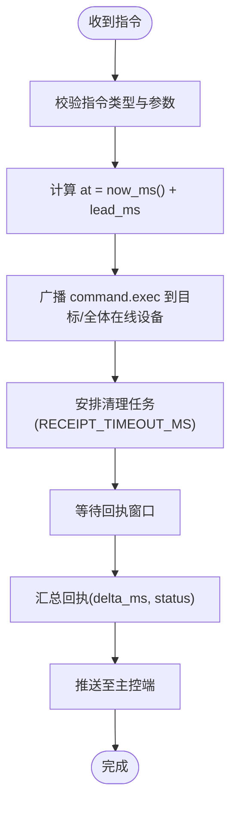
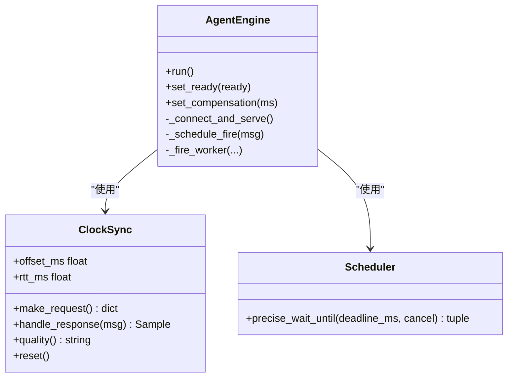
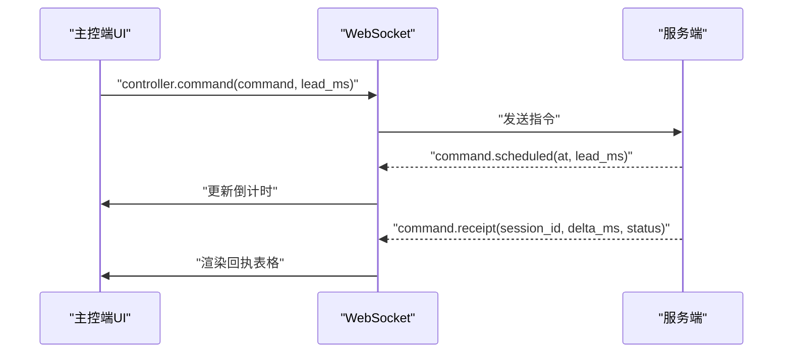
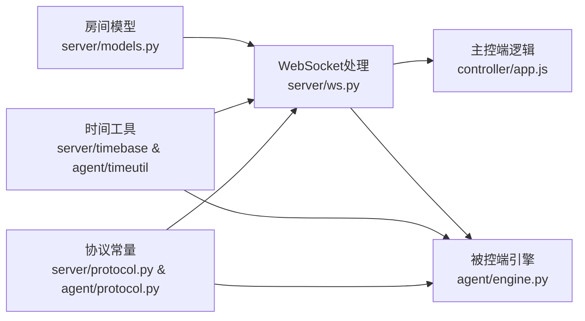

# 项目概述

<cite>
**本文引用的文件**
- [README.md](file://README.md)
- [server/main.py](file://server/server/main.py)
- [server/ws.py](file://server/server/ws.py)
- [server/models.py](file://server/server/models.py)
- [server/protocol.py](file://server/server/protocol.py)
- [agent/engine.py](file://agent/agent/engine.py)
- [agent/clocksync.py](file://agent/agent/clocksync.py)
- [agent/scheduler.py](file://agent/agent/scheduler.py)
- [agent/timeutil.py](file://agent/agent/timeutil.py)
- [agent/protocol.py](file://agent/agent/protocol.py)
- [controller/app.js](file://controller/app.js)
- [docker-compose.yml](file://docker-compose.yml)
</cite>

## 目录
1. [简介](#简介)
2. [项目结构](#项目结构)
3. [核心组件](#核心组件)
4. [架构总览](#架构总览)
5. [详细组件分析](#详细组件分析)
6. [依赖关系分析](#依赖关系分析)
7. [性能与精度特性](#性能与精度特性)
8. [快速开始指南](#快速开始指南)
9. [故障排查](#故障排查)
10. [结论](#结论)

## 简介
ScriptCue 是一个多设备口述影像同步起播系统，通过“时钟对齐 + 绝对时刻调度”的机制，让大屏电脑与多台口述员电脑在公网环境下实现 ≤50ms 精度的同步起播。系统由服务端、主控端（网页）与被控端（Python 应用）三部分构成，采用 WebSocket 长连接进行实时通信，使用类 NTP 的时钟同步算法估算本地与服务器时钟偏移，并在被控端以高精度定时到点触发播放动作，最终将回执上报给主控端用于监控与验收。

## 项目结构
- server：云端服务（FastAPI + WebSocket），负责房间管理、指令广播、授时基准、状态汇聚与审计日志。
- controller：主控端（原生 HTML/JS 网页），由服务端静态托管，提供房间创建/加入、设备状态查看与指令下发。
- agent：被控端（Python，支持 Windows/macOS），负责时钟同步、接收带绝对执行时刻的指令并精确到点触发。
- docs：协议规范与首次打开指引等文档。
- docker-compose.yml：一键启动服务端的编排配置。

图表来源
- [server/main.py:75-98](file://server/server/main.py#L75-L98)
- [server/ws.py:334-360](file://server/server/ws.py#L334-L360)
- [server/models.py:64-157](file://server/server/models.py#L64-L157)

章节来源
- [README.md:7-20](file://README.md#L7-L20)
- [server/main.py:75-98](file://server/server/main.py#L75-L98)

## 核心组件
- 服务端（FastAPI）：提供健康检查、WebSocket 接入、房间与会话管理、指令调度与回执聚合、离线检测与空闲房间清理。
- 主控端（网页）：创建/加入房间、显示设备在线与就绪状态、下发起播/暂停/测试指令、倒计时与回执汇总展示。
- 被控端（引擎+时钟同步+高精度调度）：加入房间后持续做类 NTP 时钟同步；收到带绝对执行时刻的指令后，换算为本地时刻并精确到点触发按键注入；上报回执包含偏差信息。

章节来源
- [server/main.py:75-98](file://server/server/main.py#L75-L98)
- [server/ws.py:67-207](file://server/server/ws.py#L67-L207)
- [server/models.py:17-157](file://server/server/models.py#L17-L157)
- [agent/engine.py:31-158](file://agent/agent/engine.py#L31-L158)
- [agent/clocksync.py:29-106](file://agent/agent/clocksync.py#L29-L106)
- [agent/scheduler.py:1-59](file://agent/agent/scheduler.py#L1-L59)
- [controller/app.js:1-134](file://controller/app.js#L1-L134)

## 架构总览
系统采用“服务端集中式调度 + 两端独立时钟校准”的架构。主控端仅负责业务操作与可视化；被控端承担高精度触发；服务端负责权威时间源、房间管理与指令分发。所有三方共享版本化 JSON 文本协议，保证解耦与可演进性。

图表来源
- [server/ws.py:67-104](file://server/server/ws.py#L67-L104)
- [server/ws.py:246-327](file://server/server/ws.py#L246-L327)
- [agent/engine.py:159-192](file://agent/agent/engine.py#L159-L192)
- [agent/engine.py:297-379](file://agent/agent/engine.py#L297-L379)
- [agent/clocksync.py:37-55](file://agent/agent/clocksync.py#L37-L55)

## 详细组件分析

### 服务端：房间与会话、指令调度与回执聚合
- 房间与会话：纯内存存储，支持密码保护、最大设备数限制、空闲超时销毁。会话维护在线状态、就绪标记、时钟质量、偏移与 RTT、补偿值以及待执行指令映射。
- 指令调度：主控端下发指令时，服务端计算绝对执行时刻 at = 当前时间 + 提前量，并将指令广播给目标或全部在线被控端；同时记录待执行指令以便清理。
- 回执聚合：被控端触发后上报 fired_at，服务端计算 delta_ms = fired_at - at，并推送给主控端展示。
- 离线检测：每秒扫描心跳超时（3次未响应）的设备标记离线并通知主控端。

图表来源
- [server/ws.py:67-104](file://server/server/ws.py#L67-L104)
- [server/ws.py:107-134](file://server/server/ws.py#L107-L134)
- [server/ws.py:228-244](file://server/server/ws.py#L228-L244)
- [server/models.py:64-157](file://server/server/models.py#L64-L157)

章节来源
- [server/ws.py:67-207](file://server/server/ws.py#L67-L207)
- [server/models.py:17-157](file://server/server/models.py#L17-L157)
- [server/main.py:40-72](file://server/server/main.py#L40-L72)

### 被控端：时钟同步与绝对时刻调度
- 时钟同步（类 NTP）：被控端发送请求 t0，服务端回复 ts，被控端记录 t1，计算 offset = ts - (t0 + t1)/2，rtt = t1 - t0。多次采样保留新鲜样本并按 RTT 最小选择可信偏移，避免陈旧路由影响。
- 绝对时刻调度：收到 at 后，换算 local_fire = at - offset - compensation_ms；使用“粗睡眠 + 末段自旋”策略精确到点触发，误差控制在亚毫秒级。
- 回执上报：触发后将 fired_at 换算为服务器时钟（fired_at = actual_local + offset），上报 delta_ms = fired_at - at，供主控端评估同步质量。

图表来源
- [agent/engine.py:31-158](file://agent/agent/engine.py#L31-L158)
- [agent/clocksync.py:29-106](file://agent/agent/clocksync.py#L29-L106)
- [agent/scheduler.py:33-59](file://agent/agent/scheduler.py#L33-L59)

章节来源
- [agent/engine.py:195-379](file://agent/agent/engine.py#L195-L379)
- [agent/clocksync.py:1-106](file://agent/agent/clocksync.py#L1-L106)
- [agent/scheduler.py:1-59](file://agent/agent/scheduler.py#L1-L59)

### 主控端：房间管理与指令下发
- 连接与会话：建立 WebSocket 连接，首条消息声明角色（创建/加入/恢复），接收房间信息与设备列表。
- 指令下发：设置提前量 lead_ms，生成唯一 command_id，发送到服务端；服务端返回 scheduled 消息，前端显示倒计时。
- 回执展示：根据回执汇总每个设备的 delta_ms 与状态（正常/异常/跳过/等待/未回执/离线），超过阈值高亮提示。

图表来源
- [controller/app.js:316-330](file://controller/app.js#L316-L330)
- [controller/app.js:102-134](file://controller/app.js#L102-L134)
- [controller/app.js:364-439](file://controller/app.js#L364-L439)

章节来源
- [controller/app.js:1-134](file://controller/app.js#L1-L134)
- [controller/app.js:316-439](file://controller/app.js#L316-L439)

## 依赖关系分析
- 协议一致性：服务端与被控端各自维护 protocol.py 常量副本，确保消息类型、错误码、限制一致；修改需同步递增 PROTO_VERSION。
- 时间基准：服务端 timebase.now_ms() 与被控端 timeutil.now_ms() 均返回毫秒级 Unix 时间戳，保证跨端时间统一。
- 房间生命周期：RoomManager 管理房间与会话，支持自动重建（auto_create）与空闲销毁（24h）。
- 重连与健壮性：被控端指数退避重连，主控端断线自动重连；服务端每秒扫描离线设备。

图表来源
- [server/protocol.py:1-80](file://server/server/protocol.py#L1-L80)
- [agent/protocol.py:1-80](file://agent/agent/protocol.py#L1-L80)
- [server/models.py:120-157](file://server/server/models.py#L120-L157)
- [server/ws.py:334-360](file://server/server/ws.py#L334-L360)
- [agent/engine.py:106-158](file://agent/agent/engine.py#L106-L158)
- [controller/app.js:50-81](file://controller/app.js#L50-L81)

章节来源
- [server/protocol.py:1-80](file://server/server/protocol.py#L1-L80)
- [agent/protocol.py:1-80](file://agent/agent/protocol.py#L1-L80)
- [server/models.py:120-157](file://server/server/models.py#L120-L157)

## 性能与精度特性
- 时钟对齐：类 NTP 多次采样取 RTT 最小样本作为可信偏移，抑制网络抖动与路由变化带来的误差。
- 绝对时刻调度：服务端附加 at = now_ms() + lead_ms，被控端换算 local_fire = at - offset - compensation，使用“粗睡眠 + 最后 50ms 自旋”策略逼近目标时刻，误差可达亚毫秒级。
- 精度保障：只要网络延迟与抖动不超过提前量（默认 3s），不影响同步精度；被控端在临近到点前停止提示音以避免干扰精确等待。
- 资源占用：房间数据纯内存存储，重启后由客户端重连自动重建；空闲房间 24h 自动销毁，降低长期驻留成本。

章节来源
- [agent/clocksync.py:1-106](file://agent/agent/clocksync.py#L1-L106)
- [agent/scheduler.py:1-59](file://agent/agent/scheduler.py#L1-L59)
- [agent/engine.py:297-379](file://agent/agent/engine.py#L297-L379)
- [server/main.py:54-72](file://server/server/main.py#L54-L72)

## 快速开始指南

### 服务端部署
- 开发模式：安装依赖后运行 FastAPI 服务，监听 0.0.0.0:8000。
- Docker 模式：构建镜像并运行容器，映射端口 8000，持久化审计日志目录。
- Compose 模式：在仓库根目录执行编排命令一键启动。

章节来源
- [README.md:36-55](file://README.md#L36-L55)
- [docker-compose.yml:1-15](file://docker-compose.yml#L1-L15)
- [server/main.py:75-98](file://server/server/main.py#L75-L98)

### 主控端访问
- 浏览器访问 http://<服务器地址>:8000/，网页由服务端静态托管。
- 创建或加入房间，查看设备状态并下发指令。

章节来源
- [README.md:57-59](file://README.md#L57-L59)
- [controller/app.js:1-134](file://controller/app.js#L1-L134)

### 被控端部署
- 安装依赖后启动 GUI 版或命令行版，输入服务器地址、房间码、昵称等信息加入房间。
- 打包为单文件发布：Windows 执行构建脚本生成 exe，macOS 执行脚本生成 app。
- 首次运行可能需要授予辅助功能权限（macOS）或遵循首次打开指引。

章节来源
- [README.md:61-79](file://README.md#L61-L79)
- [agent/engine.py:106-158](file://agent/agent/engine.py#L106-L158)
- [agent/gui.py:1-100](file://agent/agent/gui.py#L1-L100)

## 故障排查
- 连接问题：检查 WebSocket 是否连通，首条消息是否为合法 JSON 对象且协议版本匹配。
- 房间不存在：主控端或设备加入失败时，确认房间码正确；若服务端重启，设备可启用 auto_create 自动重建房间。
- 时钟不同步：被控端未获得有效偏移时会跳过触发并上报错误；检查网络质量与采样次数。
- 指令未回执：确认设备在线且就绪；检查补偿值设置与提前量是否合理；查看回执汇总中的状态与偏差。
- 离线判定：服务端每秒扫描心跳，连续 3 次无响应标记离线；检查设备心跳是否正常发送。

章节来源
- [server/ws.py:334-360](file://server/server/ws.py#L334-L360)
- [server/ws.py:246-327](file://server/server/ws.py#L246-L327)
- [agent/engine.py:297-379](file://agent/agent/engine.py#L297-L379)
- [server/main.py:40-72](file://server/server/main.py#L40-L72)

## 结论
ScriptCue 通过“时钟对齐 + 绝对时刻调度”实现了多设备口述影像的高精度同步起播，具备清晰的三层架构、稳定的 WebSocket 通信与完善的回执反馈机制。系统在公网环境下也能保持 ≤50ms 的同步精度，适合大屏与多台口述员协同场景。建议在生产环境中关注网络质量、补偿值调优与设备就绪状态，以获得最佳同步效果。